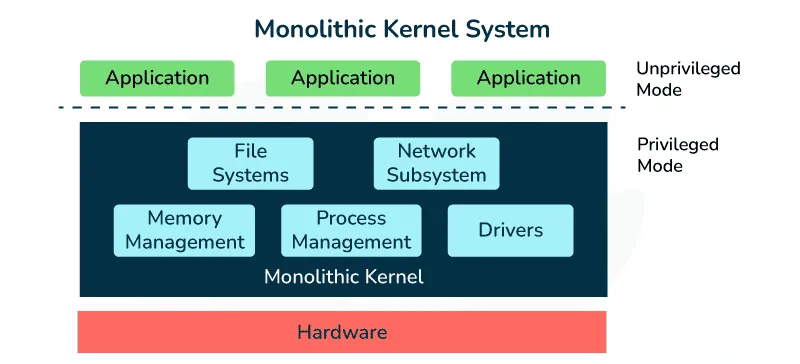

<div align="center" style="margin-top: 16px;">
    <strong>Otázka 2</strong>
</div>

<nav style="
    position: sticky;
    top: 0;
    z-index: 100;
    background: rgba(0,0,0,0.8);
    padding: 8px 0 4px 0;
    box-shadow: 0 2px 8px rgba(0,0,0,0.1);
    text-align: center;
">
    <a href="01.md" style="color:white; text-decoration:none; margin: 0 16px;">⬅️ Předchozí</a>
    <a href="../README.md" style="color:white; text-decoration:none; margin: 0 16px;">🏠 Domů</a>
    <a href="03.md" style="color:white; text-decoration:none; margin: 0 16px;">Následující ➡️</a>
</nav>

# Kritéria výběru operačního systému a jeho architektura

**Otázka:** Výběr operačního systému pro technické prostředky aplikované v závěrečné práci, nastavení bezpečnosti operačního systému; charakteristika funkcí jádra: správa procesů, souborového systému, systému I/O zařízení a správa uživatelů a skupin

---

# **Kritéria výběru operačního systému**

Při výběru operačního systému pro konkrétní technický projekt je nutné zvážit následující faktory:

## **Kompatibilita s hardwarem**

Operační systém musí být plně kompatibilní s použitým hardwarem.

- **Podporované procesory:** Ujistit se, že OS podporuje architekturu CPU (např. x86, x64, ARM – specificky pro technické projekty např. ARMv8 Cortex-A72 u Raspberry Pi 4).
- **Ovladače:** Dostupnost stabilních ovladačů pro všechny hardwarové komponenty (grafická karta, síťová karta, tiskárny, ale i specifické moduly jako kamery, senzory, GPIO, I2C, SPI rozhraní klíčová pro komunikaci s periferiemi jako ESP32-C6).
- **Hardwarové nároky:** Minimální a doporučené požadavky na RAM, úložiště a procesor. Zohlednit podporu specifických vlastností SoC (System-on-Chip), např. GPU (Broadcom VideoCore VI u Raspberry Pi).

## **Účel a použití**

Specifické požadavky projektu definují nároky na operační systém.

| Účel                                  | Požadavky                                                                                                                                                                                                 | Příklad OS                                    |
| ------------------------------------- | --------------------------------------------------------------------------------------------------------------------------------------------------------------------------------------------------------- | --------------------------------------------- |
| Kancelářská práce                     | Dobrá podpora kancelářských aplikací, spolehlivost, jednoduchost.                                                                                                                                         | Windows, macOS, Ubuntu Desktop                |
| Vývoj software                        | Podpora vývojářských nástrojů, prostředí, škálovatelnost, kontejnerizace (Docker).                                                                                                                        | Ubuntu, Fedora, macOS, Windows (s WSL)        |
| Grafický design a multimédia          | Podpora grafických a video editačních nástrojů, vysoká úroveň grafické kvality, škálovatelnost.                                                                                                           | macOS, Windows                                |
| Vědecké výpočty                       | Dobré možnosti paralelního výpočtu, podpora vědeckých aplikací, vysoká úroveň spolehlivosti.                                                                                                              | CentOS/RHEL, Ubuntu Server                    |
| **Vestavěné systémy / IoT zařízení**  | Nízká latence, schopnosti reálného času (pro řízení procesů), podpora síťových protokolů (MQTT, CoAP), efektivní správa napájení, vysoká spolehlivost a stabilita, možnost vzdálené správy a aktualizací. | Raspberry Pi OS, Ubuntu Core, Yocto, FreeRTOS |
| Serverové nasazení (vč. mini-serverů) | Stabilita, škálovatelnost, bezpečnost, výkon, správa síťových služeb.                                                                                                                                     | Windows Server, Ubuntu Server, CentOS/RHEL    |

## **Bezpečnost**

Bezpečnost je kritickým aspektem, zejména u systémů připojených k síti nebo spravujících citlivá data.

- **Aktualizace a záplaty:** Frekvence, spolehlivost a možnost automatizace bezpečnostních aktualizací. Důležitý je i mechanismus aktualizace firmwaru zařízení (např. rpi-eeprom pro Raspberry Pi).
- **Bezpečnostní funkce OS:**
  - **Firewall:** Integrovaný a konfigurovatelný firewall (např. ufw v Linuxu, Windows Defender Firewall).
  - **Šifrování:** Podpora pro šifrování disku (např. LUKS v Linuxu, BitLocker ve Windows) a šifrování komunikace (např. podpora pro TLS/SSL v síťových službách).
  - **Antivirový software a detekce průniků:** Dostupnost a integrace bezpečnostního softwaru.
  - **Mechanizmy kontroly přístupu:** Mandatory Access Control (MAC) jako SELinux nebo AppArmor, Role-Based Access Control (RBAC).
- **Uživatelská oprávnění a správa účtů:** Možnosti správy uživatelských účtů, skupin a detailní nastavení přístupových práv (princip nejnižších privilegií).
- **Hardening systému:** Možnosti “zatvrzení” systému zakázáním nepotřebných služeb a portů, auditování.

## **Stabilita a spolehlivost**

Systém musí být schopen dlouhodobého bezproblémového provozu.

- **Provozní stabilita:** Jak často dochází k selhání systému nebo pádům aplikací. Důležité jsou mechanismy pro obnovu systému, watchdog timery.
- **Souborový systém:** Použití robustních souborových systémů s žurnálováním (např. ext4, NTFS) nebo copy-on-write (např. Btrfs, ZFS). Pro embedded zařízení je výhodné OverlayFS pro ochranu rootfs před přepsáním při výpadku napájení.
- **Podpora a komunita:** Dostupnost oficiální podpory, velikost uživatelské komunity, kvalita dokumentace.

## **Cena a licenční podmínky**

Náklady a podmínky použití mohou hrát významnou roli.

- **Náklady:** Cena licencí pro OS a případný software třetích stran.
- **Licenční podmínky:** Typ licence (open-source jako GPL, MIT; komerční; freeware) a její podmínky. Open-source OS často nabízejí větší flexibilitu a transparentnost.

## **Uživatelská přívětivost a správa**

Snadnost použití a správy systému.

- **Uživatelské rozhraní (UI):** Intuitivnost a snadnost použití grafického rozhraní (GUI). Pro technické projekty a servery je často klíčové rozhraní příkazového řádku (CLI) pro “headless” provoz, skriptování a vzdálený přístup (SSH).
- **Dokumentace a podpora:** Dostupnost kvalitní dokumentace, tutoriálů a podpůrných zdrojů.

## **Podpora aplikací a vývojových nástrojů**

Dostupnost potřebného softwaru a nástrojů.

- **Dostupnost softwaru:** Šíře a kvalita dostupných aplikací, knihoven (např. paho-mqtt pro MQTT, RPi.GPIO pro ovládání GPIO na Raspberry Pi) a nástrojů.
- **Vývojové prostředí:** Podpora pro specifické programovací jazyky (Python, C/C++, Node.js, Kotlin atd.) a vývojové stacky.
- **Kompatibilita:** Schopnost spouštět aplikace vytvořené pro jiné OS (např. Wine pro Linux, Windows Subsystem for Linux - WSL).
- **Kontejnerizace:** Podpora technologií jako Docker pro snadné nasazení a izolaci aplikací.

# **Architektura operačních systémů a role funkcí jádra**

Architektura operačního systému definuje jeho vnitřní strukturu a způsob, jakým jsou organizovány jeho komponenty. Ovlivňuje výkon, bezpečnost, modularitu a spolehlivost. Klíčovou součástí každého OS je jádro (kernel), které zajišťuje základní funkce.

## **Hlavní typy architektur OS:**

[Operating Systems Structures - GeeksforGeeks](https://www.geeksforgeeks.org/different-approaches-or-structures-of-operating-systems/)

1.  **Monolitická architektura**
    - **Charakteristika:** Jádro systému obsahuje veškeré systémové služby (správa procesů, paměti, souborového systému, I/O ovladače) běžící v jednom adresovém prostoru (kernel space).
    - **Výhody:** Vysoký výkon díky přímé komunikaci mezi komponentami, relativně jednoduchá implementace.
    - **Nevýhody:** Nižší modularita, chyba v jedné části jádra může ohrozit celý systém, složitější ladění a údržba.
    - **Příklady:** Tradiční Unix, Linux, MS-DOS.



[Monolithic Architecture in OS - GeeksforGeeks](https://www.geeksforgeeks.org/monolithic-architecture/)

1.  **Víceúrovňová (vrstvená) architektura**
    - **Charakteristika:** Operační systém je rozdělen do hierarchických vrstev, kde každá vrstva poskytuje služby vrstvě nad ní a využívá služeb vrstvy pod ní.
    - **Výhody:** Lepší modularita, přehlednost, snazší ladění a údržba díky jasně definovaným rozhraním mezi vrstvami.
    - **Nevýhody:** Vyšší systémová režie, pomalejší vykonávání systémových volání.
    - **Příklady:** THE multiprogramming system, Multics.


    
2. **Architektura s mikrojádrem**
    - **Charakteristika:** Jádro (mikrojádro) poskytuje pouze nejzákladnější funkce (správa procesů, meziprocesová komunikace, základní správa paměti). Ostatní služby (ovladače zařízení, souborové systémy) běží jako oddělené procesy v uživatelském prostoru (user space).
    - **Výhody:** Vyšší bezpečnost a stabilita (chyba v ovladači neohrozí jádro), lepší modularita, flexibilita.
    - **Nevýhody:** Nižší výkon kvůli časté meziprocesové komunikaci mezi uživatelským prostorem a mikrojádrem.
    - **Příklady:** Minix, QNX, macOS (částečně, XNU kernel je hybridní).

[Difference Between Microkernel and Monolithic Kernel - GeeksforGeeks](https://www.geeksforgeeks.org/difference-between-microkernel-and-monolithic-kernel/)

1. **Hybridní architektura**
   - **Charakteristika:** Kombinuje prvky monolitické architektury a architektury s mikrojádrem. Snaží se využít výhod obou přístupů. Některé klíčové služby běží v kernel space pro výkon, zatímco jiné mohou být modularizovány.
   - **Výhody:** Dobrý kompromis mezi výkonem, modularitou a stabilitou.
   - **Nevýhody:** Může být komplexnější na návrh a implementaci.
   - **Příklady:** Windows NT (a novější verze Windows), macOS (XNU).
2. **Architektura s virtuálními počítači (hypervizory)**
   - **Charakteristika:** Hypervizor (Virtual Machine Monitor - VMM) umožňuje běh více instancí operačních systémů (hostovaných OS) na jednom fyzickém hardwaru.
   - **Výhody:** Izolace systémů, konsolidace serverů, flexibilita, testování.
   - **Nevýhody:** Režie hypervizoru může snižovat výkon, komplexnější správa.
   - **Typy hypervizorů:** Typ 1 (bare-metal, např. VMware ESXi, Xen), Typ 2 (hostované, např. VirtualBox, VMware Workstation).

[Hypervisor - GeeksforGeeks](https://www.geeksforgeeks.org/hypervisor/)

1. **Klient-server architektura (v kontextu OS)**
   - **Charakteristika:** Funkce OS jsou rozděleny mezi serverové procesy poskytující služby a klientské procesy, které tyto služby vyžadují. Často spojeno s mikrojádry.
   - **Výhody:** Modularita, možnost distribuce služeb.
   - **Nevýhody:** Režie komunikace.

[Client-Server Architecture - System Design - GeeksforGeeks](https://www.geeksforgeeks.org/client-server-architecture-system-design/)

[Client-Server Architecture Explained with Examples, Diagrams, and Real-World Applications](https://medium.com/nerd-for-tech/client-server-architecture-explained-with-examples-diagrams-and-real-world-applications-407e9e04e2d1)

### **Role funkcí jádra v zajištění spolehlivého provozu (na příkladu Linuxu pro technický projekt)**

Pro technický projekt, jako je například hydroponický systém řízený Raspberry Pi s Raspberry Pi OS (založeném na Linuxu s monolitickým jádrem), hrají funkce jádra klíčovou roli v zajištění spolehlivosti:

- **Správa procesů:**
  - **Plánování (Scheduling):** Jádro rozhoduje, který proces získá přístup k CPU. Pro real-time aplikace (např. řízení čerpadel) je možné nastavit priority procesů (např. pomocí nice, renice nebo chrt pro real-time politiky jako FIFO nebo RR – např. chrt -f 99 mosquitto pro MQTT broker).
  - **Řízení zdrojů:** Využití `cgroups` (control groups) umožňuje izolovat procesy a přidělovat jim omezené systémové zdroje (CPU, RAM, I/O), což zabraňuje tomu, aby jeden proces přetížil celý systém. Nástroje jako `cpulimit` mohou omezit CPU využití pro méně kritické úlohy.
  - **Meziprocesová komunikace (IPC):** Jádro poskytuje mechanismy (pipes, sockets, shared memory) pro komunikaci mezi procesy (např. mezi webovým serverem a procesem sbírajícím data ze senzorů).
- **Správa paměti:**
  - **Alokace a dealokace:** Jádro spravuje fyzickou a virtuální paměť, přiděluje paměť procesům a zajišťuje její uvolnění.
  - **Ochrana paměti:** Izoluje adresové prostory procesů, aby chyba v jednom procesu neovlivnila ostatní.
  - **Virtuální paměť a swapping:** Umožňuje systému používat více paměti, než je fyzicky k dispozici, odkládáním dat na disk (swap). Pro embedded systémy s omezenou flash pamětí je třeba swapování pečlivě zvážit kvůli opotřebení.
- **Správa souborového systému:**
  - **Ovladače zařízení:** Jádro obsahuje (nebo dynamicky načítá) ovladače, které umožňují komunikaci s hardwarem (senzory, aktuátory, síťové adaptéry).
  - **Konfigurace hardwaru:** U systémů jako Raspberry Pi se často používají Device Tree overlays pro dynamickou konfiguraci hardwarových periferií (GPIO piny, I2C/SPI sběrnice) bez nutnosti rekompilace jádra.
  - **Efektivní přenosy dat:** Využití DMA (Direct Memory Access) snižuje zátěž CPU při přenosu dat mezi pamětí a periferiemi (např. při čtení velkého množství dat ze senzorů).
- **Správa uživatelů a bezpečnostní model (v kontextu jádra):**
  - **Oprávnění:** Jádro vynucuje přístupová práva k souborům a zařízením na základě uživatelských identit a skupin.
  - **Bezpečnostní moduly:** Podpora pro frameworky jako AppArmor nebo SELinux (implementované na úrovni jádra) umožňuje definovat jemně granulované politiky pro jednotlivé aplikace, omezující jejich přístup k systémovým zdrojům (např. AppArmor pro omezení přístupu k /dev/mem jako prevence neautorizovaného přístupu k hardwaru).
- **Síťové funkce:**
  - **Síťový stack:** Jádro implementuje síťové protokoly (TCP/IP, UDP), které jsou nezbytné pro komunikaci zařízení v síti (např. odesílání dat přes MQTT, poskytování webového rozhraní).

# **Příklady operačních systémů**

## **Běžné desktopové a serverové OS**

### **Kancelářské aplikace a běžná uživatelská činnost**

- **Windows 10/11:** Hybridní architektura. Široká kompatibilita hardwaru a softwaru, uživatelsky přívětivé rozhraní. Dominantní pro kancelářské nástroje.
- **macOS:** Hybridní architektura (XNU kernel). Intuitivní UI, dobrá integrace s Apple ekosystémem, vysoká stabilita. Populární v kreativních odvětvích.
- **Ubuntu (Linux Desktop):** Monolitická architektura (Linux kernel). Otevřený zdrojový kód, vysoká stabilita, velká komunita, zdarma.

### **Vývoj software a programování**

- **Ubuntu (Linux):** Monolitická architektura. Široká podpora vývojářských nástrojů, terminálová prostředí, balíčkovací systémy (apt).
- **Windows 10/11 (s WSL):** Hybridní architektura. Podpora pro Visual Studio, WSL umožňuje běh Linux aplikací.
- **macOS:** Hybridní architektura. Silná podpora pro vývoj iOS/macOS aplikací (Xcode).

### **Grafický design a úprava videa**

- **macOS:** Hybridní architektura. Vysoký výkon, stabilita, podpora pro Adobe Creative Suite, Final Cut Pro.
- **Windows 10/11:** Hybridní architektura. Široká podpora grafických nástrojů, velká kompatibilita hardwaru.

### **Vědecké výpočty a simulace**

- **CentOS/RHEL (Linux):** Monolitická architektura. Vysoká stabilita, dlouhodobá podpora, vhodné pro servery a clustery.
- **Ubuntu (Linux):** Monolitická architektura. Široká podpora vědeckých nástrojů a knihoven.

### **Hraní her**

- **Windows 10/11:** Hybridní architektura. Největší podpora herních titulů, DirectX.
- **SteamOS (Linux):** Monolitická architektura. Optimalizováno pro hry (založeno na Arch Linuxu, dříve Debian).

## **Operační systémy pro vestavěné (embedded) a IoT zařízení**

Pro technické projekty, jako je závěrečná práce, jsou často relevantnější specializované OS:

- **Raspberry Pi OS (dříve Raspbian):**
  - **Architektura:** Monolitické jádro (Linux, založeno na Debianu).
  - **Vlastnosti:** Optimalizováno pro Raspberry Pi hardware (ARM), skvělá komunitní podpora, podpora GPIO, I2C, SPI, typických IoT protokolů (MQTT, HTTP) a vývojových nástrojů (Python, Node.js, C++). Balíček rpi-eeprom pro aktualizaci firmwaru bez fyzického přístupu.
  - **Použití:** Prototypování, vzdělávání, malé servery, IoT brány, řídicí systémy (např. hydroponie, domácí automatizace).
- **Ubuntu Core:**
  - **Architektura:** Monolitické jádro (Linux).
  - **Vlastnosti:** Důraz na bezpečnost, transakční aktualizace pomocí balíčků “Snaps”, které jsou kontejnerizované a izolované.
  - **Použití:** IoT zařízení a vestavěné systémy vyžadující vysokou bezpečnost a spolehlivé aktualizace.
  - **Nevýhody:** Může mít vyšší režii RAM a úložiště oproti minimalistickým distribucím.
- **FreeRTOS (a další RTOS jako Zephyr, Mbed OS):**
  - **Architektura:** Spíše real-time kernel než plnohodnotný OS.
  - **Vlastnosti:** Velmi nízká latence, malé nároky na paměť a procesor, deterministické chování, real-time schopnosti.
  - **Použití:** Primárně pro mikrokontroléry (např. ESP32, STM32) pro přímé řízení senzorů, aktuátorů a časově kritických úloh. Často doplňují hlavní OS na výkonnějším zařízení (např. ESP32 s FreeRTOS sbírá data a posílá je na Raspberry Pi s Raspberry Pi OS).
- **Windows IoT Enterprise / Core:**
  - **Architektura:** Hybridní (založeno na Windows kernelu).
  - **Vlastnosti:** Integrace s Microsoft ekosystémem (Azure IoT Hub, Visual Studio), podpora pro Universal Windows Platform (UWP) aplikace.
  - **Použití:** Komerční IoT zařízení, POS terminály, průmyslová automatizace.
  - **Nevýhody:** Omezenější komunitní podpora pro některé open-source nástroje, potenciální licenční náklady, vyšší hardwarové nároky než Linux-based embedded OS.
- **Yocto Project / Buildroot:**
  - **Architektura:** Nejsou to OS samy o sobě, ale nástroje/frameworky pro vytvoření vlastní, plně přizpůsobené linuxové distribuce.
  - **Vlastnosti:** Umožňují sestavit minimalistický OS obsahující pouze nezbytné komponenty a software pro konkrétní hardware a aplikaci. Maximální kontrola nad systémem, optimalizace velikosti a výkonu.
  - **Použití:** Komerční embedded produkty, zařízení s velmi specifickými požadavky, kde standardní distribuce nejsou vhodné. Vyžadují hlubší znalosti. (Doporučení: Pro kritické systémy zvažte přechod na Yocto Linux s vlastní sestavenou distribucí pro lepší kontrolu nad balíčky a bezpečnostními záplatami.)

## **Serverové operační systémy**

Serverové OS jsou optimalizovány pro spolehlivý a bezpečný provoz serverových aplikací, správu velkého počtu uživatelů a služeb. I malá zařízení jako Raspberry Pi mohou v technických projektech plnit roli “mini-serverů” (např. MQTT broker, webový server pro ovládací rozhraní).

- **Specifika serverových OS:**
  - GUI často není k dispozici nebo je volitelné (správa přes CLI/SSH).
  - Možnost konfigurace a aktualizace HW a SW bez restartu (ne vždy).
  - Robustní nástroje pro zálohování a obnovu.
  - Vysoká bezpečnost a ochrana paměti.
  - Pokročilé síťové funkce a správa služeb.
- **Příklady:**
  - **Windows Server:** Hybridní architektura. Podpora pro Active Directory, Hyper-V, .NET.
  - **Ubuntu Server:** Monolitická (Linux Kernel). Flexibilita (cloud, on-premise), podpora open-source, snadná automatizace.
  - **CentOS/RHEL:** Monolitická (Linux Kernel). Dlouhodobá podpora, stabilita, pro kritické aplikace.
  - **Debian Server:** Monolitická (Linux Kernel). Stabilita, bezpečnost, velká komunita.
  - **FreeBSD:** Monolitická (odlišný kernel od Linuxu). Robustní síťové funkce, bezpečnost (často pro firewally, NAS).

# **Nastavení bezpečnosti operačního systému pro technický projekt**

Zabezpečení OS v technickém projektu je klíčové pro ochranu dat, funkčnosti a prevenci neoprávněného přístupu. Následující kroky by měly být zváženy (příklady často pro Linux-based systémy jako Raspberry Pi OS):

1. **Hardening operačního systému (Zatvrzení)**
   - **Pravidelné aktualizace:** Udržujte systém a všechny balíčky aktuální.
     sudo apt update && sudo apt full-upgrade -y
     Nastavte automatické aktualizace pro bezpečnostní záplaty:
     sudo apt install unattended-upgrades
     sudo dpkg-reconfigure --priority=low unattended-upgrades
   - **Změna výchozích přihlašovacích údajů:** Ihned po instalaci změňte heslo pro výchozího uživatele (např. pi na Raspberry Pi OS) nebo jej deaktivujte/smažte a vytvořte nového silného uživatele.
     ```
     passwd # Pro změnu hesla aktuálního uživatele

     sudo useradd -m -G sudo novyuzivatel # Vytvoření nového uživatele s sudo právy

     sudo passwd novyuzivatel

     sudo deluser pi # Příklad smazání uživatele pi (opatrně!)
     ```
   - **Zakázání nepotřebných služeb:** Identifikujte a deaktivujte služby, které nejsou pro projekt nezbytné, aby se snížila plocha pro útok.
     ```
     sudo systemctl list-unit-files --type=service # Zobrazí služby

     sudo systemctl stop nazevsluzby.service

     sudo systemctl disable nazevsluzby.service

     sudo systemctl mask avahi-daemon.service # Příklad maskování služby
     ```
   - **Omezení SSH přístupu:**
     - Používejte klíčovou autentizaci místo hesel.
     - Zakažte přihlášení roota přes SSH (PermitRootLogin no v /etc/ssh/sshd_config).
     - Změňte výchozí SSH port (např. z 22 na jiný).
     - Omezte SSH přístup pouze na konkrétní IP adresy/sítě pomocí firewallu.
2. Konfigurace firewallu

   Použijte firewall k řízení příchozího a odchozího síťového provozu. Povolte pouze nezbytné porty.

   - **Příklad s ufw (Uncomplicated Firewall) na Linuxu:**
     ```
     sudo apt install ufw
     sudo ufw default deny incoming # Zakázat všechna příchozí spojení ve výchozím stavu
     sudo ufw default allow outgoing # Povolit všechna odchozí spojení ve výchozím stavu
     sudo ufw allow ssh # Povolit SSH (standardní port 22)
     # Povolit SSH na vlastním portu, např. 2222:
     # sudo ufw allow 2222/tcp
     sudo ufw allow http # Povolit HTTP (port 80)
     sudo ufw allow https # Povolit HTTPS (port 443)
     sudo ufw allow 1883/tcp # Povolit MQTT (port 1883)
     # Příklad omezení na lokální síť pro SSH:
     # sudo ufw allow from 192.168.1.0/24 to any port 22 proto tcp
     sudo ufw enable # Aktivovat firewall
     sudo ufw status verbose # Zkontrolovat stav
     ```

3. Zabezpečení specifických aplikací a služeb

   Každá běžící služba (web server, MQTT broker, databáze) by měla být konfigurována s ohledem na bezpečnost.

   - Příklad: Zabezpečení MQTT brokera (Mosquitto):
     V konfiguračním souboru (např. /etc/mosquitto/conf.d/default.conf nebo vlastní):
     ```
     # /etc/mosquitto/conf.d/hydro.conf
     listener 1883
     allow_anonymous false
     password_file /etc/mosquitto/passwdfile

     # Pro TLS zabezpečení:
     # listener 8883
     # certfile /etc/mosquitto/certs/server.crt
     # keyfile /etc/mosquitto/certs/server.key
     # cafile /etc/mosquitto/certs/ca.crt
     # tls_version tlsv1.3 # Nebo tlsv1.2
     # require_certificate true # Pokud klienti musí mít certifikát

     Vytvoření souboru s hesly:
     sudo mosquitto_passwd -c /etc/mosquitto/passwdfile uzivatelskejmeno

     Nastavení oprávnění pro soubor s hesly:
     sudo chown mosquitto:mosquitto /etc/mosquitto/passwdfile
     sudo chmod 0600 /etc/mosquitto/passwdfile
     ```

4. **Správa uživatelských účtů a oprávnění**
   - **Princip nejnižších privilegií:** Každý proces a uživatel by měl mít pouze ta oprávnění, která nezbytně potřebuje ke své funkci.
   - Používejte sudo uvážlivě. Pro démony a aplikace vytvářejte dedikované uživatele s omezenými právy.
   - Pravidelně kontrolujte soubor /etc/sudoers (pomocí visudo).
5. **Šifrování dat**
   - **Šifrování při přenosu (Data in Transit):** Používejte TLS/SSL pro veškerou síťovou komunikaci (HTTPS, MQTTS, SSH).
   - **Šifrování uložených dat (Data at Rest):** Pokud projekt pracuje s citlivými daty, zvažte šifrování úložiště (např. pomocí LUKS pro externí SSD nebo oddíly).
6. **Monitorování a logování**
   - Nastavte a pravidelně kontrolujte systémové logy (např. `/var/log/syslog, /var/log/auth.log`, logy specifických aplikací).
   - Zvažte nástroje pro centralizované logování a monitorování (např. Prometheus, Grafana, ELK stack) pro komplexnější systémy.
   - Nástroje jako fail2ban mohou automaticky blokovat IP adresy, které se pokoušejí o útoky hrubou silou (např. na SSH).
7. **Automatizované zálohování**
   - Pravidelně zálohujte konfiguraci systému a důležitá data.
   - Strategie: Co zálohovat, kam (lokálně, vzdáleně, cloud), jak často, jak dlouho uchovávat.
   - Nástroje: rsync, cron, restic, borgbackup nebo specifické skripty.
   - Ověřujte integritu záloh a schopnost obnovy.
8. Fyzická bezpečnost (pro embedded zařízení)

   Pokud je zařízení fyzicky přístupné, zvažte i ochranu proti neoprávněné manipulaci (např. zakrytování portů, zabezpečení bootloaderu, pokud to hardware umožňuje).

# **Shrnutí pro státní závěrečnou zkoušku**

Při obhajobě výběru OS pro technický projekt (např. hydroponický systém na Raspberry Pi) je důležité zdůraznit:

- **Proč byl zvolen konkrétní OS (např. Raspberry Pi OS):**
  - Nativní podpora pro cílový hardware (Raspberry Pi, jeho GPIO, GPU).
  - Dostupnost potřebných ovladačů a softwarových balíčků (Python, Node.js, MQTT knihovny).
  - Velká komunita a množství dostupných zdrojů a návodů.
  - Nízké hardwarové nároky a dostatečný výkon pro danou úlohu.
  - Možnost aktualizace firmwaru (např. rpi-eeprom) bez fyzického přístupu.
- **Jak architektura OS a funkce jádra přispívají k cílům projektu:**
  - Monolitické jádro Linuxu poskytuje efektivní přístup k hardwaru a dobrý výkon.
  - Správa procesů umožňuje prioritizaci kritických úloh (např. sběr dat, řízení) a izolaci služeb.
  - Robustní souborový systém (ext4 s žurnálováním) a OverlayFS zajišťují integritu dat a systému.
  - Správa I/O přes Device Tree a ovladače umožňuje flexibilní práci s periferiemi.
- **Jak byla zajištěna bezpečnost systému:**
  - Konkrétní kroky provedené pro hardening OS (aktualizace, silná hesla, zakázané služby).
  - Nastavení firewallu (ufw) s definovanými pravidly.
  - Zabezpečení klíčových služeb (např. MQTT heslem a TLS).
  - Správa uživatelských účtů a oprávnění.
  - (Případně) Šifrování, zálohování, monitorování.
- **Zhodnocení alternativ a proč nebyly zvoleny:**
  - Krátce zmínit jiné OS (např. Ubuntu Core, Windows IoT) a důvody, proč byly pro daný projekt méně vhodné (např. vyšší režie, menší komunitní podpora pro specifický hardware, licenční omezení).
- **Možná budoucí vylepšení nebo doporučení:**
  - Pro kritičtější nasazení zvážit přechod na plně customizovatelný systém (Yocto) pro maximální kontrolu a minimalizaci.
