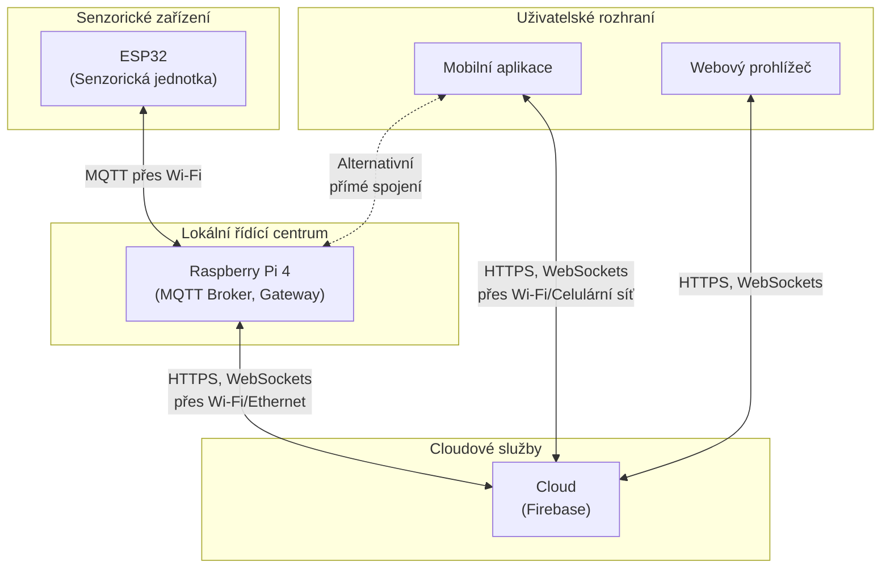

<div align="center" style="margin-top: 16px;">
    <strong>Otázka 4</strong>
</div>

<nav style="
    position: sticky;
    top: 0;
    z-index: 100;
    background: rgba(0,0,0,0.8);
    padding: 8px 0 4px 0;
    box-shadow: 0 2px 8px rgba(0,0,0,0.1);
    text-align: center;
">
    <a href="03.md" style="color:white; text-decoration:none; margin: 0 16px;">⬅️ Předchozí</a>
    <a href="../README.md" style="color:white; text-decoration:none; margin: 0 16px;">🏠 Domů</a>
    <a href="05.md" style="color:white; text-decoration:none; margin: 0 16px;">Následující ➡️</a>
</nav>

# Síťová komunikace mezi zařízeními

**Otázka:** Využití fyzických komponent počítačových sítí (přenosová média a síťová zařízení) v rámci závěrečné práce; přenos signálu a komunikace v místní síti (drátové i bezdrátové sítě); logická adresace zařízení; principy směrování datových zprávů; volba protokolu transportní vrstvy (TCP, UDP)

---

## 1. Úvod do počítačových sítí

Počítačové sítě představují soubor zařízení, která jsou vzájemně propojena za účelem sdílení dat a zdrojů. V moderních aplikacích, včetně IoT systémů, je síťová komunikace zásadní pro přenos dat mezi různými komponentami.

### 1.1 Základní koncepty

- **Síť**: Propojení dvou nebo více zařízení umožňující výměnu informací
- **Komunikační protokol**: Soubor pravidel pro komunikaci mezi zařízeními
- **Referenční model ISO/OSI**: Sedmivrstvý model popisující síťovou komunikaci
- **Model TCP/IP**: Zjednodušený čtyřvrstvý model prakticky implementující síťovou komunikaci
  


## 2. Fyzická vrstva síťové komunikace

Fyzická vrstva se zabývá přenosem bitů přes fyzické médium a definuje elektrické, mechanické a funkční specifikace pro aktivaci, udržování a deaktivaci fyzického spojení.

### 2.1 Přenosová média

### 2.1.1 Metalická vedení

- **Kroucená dvojlinka (Twisted Pair)**:
    - **UTP (Unshielded Twisted Pair)**: Bez stínění, náchylnější k rušení
    - **STP (Shielded Twisted Pair)**: Se stíněním pro vyšší odolnost proti rušení
    - **Kategorie**: Cat 5e (1 Gbps), Cat 6 (až 10 Gbps), Cat 6a, Cat 7, Cat 8
    - **Využití**: Ethernet v lokálních sítích, strukturovaná kabeláž v budovách
- **Koaxiální kabel**:
    - Střední vodič obklopený dielektrikem a vnějším vodivým stíněním
    - Vyšší odolnost proti elektromagnetické interferenci
    - **Využití**: CATV (kabelová televize), starší sítě 10BASE2, 10BASE5

### 2.1.2 Optická vedení


- **Principy**: Přenos dat pomocí světelných pulzů v optických vláknech
- **Typy vláken**:
    - **Jednovidová (Single-mode)**: Tenčí jádro, dlouhé vzdálenosti, vyšší cena
    - **Mnohovidová (Multi-mode)**: Širší jádro, kratší vzdálenosti, nižší cena
- **Výhody**: Vysoká přenosová rychlost, imunita vůči elektromagnetickému rušení, delší dosah
- **Využití**: Páteřní sítě, datová centra, dálkové spoje

### 2.1.3 Bezdrátová média

- **Rádiové vlny**:
    - Různá frekvenční pásma pro různé aplikace
    - **Wi-Fi**: 2,4 GHz a 5 GHz pásma, standardy IEEE 802.11
    - **Bluetooth**: 2,4 GHz pásmo, krátký dosah, nízká spotřeba energie
    - **Celulární sítě**: 2G-5G, rozsáhlé pokrytí
    - **LPWAN**: LoRaWAN, Sigfox, NB-IoT pro IoT aplikace
- **Infračervené záření**:
    - Vyžaduje přímou viditelnost
    - Omezený dosah
    - **Využití**: Dálková ovládání, některé průmyslové aplikace

TODO: Vložit tabulku srovnávající přenosové rychlosti, maximální vzdálenosti a typické využití různých přenosových médií

### 2.2 Principy přenosu signálu

### 2.2.1 Analogový vs. digitální přenos


- **Analogový přenos**: Kontinuální signál, náchylnější k rušení a degradaci
- **Digitální přenos**: Diskrétní hodnoty (0 a 1), vyšší odolnost proti rušení, možnost detekce a opravy chyb

### 2.2.2 Modulační techniky


- **Amplitudová modulace (AM)**: Změna amplitudy nosné vlny
- **Frekvenční modulace (FM)**: Změna frekvence nosné vlny
- **Fázová modulace (PM)**: Změna fáze nosné vlny
- **Kvadraturní amplitudová modulace (QAM)**: Kombinace amplitudové a fázové modulace

### 2.2.3 Multiplexování


- **Frekvenční multiplexování (FDM)**: Rozdělení frekvenčního pásma mezi více kanálů
- **Časové multiplexování (TDM)**: Střídání přenosu dat z různých zdrojů v čase
- **Vlnové multiplexování (WDM)**: Přenos více signálů různými vlnovými délkami v optických vláknech

TODO: Vložit obrázek ilustrující různé modulační techniky a jejich signály

### 2.3 Fyzická topologie sítí

- **Sběrnicová (Bus)**: Zařízení připojena k jednomu sdílenému médiu
- **Hvězdicová (Star)**: Zařízení připojena k centrálnímu uzlu
- **Kruhová (Ring)**: Zařízení tvoří uzavřený kruh
- **Mesh (Plně propojená)**: Každé zařízení propojeno s každým jiným zařízením
- **Hybridní**: Kombinace různých topologií

TODO: Vložit schémata jednotlivých topologií sítí

## 3. Síťová zařízení

### 3.1 Aktivní síťové prvky

- **Opakovač (Repeater)**: Zesiluje signál pro překonání větších vzdáleností
- **Rozbočovač (Hub)**: Propojuje více zařízení, sdílí šířku pásma
- **Přepínač (Switch)**: Inteligentní propojení zařízení, směrování na základě MAC adres
- **Směrovač (Router)**: Propojení sítí, směrování na základě IP adres
- **Brána (Gateway)**: Propojení různých typů sítí nebo protokolů
- **Access Point**: Bezdrátový přístupový bod pro připojení k síti

### 3.2 Pasivní síťové prvky

- **Kabely**: Přenosová média
- **Konektory**: RJ-45, LC/SC (optika), atd.
- **Patch panely**: Propojovací panely pro strukturovanou kabeláž
- **Racky**: Skříně pro umístění aktivních prvků
- **Zásuvky**: Síťové zásuvky v místnostech

### 3.3 Fyzické charakteristiky přepínačů a směrovačů

- **Porty**: Počet a typ (RJ-45, SFP, SFP+)
- **Propustnost**: Celková kapacita přenosu dat
- **Latence**: Zpoždění při zpracování paketů
- **Power over Ethernet (PoE)**: Schopnost napájet zařízení přes ethernetový kabel
- **Managementové možnosti**: Konfigurace přes CLI, webové rozhraní, SNMP

## 4. Linková vrstva

Linková vrstva zajišťuje spolehlivý přenos dat mezi přímo propojenými zařízeními a řeší přístup k médiu.

### 4.1 MAC adresy

- **Definice**: Jedinečný identifikátor síťového zařízení na linkové vrstvě
- **Formát**: 48-bitová adresa, zapisovaná jako šest dvojic hexadecimálních číslic (např. 00:1A:2B:3C:4D:5E)
- **OUI (Organizationally Unique Identifier)**: První tři bajty identifikují výrobce
- **Broadcast adresa**: FF:FF:FF:FF:FF:FF

### 4.2 Přístupové metody k médiu

- **CSMA/CD (Carrier Sense Multiple Access with Collision Detection)**:
    - Využívaná v Ethernetu
    - Zařízení naslouchá před vysíláním
    - Detekuje kolize a zařídí opakovaný přenos
- **CSMA/CA (Carrier Sense Multiple Access with Collision Avoidance)**:
    - Využívaná v bezdrátových sítích (Wi-Fi)
    - Snaží se předcházet kolizím
- **Token Ring**: Přístup řízen předáváním tokenu

### 4.3 Ethernet

- **Standardy**: IEEE 802.3
- **Rychlosti**: 10 Mbps, 100 Mbps (Fast Ethernet), 1 Gbps (Gigabit Ethernet), 10 Gbps, 40 Gbps, 100 Gbps
- **Rámec**: Struktura obsahující hlavičku, data a kontrolní součet


### 4.4 Wi-Fi (IEEE 802.11)

- **Standardy**: 802.11a/b/g/n/ac/ax/be
- **Frekvence**: 2,4 GHz a 5 GHz pásma, nově 6 GHz (Wi-Fi 6E)
- **Rychlosti**: Od jednotek Mbps až po jednotky Gbps
- **Zabezpečení**: WEP, WPA, WPA2, WPA3

## 5. Síťová vrstva a logická adresace

### 5.1 IP adresace

### 5.1.1 IPv4

- **Formát**: 32-bitová adresa rozdělená do čtyř oktetů (např. 192.168.1.1)
- **Třídy adres**: A, B, C, D (multicast), E (experimentální)
- **Privátní rozsahy**: 10.0.0.0/8, 172.16.0.0/12, 192.168.0.0/16
- **Speciální adresy**: Loopback (127.0.0.1), broadcast (255.255.255.255)
- **CIDR (Classless Inter-Domain Routing)**: Zápis pomocí prefixu sítě (např. 192.168.1.0/24)
- **Vyčerpání adres**: Omezený adresní prostor vedoucí k nutnosti NAT a přechodu na IPv6

### 5.1.2 IPv6

- **Formát**: 128-bitová adresa zapisovaná jako osm skupin hexadecimálních číslic (např. 2001:0db8:85a3:0000:0000:8a2e:0370:7334)
- **Zkrácený zápis**: Vynechání úvodních nul a nahrazení souvislých nulových bloků dvojitým dvojtečkovým oddělovačem
- **Typy adres**: Globální unicast, link-local, unikátní lokální, multicast
- **Výhody**: Obrovský adresní prostor, vestavěná bezpečnost, automatická konfigurace

### 5.2 Směrování

### 5.2.1 Principy směrování

- **Směrovací tabulka**: Seznam cílových sítí a informací o následujícím skoku
- **Metriky**: Kritéria pro výběr nejlepší cesty (počet skoků, šířka pásma, zpoždění)
- **Defaultní brána**: Výchozí směrovač pro komunikaci mimo lokální síť

### 5.2.2 Směrovací protokoly

- **IGP (Interior Gateway Protocols)**:
    - **RIP (Routing Information Protocol)**: Jednoduchý, distance-vector, omezení 15 skoků
    - **OSPF (Open Shortest Path First)**: Link-state, rychlá konvergence, podporuje velké sítě
    - **EIGRP (Enhanced Interior Gateway Routing Protocol)**: Hybridní protokol vyvinutý Ciscem
- **EGP (Exterior Gateway Protocols)**:
    - **BGP (Border Gateway Protocol)**: Standard pro směrování mezi autonomními systémy na internetu

### 5.2.3 Statické vs. dynamické směrování

- **Statické směrování**: Manuální konfigurace cest, vhodné pro malé sítě
- **Dynamické směrování**: Automatická výměna informací mezi směrovači, adaptace na změny v síti

Transportní vrstva zajišťuje end-to-end komunikaci mezi procesy běžícími na koncových zařízeních a poskytuje mechanismy pro spolehlivý nebo nespolehlivý přenos dat.

### 6.1 TCP (Transmission Control Protocol)

- **Charakteristika**: Spojově orientovaný, spolehlivý protokol
- **Navázání spojení**: Three-way handshake (SYN, SYN-ACK, ACK)
- **Řízení toku**: Zajištění, že odesílatel nezahlcuje příjemce
- **Řízení zahlcení**: Adaptace na podmínky v síti
- **Potvrzování**: Potvrzování přijatých segmentů a opětovné vysílání ztracených
- **Porty**: 16-bitové číslo identifikující aplikaci (0-65535)
- **Hlavička**: 20-60 bajtů

 

### 6.1.1 Mechanismy TCP

- **Posouvající se okno (Sliding Window)**: Efektivní využití šířky pásma
- **Opětovné vysílání (Retransmission)**: Při ztrátě nebo poškození segmentu
- **Sekvenční čísla**: Zajištění správného pořadí doručení
- **Kontrolní součet**: Detekce poškození dat


### 6.2 UDP (User Datagram Protocol)

- **Charakteristika**: Nespojově orientovaný, nespolehlivý protokol
- **Výhody**: Nízká režie, minimální zpoždění
- **Nevýhody**: Bez záruky doručení, pořadí a deduplikace
- **Hlavička**: Pouze 8 bajtů
- **Vhodné aplikace**: Streamování médií, online hry, DNS dotazy


### 6.3 Porty a sockety

- **Porty**: Identifikují aplikace nebo služby na zařízení
    - **Dobře známé porty (Well-known ports)**: 0-1023
    - **Registrované porty**: 1024-49151
    - **Dynamické/privátní porty**: 49152-65535
    - **Příklady**: HTTP (80), HTTPS (443), SSH (22), MQTT (1883/8883)
- **Socket**: Kombinace IP adresy a portu identifikující konkrétní koncový bod komunikace

## 7. Aplikační protokoly

### 7.1 HTTP/HTTPS

- **HTTP**: Hypertext Transfer Protocol pro přenos webových stránek
- **HTTPS**: Zabezpečená verze využívající SSL/TLS
- **Metody**: GET, POST, PUT, DELETE, atd.
- **Stavové kódy**: 200 OK, 404 Not Found, 500 Internal Server Error, atd.

### 7.2 DNS (Domain Name System)

- **Účel**: Překlad doménových jmen na IP adresy
- **Hierarchický systém**: Kořenové servery, TLD servery, autoritativní servery
- **Rekurzivní vs. iterativní dotazy**: Způsoby získávání odpovědi

### 7.3 DHCP (Dynamic Host Configuration Protocol)

- **Účel**: Automatická konfigurace síťových parametrů
- **Proces**: Discover, Offer, Request, Acknowledge (DORA)
- **Přidělované informace**: IP adresa, maska podsítě, výchozí brána, DNS servery

### 7.4 MQTT (Message Queuing Telemetry Transport)

- **Charakteristika**: Lehký publish-subscribe protokol ideální pro IoT
- **Kvalita služby (QoS)**: Úrovně 0, 1, 2
- **Témata (Topics)**: Hierarchická struktura pro organizaci zpráv
- **Broker**: Centrální komponenta zprostředkující výměnu zpráv

## 8. Zabezpečení síťové komunikace

### 8.1 Šifrování

- **Symetrické**: Stejný klíč pro šifrování i dešifrování (AES, DES)
- **Asymetrické**: Veřejný a soukromý klíč (RSA, ECC)
- **Hashovací funkce**: Jednosměrné funkce pro integritu dat (SHA, MD5)

### 8.2 VPN (Virtual Private Network)

- **Účel**: Zabezpečené připojení přes nezabezpečenou síť
- **Protokoly**: IPsec, SSL/TLS, OpenVPN, WireGuard
- **Typy**: Site-to-site VPN, Remote-access VPN

### 8.3 Firewall a IDS/IPS

- **Firewall**: Filtrování síťového provozu na základě pravidel
- **IDS (Intrusion Detection System)**: Detekce neautorizovaných aktivit
- **IPS (Intrusion Prevention System)**: Aktivní blokování hrozeb

## 9. Síťová komunikace v hydroponickém systému

### 9.1 Přehled síťové architektury systému

V rámci automatizovaného hydroponického systému je implementována vícevrstvá síťová architektura zajišťující efektivní komunikaci mezi všemi komponentami:



### 9.2 Fyzická a linková vrstva

### 9.2.1 Přenosová média a technologie

- **Wi-Fi (IEEE 802.11b/g/n)**:
    - Bezdrátové propojení ESP32 s Raspberry Pi
    - Frekvence 2,4 GHz pro lepší prostupnost překážkami
    - Rychlost připojení až 150 Mbps (dostatečné pro datový tok senzorů)
    - Zabezpečení WPA2-PSK
- **Ethernet**:
    - Volitelné drátové připojení Raspberry Pi do lokální sítě
    - Standard 1000BASE-T (Gigabit Ethernet)
    - Vyšší spolehlivost a stabilita připojení pro bránu

### 9.2.2 Topologie sítě

- **Hvězdicová topologie** s Raspberry Pi jako centrálním uzlem
- Zálohování spojení mezi ESP32 a Raspberry Pi při výpadku Wi-Fi:
    - Lokální buffer na ESP32 pro dočasné ukládání dat
    - Automatické obnovení přenosu po znovunavázání spojení

### 9.3 Síťová a transportní vrstva

### 9.3.1 IP adresace

- **Lokální síť**:
    - IPv4 adresace v privátním rozsahu 192.168.x.x
    - DHCP pro dynamické přidělování adres zařízením
    - Rezervace IP adresy pro Raspberry Pi (např. 192.168.1.10) pro stabilní konfiguraci
- **Vzdálený přístup**:
    - Možnost pevné veřejné IP adresy pro přímý přístup
    - Alternativně využití DDNS (Dynamic DNS) pro přístup přes doménové jméno
    - Port forwarding na směrovači pro přesměrování požadavků na Raspberry Pi

### 9.3.2 Volba transportních protokolů

- **TCP**:
    - Použito pro konfigurační příkazy vyžadující potvrzení
    - SSH připojení k Raspberry Pi pro vzdálenou správu
    - HTTPS komunikace s Firebase a webovým rozhraním
- **UDP**:
    - Využití pro nekritické datové toky ze senzorů, kde je přijatelná občasná ztráta paketu
    - Nižší režie pro přenos velkého množství senzorických dat

### 9.4 Aplikační protokoly

### 9.4.1 MQTT (Message Queuing Telemetry Transport)

MQTT byl zvolen jako primární protokol pro komunikaci mezi ESP32 a Raspberry Pi z následujících důvodů:

- **Lehký protokol** s minimálními nároky na hardware a síťovou kapacitu
- **Publish-subscribe model** umožňující efektivní distribuci dat mezi více odběrateli
- **Kvalita služby (QoS)** na třech úrovních:
    - QoS 0 (At most once) pro běžná senzorická data
    - QoS 1 (At least once) pro důležitější řídicí data
    - QoS 2 (Exactly once) pro kritické konfigurační změny
- **Struktura témat (topics)**:
    
    ```
    hydroponics/[unit_id]/sensors/temperature
    hydroponics/[unit_id]/sensors/humidity
    hydroponics/[unit_id]/sensors/ph
    hydroponics/[unit_id]/sensors/tds
    hydroponics/[unit_id]/sensors/water_level
    hydroponics/[unit_id]/sensors/light
    hydroponics/[unit_id]/actuators/pump
    hydroponics/[unit_id]/actuators/light
    hydroponics/[unit_id]/system/status
    ```
    
- **Mosquitto MQTT Broker** běžící na Raspberry Pi:
    - Autentizace pomocí uživatelského jména a hesla
    - TLS šifrování pro zabezpečení komunikace
    - Perzistence zpráv pro uchování kritických dat při restartu

TODO: Vložit diagram znázorňující strukturu MQTT témat a směr toku dat

### 9.4.2 RESTful API a Firebase SDK

Pro komunikaci mezi Raspberry Pi, mobilní aplikací a webovým rozhraním je využita kombinace:

- **Firebase Realtime Database API**:
    - WebSockets pro real-time aktualizace dat
    - JSON struktura pro ukládání a synchronizaci dat
    - Autentizace pomocí Firebase Authentication
- **RESTful API** na Raspberry Pi:
    - Endpointy pro manuální řízení a konfiguraci
    - JSON formát pro výměnu dat
    - JWT (JSON Web Tokens) pro autentizaci požadavků

### 9.5 Řešení síťových výzev v projektu

### 9.5.1 Zajištění spolehlivosti

- **Offline režim ESP32**:
    - Lokální buffer pro ukládání dat při výpadku spojení
    - Automatická resynchronizace po obnovení spojení
    - NTP synchronizace času pro správné časové značky dat
- **Redundance připojení Raspberry Pi**:
    - Primární připojení přes Ethernet
    - Záložní připojení přes Wi-Fi
    - Možnost 4G/LTE modemu jako druhé zálohy

### 9.5.2 Optimalizace přenosu dat

- **Agregace dat**:
    - Odesílání dávek měření namísto jednotlivých hodnot
    - Komprese dat pro snížení objemu přenosu
    - Variabilní frekvence měření podle důležitosti parametru
- **Filtrování na hraně**:
    - Předběžné zpracování dat na ESP32
    - Odesílání pouze signifikantních změn hodnot
    - Prahové hodnoty pro detekci anomálií

### 9.5.3 Zabezpečení komunikace

- **Zabezpečení MQTT**:
    - TLS šifrování (port 8883)
    - Uživatelské jméno a heslo pro autentizaci
    - ACL (Access Control List) pro řízení přístupu k tématům
- **Zabezpečení webové a mobilní aplikace**:
    - HTTPS pro všechnu komunikaci
    - Firebase Authentication pro správu přístupu
    - JWT pro API autorizaci
- **Zabezpečení lokální sítě**:
    - Oddělená VLAN pro IoT zařízení
    - Filtrování MAC adres na Wi-Fi
    - Firewall pravidla omezující komunikaci pouze na potřebné protokoly a porty

### 9.6 Monitoring a diagnostika síťové komunikace

- **Logging na Raspberry Pi**:
    - Zaznamenávání všech komunikačních událostí
    - Detekce a notifikace při abnormalitách
    - Rotace logů pro efektivní správu úložiště
- **Vizualizace síťových metrik**:
    - Grafické zobrazení latence, ztrátovosti paketů a propustnosti
    - Historické trendy pro identifikaci postupné degradace
    - Alerting při překročení definovaných prahových hodnot
- **Vzdálená diagnostika**:
    - SSH přístup pro přímou správu systému
    - MQTT téma pro diagnostické příkazy
    - Automatické reportování stavu zařízení

TODO: Vložit ukázku dashboardu pro monitoring síťové komunikace

### 10.1 Škálování systému

- **Mesh síť ESP32 zařízení**:
    - ESP-MESH pro vytvoření samoorganizující se sítě
    - Rozšíření dosahu bez dodatečných přístupových bodů
    - Automatické směrování dat přes uzly sítě
- **Distribuovaná architektura**:
    - Více Raspberry Pi jednotek pro větší instalace
    - Synchronizace dat mezi jednotkami
    - Load balancing pro optimální využití zdrojů

### 10.2 Integrace pokročilých síťových technologií

- **Edge computing**:
    - Přesun více výpočetních operací na ESP32
    - ML modely pro predikci růstu rostlin běžící na hraně
    - Redukce objemu přenášených dat díky lokálnímu zpracování
- **5G konektivita**:
    - Vyšší rychlost a nižší latence
    - Network slicing pro garantovanou kvalitu služby
    - Připojení velkého počtu zařízení v hustých instalacích

### 10.3 Interoperabilita s dalšími systémy

- **Standardizované API**:
    - OpenAPI specifikace pro dokumentaci a testování
    - Webhook integrace pro notifikace externím systémům
    - OAuth 2.0 pro bezpečnou autorizaci třetích stran
- **IoT platformy**:
    - Integrace s AWS IoT, Azure IoT Hub nebo Google IoT Core
    - Využití pokročilých analytických nástrojů cloudových platforem
    - Globální škálovatelnost pro komerční nasazení

## 11. Závěr

Síťová komunikace je kritickou komponentou moderních IoT řešení, včetně automatizovaného hydroponického systému. Správně navržená síťová architektura zajišťuje efektivní a bezpečný tok dat mezi senzorickými jednotkami, řídicím systémem a uživatelskými rozhraními.

V rámci implementovaného hydroponického systému byla zvolena kombinace Wi-Fi připojení, MQTT protokolu a Firebase cloudových služeb, která poskytuje vyvážený poměr mezi spolehlivostí, výkonem a složitostí implementace. Díky této architektuře je možné sbírat data ze všech senzorů v reálném čase, ukládat je pro pozdější analýzu a zároveň poskytovat uživatelům intuitivní přístup skrze mobilní a webovou aplikaci.

Klíčovým aspektem řešení je robustnost proti výpadkům, zabezpečení komunikace a optimalizace datových toků, což zajišťuje dlouhodobou stabilitu a škálovatelnost celého systému.