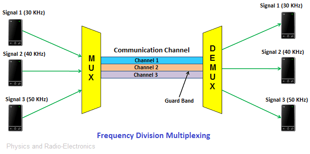
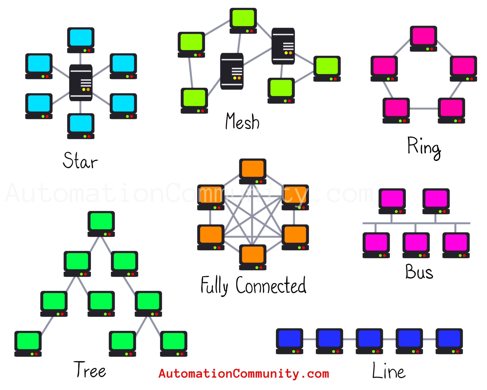
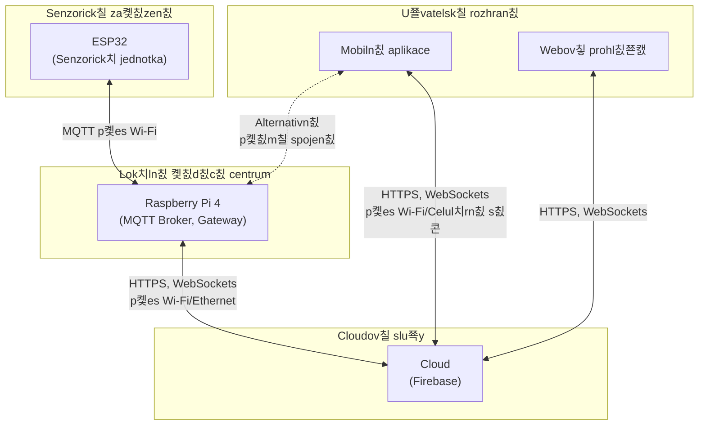

<div align="center" style="margin-top: 16px;">
    <strong>Ot치zka 4</strong>
</div>

<nav style="
    position: sticky;
    top: 0;
    z-index: 100;
    background: rgba(0,0,0,0.8);
    padding: 8px 0 4px 0;
    box-shadow: 0 2px 8px rgba(0,0,0,0.1);
    text-align: center;
">
    <a href="03.md" style="color:white; text-decoration:none; margin: 0 16px;">拘勇 P콏edchoz칤</a>
    <a href="../README.md" style="color:white; text-decoration:none; margin: 0 16px;">游 Dom콢</a>
    <a href="05.md" style="color:white; text-decoration:none; margin: 0 16px;">N치sleduj칤c칤 俱뫮잺</a>
</nav>

# S칤콘ov치 komunikace mezi za콏칤zen칤mi

<span style="background:#ffebee; color:#b71c1c; padding:2px 8px; border-radius:4px; font-weight:bold;">游댮 Kl칤캜ov치 ot치zka 2</span>

> [!TIP]Ot치zka
> Vyu쬴t칤 fyzick칳ch komponent po캜칤ta캜ov칳ch s칤t칤 (p콏enosov치 m칠dia a s칤콘ov치 za콏칤zen칤) v r치mci z치v캩re캜n칠 pr치ce; p콏enos sign치lu a komunikace v m칤stn칤 s칤ti (dr치tov칠 i bezdr치tov칠 s칤t캩); logick치 adresace za콏칤zen칤; principy sm캩rov치n칤 datov칳ch zpr치v콢; volba protokolu transportn칤 vrstvy (TCP, UDP)

---

## 1. 칔vod do po캜칤ta캜ov칳ch s칤t칤

Po캜칤ta캜ov칠 s칤t캩 p콏edstavuj칤 soubor za콏칤zen칤, kter치 jsou vz치jemn캩 propojena za 칰캜elem sd칤len칤 dat a zdroj콢. V modern칤ch aplikac칤ch, v캜etn캩 IoT syst칠m콢, je s칤콘ov치 komunikace z치sadn칤 pro p콏enos dat mezi r콢zn칳mi komponentami.

### 1.1 Z치kladn칤 koncepty

- **S칤콘**: Propojen칤 dvou nebo v칤ce za콏칤zen칤 umo쮄갓j칤c칤 v칳m캩nu informac칤
- **Komunika캜n칤 protokol**: Soubor pravidel pro komunikaci mezi za콏칤zen칤mi
- **Referen캜n칤 model ISO/OSI**: Sedmivrstv칳 model popisuj칤c칤 s칤콘ovou komunikaci
- **Model TCP/IP**: Zjednodu코en칳 캜ty콏vrstv칳 model prakticky implementuj칤c칤 s칤콘ovou komunikaci
  


## 2. Fyzick치 vrstva s칤콘ov칠 komunikace

Fyzick치 vrstva se zab칳v치 p콏enosem bit콢 p콏es fyzick칠 m칠dium a definuje elektrick칠, mechanick칠 a funk캜n칤 specifikace pro aktivaci, udr쬺v치n칤 a deaktivaci fyzick칠ho spojen칤.

### 2.1 P콏enosov치 m칠dia

### 2.1.1 Metalick치 veden칤

- **Kroucen치 dvojlinka (Twisted Pair)**:
    - **UTP (Unshielded Twisted Pair)**: Bez st칤n캩n칤, n치chyln캩j코칤 k ru코en칤
    - **STP (Shielded Twisted Pair)**: Se st칤n캩n칤m pro vy코코칤 odolnost proti ru코en칤
    - **Kategorie**: Cat 5e (1 Gbps), Cat 6 (a 10 Gbps), Cat 6a, Cat 7, Cat 8
    - **Vyu쬴t칤**: Ethernet v lok치ln칤ch s칤t칤ch, strukturovan치 kabel치 v budov치ch
- **Koaxi치ln칤 kabel**:
    - St콏edn칤 vodi캜 obklopen칳 dielektrikem a vn캩j코칤m vodiv칳m st칤n캩n칤m
    - Vy코코칤 odolnost proti elektromagnetick칠 interferenci
    - **Vyu쬴t칤**: CATV (kabelov치 televize), star코칤 s칤t캩 10BASE2, 10BASE5

### 2.1.2 Optick치 veden칤


- **Principy**: P콏enos dat pomoc칤 sv캩teln칳ch pulz콢 v optick칳ch vl치knech
- **Typy vl치ken**:
    - **Jednovidov치 (Single-mode)**: Ten캜칤 j치dro, dlouh칠 vzd치lenosti, vy코코칤 cena
    - **Mnohovidov치 (Multi-mode)**: 말r코칤 j치dro, krat코칤 vzd치lenosti, ni쮄뫆 cena
- **V칳hody**: Vysok치 p콏enosov치 rychlost, imunita v콢캜i elektromagnetick칠mu ru코en칤, del코칤 dosah
- **Vyu쬴t칤**: P치te콏n칤 s칤t캩, datov치 centra, d치lkov칠 spoje

### 2.1.3 Bezdr치tov치 m칠dia

- **R치diov칠 vlny**:
    - R콢zn치 frekven캜n칤 p치sma pro r콢zn칠 aplikace
    - **Wi-Fi**: 2,4 GHz a 5 GHz p치sma, standardy IEEE 802.11
    - **Bluetooth**: 2,4 GHz p치smo, kr치tk칳 dosah, n칤zk치 spot콏eba energie
    - **Celul치rn칤 s칤t캩**: 2G-5G, rozs치hl칠 pokryt칤
    - **LPWAN**: LoRaWAN, Sigfox, NB-IoT pro IoT aplikace
- **Infra캜erven칠 z치콏en칤**:
    - Vy쬬duje p콏칤mou viditelnost
    - Omezen칳 dosah
    - **Vyu쬴t칤**: D치lkov치 ovl치d치n칤, n캩kter칠 pr콢myslov칠 aplikace

TODO: Vlo쬴t tabulku srovn치vaj칤c칤 p콏enosov칠 rychlosti, maxim치ln칤 vzd치lenosti a typick칠 vyu쬴t칤 r콢zn칳ch p콏enosov칳ch m칠di칤

### 2.2 Principy p콏enosu sign치lu

### 2.2.1 Analogov칳 vs.맋igit치ln칤 p콏enos


- **Analogov칳 p콏enos**: Kontinu치ln칤 sign치l, n치chyln캩j코칤 k ru코en칤 a degradaci
- **Digit치ln칤 p콏enos**: Diskr칠tn칤 hodnoty (0 a 1), vy코코칤 odolnost proti ru코en칤, mo쬹ost detekce a opravy chyb

### 2.2.2 Modula캜n칤 techniky


- **Amplitudov치 modulace (AM)**: Zm캩na amplitudy nosn칠 vlny
- **Frekven캜n칤 modulace (FM)**: Zm캩na frekvence nosn칠 vlny
- **F치zov치 modulace (PM)**: Zm캩na f치ze nosn칠 vlny
- **Kvadraturn칤 amplitudov치 modulace (QAM)**: Kombinace amplitudov칠 a f치zov칠 modulace

### 2.2.3 Multiplexov치n칤


- **Frekven캜n칤 multiplexov치n칤 (FDM)**: Rozd캩len칤 frekven캜n칤ho p치sma mezi v칤ce kan치l콢
- **캛asov칠 multiplexov치n칤 (TDM)**: St콏칤d치n칤 p콏enosu dat z r콢zn칳ch zdroj콢 v 캜ase
- **Vlnov칠 multiplexov치n칤 (WDM)**: P콏enos v칤ce sign치l콢 r콢zn칳mi vlnov칳mi d칠lkami v optick칳ch vl치knech



### 2.3 Fyzick치 topologie s칤t칤

- **Sb캩rnicov치 (Bus)**: Za콏칤zen칤 p콏ipojena k jednomu sd칤len칠mu m칠diu
- **Hv캩zdicov치 (Star)**: Za콏칤zen칤 p콏ipojena k centr치ln칤mu uzlu
- **Kruhov치 (Ring)**: Za콏칤zen칤 tvo콏칤 uzav콏en칳 kruh
- **Mesh (Pln캩 propojen치)**: Ka쬯칠 za콏칤zen칤 propojeno s ka쬯칳m jin칳m za콏칤zen칤m
- **Hybridn칤**: Kombinace r콢zn칳ch topologi칤



## 3. S칤콘ov치 za콏칤zen칤

### 3.1 Aktivn칤 s칤콘ov칠 prvky

- **Opakova캜 (Repeater)**: Zesiluje sign치l pro p콏ekon치n칤 v캩t코칤ch vzd치lenost칤
- **Rozbo캜ova캜 (Hub)**: Propojuje v칤ce za콏칤zen칤, sd칤l칤 코칤콏ku p치sma
- **P콏ep칤na캜 (Switch)**: Inteligentn칤 propojen칤 za콏칤zen칤, sm캩rov치n칤 na z치klad캩 MAC adres
- **Sm캩rova캜 (Router)**: Propojen칤 s칤t칤, sm캩rov치n칤 na z치klad캩 IP adres
- **Br치na (Gateway)**: Propojen칤 r콢zn칳ch typ콢 s칤t칤 nebo protokol콢
- **Access Point**: Bezdr치tov칳 p콏칤stupov칳 bod pro p콏ipojen칤 k s칤ti

### 3.2 Pasivn칤 s칤콘ov칠 prvky

- **Kabely**: P콏enosov치 m칠dia
- **Konektory**: RJ-45, LC/SC (optika), atd.
- **Patch panely**: Propojovac칤 panely pro strukturovanou kabel치
- **Racky**: Sk콏칤n캩 pro um칤st캩n칤 aktivn칤ch prvk콢
- **Z치suvky**: S칤콘ov칠 z치suvky v m칤stnostech

### 3.3 Fyzick칠 charakteristiky p콏ep칤na캜콢 a sm캩rova캜콢

- **Porty**: Po캜et a typ (RJ-45, SFP, SFP+)
- **Propustnost**: Celkov치 kapacita p콏enosu dat
- **Latence**: Zpo쬯캩n칤 p콏i zpracov치n칤 paket콢
- **Power over Ethernet (PoE)**: Schopnost nap치jet za콏칤zen칤 p콏es ethernetov칳 kabel
- **Managementov칠 mo쬹osti**: Konfigurace p콏es CLI, webov칠 rozhran칤, SNMP

## 4. Linkov치 vrstva

Linkov치 vrstva zaji코콘uje spolehliv칳 p콏enos dat mezi p콏칤mo propojen칳mi za콏칤zen칤mi a 콏e코칤 p콏칤stup k m칠diu.

### 4.1 MAC adresy

- **Definice**: Jedine캜n칳 identifik치tor s칤콘ov칠ho za콏칤zen칤 na linkov칠 vrstv캩
- **Form치t**: 48-bitov치 adresa, zapisovan치 jako 코est dvojic hexadecim치ln칤ch 캜칤slic (nap콏. 00:1A:2B:3C:4D:5E)
- **OUI (Organizationally Unique Identifier)**: Prvn칤 t콏i bajty identifikuj칤 v칳robce
- **Broadcast adresa**: FF:FF:FF:FF:FF:FF

### 4.2 P콏칤stupov칠 metody k m칠diu

- **CSMA/CD (Carrier Sense Multiple Access with Collision Detection)**:
    - Vyu쮂셨an치 v Ethernetu
    - Za콏칤zen칤 naslouch치 p콏ed vys칤l치n칤m
    - Detekuje kolize a za콏칤d칤 opakovan칳 p콏enos
- **CSMA/CA (Carrier Sense Multiple Access with Collision Avoidance)**:
    - Vyu쮂셨an치 v bezdr치tov칳ch s칤t칤ch (Wi-Fi)
    - Sna쮂 se p콏edch치zet koliz칤m
- **Token Ring**: P콏칤stup 콏칤zen p콏ed치v치n칤m tokenu

### 4.3 Ethernet

- **Standardy**: IEEE 802.3
- **Rychlosti**: 10 Mbps, 100 Mbps (Fast Ethernet), 1 Gbps (Gigabit Ethernet), 10 Gbps, 40 Gbps, 100 Gbps
- **R치mec**: Struktura obsahuj칤c칤 hlavi캜ku, data a kontroln칤 sou캜et


### 4.4 Wi-Fi (IEEE 802.11)

- **Standardy**: 802.11a/b/g/n/ac/ax/be
- **Frekvence**: 2,4 GHz a 5 GHz p치sma, nov캩 6 GHz (Wi-Fi 6E)
- **Rychlosti**: Od jednotek Mbps a po jednotky Gbps
- **Zabezpe캜en칤**: WEP, WPA, WPA2, WPA3

## 5. S칤콘ov치 vrstva a logick치 adresace

### 5.1 IP adresace

### 5.1.1 IPv4

- **Form치t**: 32-bitov치 adresa rozd캩len치 do 캜ty콏 oktet콢 (nap콏. 192.168.1.1)
- **T콏칤dy adres**: A, B, C, D (multicast), E (experiment치ln칤)
- **Priv치tn칤 rozsahy**: 10.0.0.0/8, 172.16.0.0/12, 192.168.0.0/16
- **Speci치ln칤 adresy**: Loopback (127.0.0.1), broadcast (255.255.255.255)
- **CIDR (Classless Inter-Domain Routing)**: Z치pis pomoc칤 prefixu s칤t캩 (nap콏. 192.168.1.0/24)
- **Vy캜erp치n칤 adres**: Omezen칳 adresn칤 prostor vedouc칤 k nutnosti NAT a p콏echodu na IPv6

### 5.1.2 IPv6

- **Form치t**: 128-bitov치 adresa zapisovan치 jako osm skupin hexadecim치ln칤ch 캜칤slic (nap콏. 2001:0db8:85a3:0000:0000:8a2e:0370:7334)
- **Zkr치cen칳 z치pis**: Vynech치n칤 칰vodn칤ch nul a nahrazen칤 souvisl칳ch nulov칳ch blok콢 dvojit칳m dvojte캜kov칳m odd캩lova캜em
- **Typy adres**: Glob치ln칤 unicast, link-local, unik치tn칤 lok치ln칤, multicast
- **V칳hody**: Obrovsk칳 adresn칤 prostor, vestav캩n치 bezpe캜nost, automatick치 konfigurace

### 5.2 Sm캩rov치n칤

### 5.2.1 Principy sm캩rov치n칤

- **Sm캩rovac칤 tabulka**: Seznam c칤lov칳ch s칤t칤 a informac칤 o n치sleduj칤c칤m skoku
- **Metriky**: Krit칠ria pro v칳b캩r nejlep코칤 cesty (po캜et skok콢, 코칤콏ka p치sma, zpo쬯캩n칤)
- **Defaultn칤 br치na**: V칳choz칤 sm캩rova캜 pro komunikaci mimo lok치ln칤 s칤콘

### 5.2.2 Sm캩rovac칤 protokoly

- **IGP (Interior Gateway Protocols)**:
    - **RIP (Routing Information Protocol)**: Jednoduch칳, distance-vector, omezen칤 15 skok콢
    - **OSPF (Open Shortest Path First)**: Link-state, rychl치 konvergence, podporuje velk칠 s칤t캩
    - **EIGRP (Enhanced Interior Gateway Routing Protocol)**: Hybridn칤 protokol vyvinut칳 Ciscem
- **EGP (Exterior Gateway Protocols)**:
    - **BGP (Border Gateway Protocol)**: Standard pro sm캩rov치n칤 mezi autonomn칤mi syst칠my na internetu

### 5.2.3 Statick칠 vs.맋ynamick칠 sm캩rov치n칤

- **Statick칠 sm캩rov치n칤**: Manu치ln칤 konfigurace cest, vhodn칠 pro mal칠 s칤t캩
- **Dynamick칠 sm캩rov치n칤**: Automatick치 v칳m캩na informac칤 mezi sm캩rova캜i, adaptace na zm캩ny v s칤ti

Transportn칤 vrstva zaji코콘uje end-to-end komunikaci mezi procesy b캩쮂셖칤mi na koncov칳ch za콏칤zen칤ch a poskytuje mechanismy pro spolehliv칳 nebo nespolehliv칳 p콏enos dat.

### 6.1 TCP (Transmission Control Protocol)

- **Charakteristika**: Spojov캩 orientovan칳, spolehliv칳 protokol
- **Nav치z치n칤 spojen칤**: Three-way handshake (SYN, SYN-ACK, ACK)
- **콎칤zen칤 toku**: Zaji코t캩n칤, 쬰 odes칤latel nezahlcuje p콏칤jemce
- **콎칤zen칤 zahlcen칤**: Adaptace na podm칤nky v s칤ti
- **Potvrzov치n칤**: Potvrzov치n칤 p콏ijat칳ch segment콢 a op캩tovn칠 vys칤l치n칤 ztracen칳ch
- **Porty**: 16-bitov칠 캜칤slo identifikuj칤c칤 aplikaci (0-65535)
- **Hlavi캜ka**: 20-60 bajt콢


### 6.1.1 Mechanismy TCP

- **Posouvaj칤c칤 se okno (Sliding Window)**: Efektivn칤 vyu쬴t칤 코칤콏ky p치sma
- **Op캩tovn칠 vys칤l치n칤 (Retransmission)**: P콏i ztr치t캩 nebo po코kozen칤 segmentu
- **Sekven캜n칤 캜칤sla**: Zaji코t캩n칤 spr치vn칠ho po콏ad칤 doru캜en칤
- **Kontroln칤 sou캜et**: Detekce po코kozen칤 dat


### 6.2 UDP (User Datagram Protocol)

- **Charakteristika**: Nespojov캩 orientovan칳, nespolehliv칳 protokol
- **V칳hody**: N칤zk치 re쬴e, minim치ln칤 zpo쬯캩n칤
- **Nev칳hody**: Bez z치ruky doru캜en칤, po콏ad칤 a deduplikace
- **Hlavi캜ka**: Pouze 8 bajt콢
- **Vhodn칠 aplikace**: Streamov치n칤 m칠di칤, online hry, DNS dotazy


### 6.3 Porty a sockety

- **Porty**: Identifikuj칤 aplikace nebo slu쬭y na za콏칤zen칤
    - **Dob콏e zn치m칠 porty (Well-known ports)**: 0-1023
    - **Registrovan칠 porty**: 1024-49151
    - **Dynamick칠/priv치tn칤 porty**: 49152-65535
    - **P콏칤klady**: HTTP (80), HTTPS (443), SSH (22), MQTT (1883/8883)
- **Socket**: Kombinace IP adresy a portu identifikuj칤c칤 konkr칠tn칤 koncov칳 bod komunikace

## 7. Aplika캜n칤 protokoly

### 7.1 HTTP/HTTPS

- **HTTP**: Hypertext Transfer Protocol pro p콏enos webov칳ch str치nek
- **HTTPS**: Zabezpe캜en치 verze vyu쮂셨aj칤c칤 SSL/TLS
- **Metody**: GET, POST, PUT, DELETE, atd.
- **Stavov칠 k칩dy**: 200 OK, 404 Not Found, 500 Internal Server Error, atd.

### 7.2 DNS (Domain Name System)

- **칔캜el**: P콏eklad dom칠nov칳ch jmen na IP adresy
- **Hierarchick칳 syst칠m**: Ko콏enov칠 servery, TLD servery, autoritativn칤 servery
- **Rekurzivn칤 vs.말terativn칤 dotazy**: Zp콢soby z칤sk치v치n칤 odpov캩di

### 7.3 DHCP (Dynamic Host Configuration Protocol)

- **칔캜el**: Automatick치 konfigurace s칤콘ov칳ch parametr콢
- **Proces**: Discover, Offer, Request, Acknowledge (DORA)
- **P콏id캩lovan칠 informace**: IP adresa, maska pods칤t캩, v칳choz칤 br치na, DNS servery

### 7.4 MQTT (Message Queuing Telemetry Transport)

- **Charakteristika**: Lehk칳 publish-subscribe protokol ide치ln칤 pro IoT
- **Kvalita slu쬭y (QoS)**: 칔rovn캩 0, 1, 2
- **T칠mata (Topics)**: Hierarchick치 struktura pro organizaci zpr치v
- **Broker**: Centr치ln칤 komponenta zprost콏edkuj칤c칤 v칳m캩nu zpr치v

## 8. Zabezpe캜en칤 s칤콘ov칠 komunikace

### 8.1 말frov치n칤

- **Symetrick칠**: Stejn칳 kl칤캜 pro 코ifrov치n칤 i de코ifrov치n칤 (AES, DES)
- **Asymetrick칠**: Ve콏ejn칳 a soukrom칳 kl칤캜 (RSA, ECC)
- **Hashovac칤 funkce**: Jednosm캩rn칠 funkce pro integritu dat (SHA, MD5)

### 8.2 VPN (Virtual Private Network)

- **칔캜el**: Zabezpe캜en칠 p콏ipojen칤 p콏es nezabezpe캜enou s칤콘
- **Protokoly**: IPsec, SSL/TLS, OpenVPN, WireGuard
- **Typy**: Site-to-site VPN, Remote-access VPN

### 8.3 Firewall a IDS/IPS

- **Firewall**: Filtrov치n칤 s칤콘ov칠ho provozu na z치klad캩 pravidel
- **IDS (Intrusion Detection System)**: Detekce neautorizovan칳ch aktivit
- **IPS (Intrusion Prevention System)**: Aktivn칤 blokov치n칤 hrozeb

## 9. S칤콘ov치 komunikace v hydroponick칠m syst칠mu

### 9.1 P콏ehled s칤콘ov칠 architektury syst칠mu

V r치mci automatizovan칠ho hydroponick칠ho syst칠mu je implementov치na v칤cevrstv치 s칤콘ov치 architektura zaji코콘uj칤c칤 efektivn칤 komunikaci mezi v코emi komponentami:



### 9.2 Fyzick치 a linkov치 vrstva

### 9.2.1 P콏enosov치 m칠dia a technologie

- **Wi-Fi (IEEE 802.11b/g/n)**:
    - Bezdr치tov칠 propojen칤 ESP32 s Raspberry Pi
    - Frekvence 2,4 GHz pro lep코칤 prostupnost p콏ek치쬶ami
    - Rychlost p콏ipojen칤 a 150 Mbps (dostate캜n칠 pro datov칳 tok senzor콢)
    - Zabezpe캜en칤 WPA2-PSK
- **Ethernet**:
    - Voliteln칠 dr치tov칠 p콏ipojen칤 Raspberry Pi do lok치ln칤 s칤t캩
    - Standard 1000BASE-T (Gigabit Ethernet)
    - Vy코코칤 spolehlivost a stabilita p콏ipojen칤 pro br치nu

### 9.2.2 Topologie s칤t캩

- **Hv캩zdicov치 topologie** s Raspberry Pi jako centr치ln칤m uzlem
- Z치lohov치n칤 spojen칤 mezi ESP32 a Raspberry Pi p콏i v칳padku Wi-Fi:
    - Lok치ln칤 buffer na ESP32 pro do캜asn칠 ukl치d치n칤 dat
    - Automatick칠 obnoven칤 p콏enosu po znovunav치z치n칤 spojen칤

### 9.3 S칤콘ov치 a transportn칤 vrstva

### 9.3.1 IP adresace

- **Lok치ln칤 s칤콘**:
    - IPv4 adresace v priv치tn칤m rozsahu 192.168.x.x
    - DHCP pro dynamick칠 p콏id캩lov치n칤 adres za콏칤zen칤m
    - Rezervace IP adresy pro Raspberry Pi (nap콏. 192.168.1.10) pro stabiln칤 konfiguraci
- **Vzd치len칳 p콏칤stup**:
    - Mo쬹ost pevn칠 ve콏ejn칠 IP adresy pro p콏칤m칳 p콏칤stup
    - Alternativn캩 vyu쬴t칤 DDNS (Dynamic DNS) pro p콏칤stup p콏es dom칠nov칠 jm칠no
    - Port forwarding na sm캩rova캜i pro p콏esm캩rov치n칤 po쬬davk콢 na Raspberry Pi

### 9.3.2 Volba transportn칤ch protokol콢

- **TCP**:
    - Pou쬴to pro konfigura캜n칤 p콏칤kazy vy쬬duj칤c칤 potvrzen칤
    - SSH p콏ipojen칤 k Raspberry Pi pro vzd치lenou spr치vu
    - HTTPS komunikace s Firebase a webov칳m rozhran칤m
- **UDP**:
    - Vyu쬴t칤 pro nekritick칠 datov칠 toky ze senzor콢, kde je p콏ijateln치 ob캜asn치 ztr치ta paketu
    - Ni쮄뫆 re쬴e pro p콏enos velk칠ho mno쬽tv칤 senzorick칳ch dat

### 9.4 Aplika캜n칤 protokoly

### 9.4.1 MQTT (Message Queuing Telemetry Transport)

MQTT byl zvolen jako prim치rn칤 protokol pro komunikaci mezi ESP32 a Raspberry Pi z n치sleduj칤c칤ch d콢vod콢:

- **Lehk칳 protokol** s minim치ln칤mi n치roky na hardware a s칤콘ovou kapacitu
- **Publish-subscribe model** umo쮄갓j칤c칤 efektivn칤 distribuci dat mezi v칤ce odb캩rateli
- **Kvalita slu쬭y (QoS)** na t콏ech 칰rovn칤ch:
    - QoS 0 (At most once) pro b캩쬹치 senzorick치 data
    - QoS 1 (At least once) pro d콢le쬴t캩j코칤 콏칤dic칤 data
    - QoS 2 (Exactly once) pro kritick칠 konfigura캜n칤 zm캩ny
- **Struktura t칠mat (topics)**:
    
    ```
    hydroponics/[unit_id]/sensors/temperature
    hydroponics/[unit_id]/sensors/humidity
    hydroponics/[unit_id]/sensors/ph
    hydroponics/[unit_id]/sensors/tds
    hydroponics/[unit_id]/sensors/water_level
    hydroponics/[unit_id]/sensors/light
    hydroponics/[unit_id]/actuators/pump
    hydroponics/[unit_id]/actuators/light
    hydroponics/[unit_id]/system/status
    ```
    
- **Mosquitto MQTT Broker** b캩쮂셖칤 na Raspberry Pi:
    - Autentizace pomoc칤 u쬴vatelsk칠ho jm칠na a hesla
    - TLS 코ifrov치n칤 pro zabezpe캜en칤 komunikace
    - Perzistence zpr치v pro uchov치n칤 kritick칳ch dat p콏i restartu

TODO: Vlo쬴t diagram zn치zor켿uj칤c칤 strukturu MQTT t칠mat a sm캩r toku dat

### 9.4.2 RESTful API a Firebase SDK

Pro komunikaci mezi Raspberry Pi, mobiln칤 aplikac칤 a webov칳m rozhran칤m je vyu쬴ta kombinace:

- **Firebase Realtime Database API**:
    - WebSockets pro real-time aktualizace dat
    - JSON struktura pro ukl치d치n칤 a synchronizaci dat
    - Autentizace pomoc칤 Firebase Authentication
- **RESTful API** na Raspberry Pi:
    - Endpointy pro manu치ln칤 콏칤zen칤 a konfiguraci
    - JSON form치t pro v칳m캩nu dat
    - JWT (JSON Web Tokens) pro autentizaci po쬬davk콢

### 9.5 콎e코en칤 s칤콘ov칳ch v칳zev v projektu

### 9.5.1 Zaji코t캩n칤 spolehlivosti

- **Offline re쬴m ESP32**:
    - Lok치ln칤 buffer pro ukl치d치n칤 dat p콏i v칳padku spojen칤
    - Automatick치 resynchronizace po obnoven칤 spojen칤
    - NTP synchronizace 캜asu pro spr치vn칠 캜asov칠 zna캜ky dat
- **Redundance p콏ipojen칤 Raspberry Pi**:
    - Prim치rn칤 p콏ipojen칤 p콏es Ethernet
    - Z치lo쬹칤 p콏ipojen칤 p콏es Wi-Fi
    - Mo쬹ost 4G/LTE modemu jako druh칠 z치lohy

### 9.5.2 Optimalizace p콏enosu dat

- **Agregace dat**:
    - Odes칤l치n칤 d치vek m캩콏en칤 nam칤sto jednotliv칳ch hodnot
    - Komprese dat pro sn칤쬰n칤 objemu p콏enosu
    - Variabiln칤 frekvence m캩콏en칤 podle d콢le쬴tosti parametru
- **Filtrov치n칤 na hran캩**:
    - P콏edb캩쬹칠 zpracov치n칤 dat na ESP32
    - Odes칤l치n칤 pouze signifikantn칤ch zm캩n hodnot
    - Prahov칠 hodnoty pro detekci anom치li칤

### 9.5.3 Zabezpe캜en칤 komunikace

- **Zabezpe캜en칤 MQTT**:
    - TLS 코ifrov치n칤 (port 8883)
    - U쬴vatelsk칠 jm칠no a heslo pro autentizaci
    - ACL (Access Control List) pro 콏칤zen칤 p콏칤stupu k t칠mat콢m
- **Zabezpe캜en칤 webov칠 a mobiln칤 aplikace**:
    - HTTPS pro v코echnu komunikaci
    - Firebase Authentication pro spr치vu p콏칤stupu
    - JWT pro API autorizaci
- **Zabezpe캜en칤 lok치ln칤 s칤t캩**:
    - Odd캩len치 VLAN pro IoT za콏칤zen칤
    - Filtrov치n칤 MAC adres na Wi-Fi
    - Firewall pravidla omezuj칤c칤 komunikaci pouze na pot콏ebn칠 protokoly a porty

### 9.6 Monitoring a diagnostika s칤콘ov칠 komunikace

- **Logging na Raspberry Pi**:
    - Zaznamen치v치n칤 v코ech komunika캜n칤ch ud치lost칤
    - Detekce a notifikace p콏i abnormalit치ch
    - Rotace log콢 pro efektivn칤 spr치vu 칰lo쬴코t캩
- **Vizualizace s칤콘ov칳ch metrik**:
    - Grafick칠 zobrazen칤 latence, ztr치tovosti paket콢 a propustnosti
    - Historick칠 trendy pro identifikaci postupn칠 degradace
    - Alerting p콏i p콏ekro캜en칤 definovan칳ch prahov칳ch hodnot
- **Vzd치len치 diagnostika**:
    - SSH p콏칤stup pro p콏칤mou spr치vu syst칠mu
    - MQTT t칠ma pro diagnostick칠 p콏칤kazy
    - Automatick칠 reportov치n칤 stavu za콏칤zen칤

TODO: Vlo쬴t uk치zku dashboardu pro monitoring s칤콘ov칠 komunikace

### 10.1 맒치lov치n칤 syst칠mu

- **Mesh s칤콘 ESP32 za콏칤zen칤**:
    - ESP-MESH pro vytvo콏en칤 samoorganizuj칤c칤 se s칤t캩
    - Roz코칤콏en칤 dosahu bez dodate캜n칳ch p콏칤stupov칳ch bod콢
    - Automatick칠 sm캩rov치n칤 dat p콏es uzly s칤t캩
- **Distribuovan치 architektura**:
    - V칤ce Raspberry Pi jednotek pro v캩t코칤 instalace
    - Synchronizace dat mezi jednotkami
    - Load balancing pro optim치ln칤 vyu쬴t칤 zdroj콢

### 10.2 Integrace pokro캜il칳ch s칤콘ov칳ch technologi칤

- **Edge computing**:
    - P콏esun v칤ce v칳po캜etn칤ch operac칤 na ESP32
    - ML modely pro predikci r콢stu rostlin b캩쮂셖칤 na hran캩
    - Redukce objemu p콏en치코en칳ch dat d칤ky lok치ln칤mu zpracov치n칤
- **5G konektivita**:
    - Vy코코칤 rychlost a ni쮄뫆 latence
    - Network slicing pro garantovanou kvalitu slu쬭y
    - P콏ipojen칤 velk칠ho po캜tu za콏칤zen칤 v hust칳ch instalac칤ch

### 10.3 Interoperabilita s dal코칤mi syst칠my

- **Standardizovan칠 API**:
    - OpenAPI specifikace pro dokumentaci a testov치n칤
    - Webhook integrace pro notifikace extern칤m syst칠m콢m
    - OAuth 2.0 pro bezpe캜nou autorizaci t콏et칤ch stran
- **IoT platformy**:
    - Integrace s AWS IoT, Azure IoT Hub nebo Google IoT Core
    - Vyu쬴t칤 pokro캜il칳ch analytick칳ch n치stroj콢 cloudov칳ch platforem
    - Glob치ln칤 코k치lovatelnost pro komer캜n칤 nasazen칤

## 11. Z치v캩r

S칤콘ov치 komunikace je kritickou komponentou modern칤ch IoT 콏e코en칤, v캜etn캩 automatizovan칠ho hydroponick칠ho syst칠mu. Spr치vn캩 navr쬰n치 s칤콘ov치 architektura zaji코콘uje efektivn칤 a bezpe캜n칳 tok dat mezi senzorick칳mi jednotkami, 콏칤dic칤m syst칠mem a u쬴vatelsk칳mi rozhran칤mi.

V r치mci implementovan칠ho hydroponick칠ho syst칠mu byla zvolena kombinace Wi-Fi p콏ipojen칤, MQTT protokolu a Firebase cloudov칳ch slu쬰b, kter치 poskytuje vyv치쬰n칳 pom캩r mezi spolehlivost칤, v칳konem a slo쬴tost칤 implementace. D칤ky t칠to architektu콏e je mo쬹칠 sb칤rat data ze v코ech senzor콢 v re치ln칠m 캜ase, ukl치dat je pro pozd캩j코칤 anal칳zu a z치rove켿 poskytovat u쬴vatel콢m intuitivn칤 p콏칤stup skrze mobiln칤 a webovou aplikaci.

Kl칤캜ov칳m aspektem 콏e코en칤 je robustnost proti v칳padk콢m, zabezpe캜en칤 komunikace a optimalizace datov칳ch tok콢, co zaji코콘uje dlouhodobou stabilitu a 코k치lovatelnost cel칠ho syst칠mu.