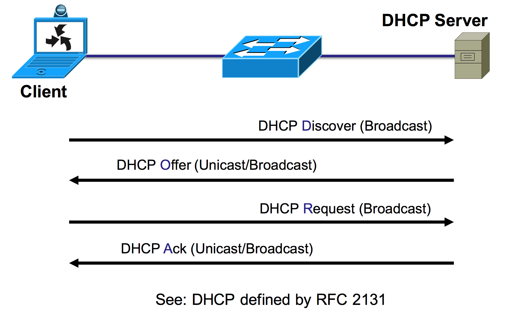
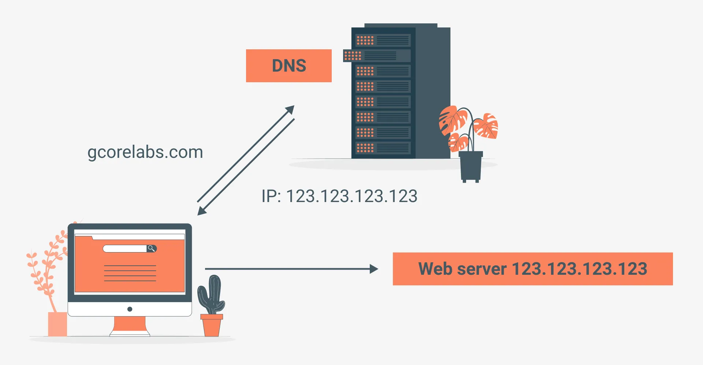
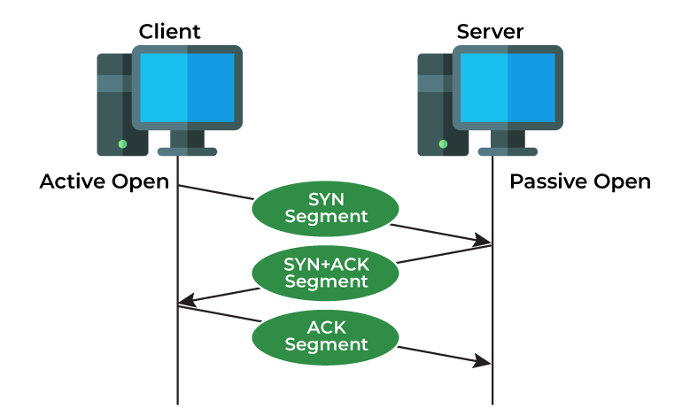
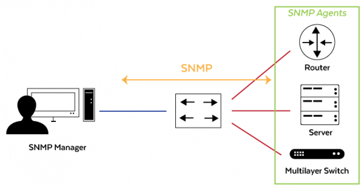
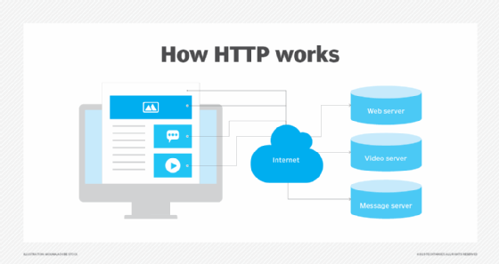
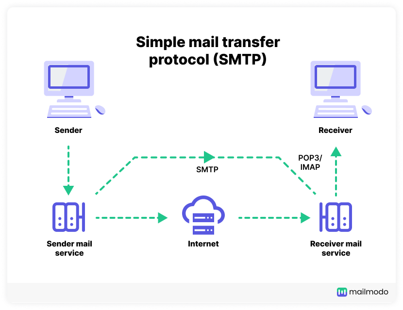
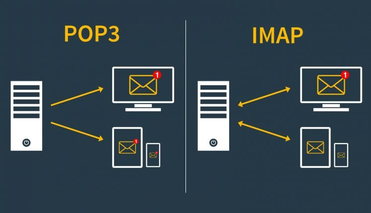
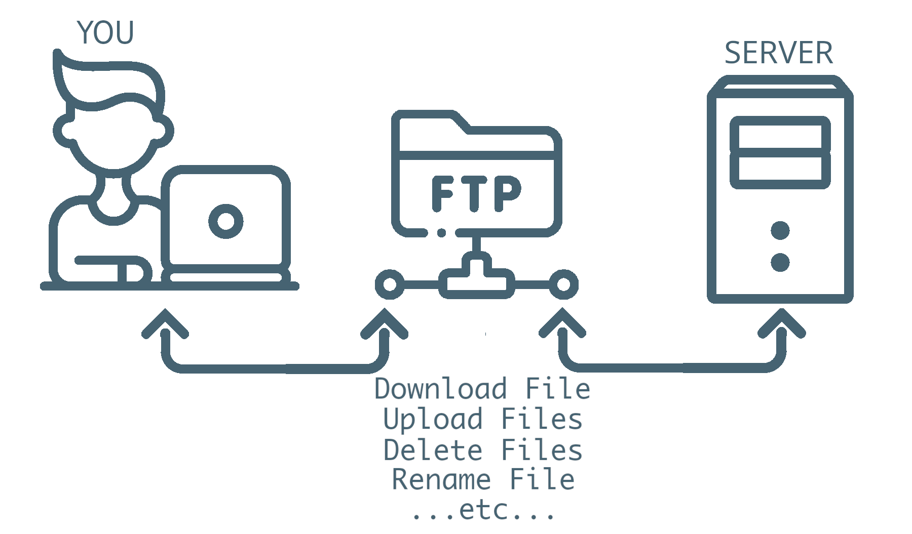

<div align="center" style="margin-top: 16px;">
    <strong>Otázka 5</strong>
</div>

<nav style="
    position: sticky;
    top: 0;
    z-index: 100;
    background: rgba(0,0,0,0.8);
    padding: 8px 0 4px 0;
    box-shadow: 0 2px 8px rgba(0,0,0,0.1);
    text-align: center;
">
    <a href="04.md" style="color:white; text-decoration:none; margin: 0 16px;">⬅️ Předchozí</a>
    <a href="../README.md" style="color:white; text-decoration:none; margin: 0 16px;">🏠 Domů</a>
    <a href="06.md" style="color:white; text-decoration:none; margin: 0 16px;">Následující ➡️</a>
</nav>

# Aplikační protokoly pro síťovou komunikaci

**Otázka:** Využití aplikačních protokolů pro web, e-mail, přenos souborů, vzdálený přístup aj. včetně jejich zabezpečení; nastavení a vlastnosti protokolů DHCP, DNS a SNMP pro spolehlivou funkčnost koncových zařízení

---

# Aplikační protokoly pro síťovou komunikaci

## Úvod do aplikační vrstvy

Aplikační vrstva zajišťuje přístup k transportní vrstvě a poskytuje rozhraní služeb pro:

- Systémové aplikace
- Uživatelské aplikace

Hlavní funkcí aplikační vrstvy je poskytovat aplikacím přístup k síťovým službám, což umožňuje efektivní komunikaci v počítačové síti.

## Základní síťové protokoly

### DHCP (Dynamic Host Configuration Protocol)

**Funkce:** Automaticky přiděluje síťové parametry klientům  
**Komunikační model:** Klient-server  
**Transport:** UDP (Server: port 67, Klient: port 68)



**Přidělované parametry:**

- IP adresa
- Síťová maska
- Výchozí brána
- DNS servery
- Doménový suffix sítě
- NTP server pro synchronizaci času
- Doba platnosti přidělené adresy (lease time)

**Průběh DHCP komunikace:**

1. DHCP Discover - klient hledá DHCP server
2. DHCP Offer - server nabízí IP adresu a další parametry
3. DHCP Request - klient žádá o konkrétní nabídku
4. DHCP Acknowledge - server potvrzuje přidělení parametrů

### DNS (Domain Name System)

**Funkce:** Převádí doménová jména na IP adresy a naopak



### **Transportní protokoly:**

**UDP (User Datagram Protocol)**

- Používá se pro **většinu jednoduchých DNS dotazů**, protože je rychlejší a má nižší režii než TCP.
- Je **bezspojení (connectionless)** – neprovádí se žádné navazování spojení před odesláním dat.
- Nespolehlivý, ale **rychlý**.
- Maximální velikost UDP DNS odpovědi je **512 bajtů** (bez EDNS rozšíření).
- V DNS se používá pro dotazy jako `A`, `AAAA`, `CNAME`, `MX` apod.


**TCP (Transmission Control Protocol)**

- Používá se pro **složitější a větší přenosy**, např. **zónové přenosy (zone transfer)** mezi DNS servery (`AXFR`, `IXFR`).
- Je **spojenový (connection-oriented)** – navazuje spojení před odesláním dat.
- Poskytuje **spolehlivý přenos**, kontrolu chyb a zajišťuje doručení ve správném pořadí.
- DNS klient použije TCP, když:
    - odpověď je větší než 512 bajtů (nebo 4096 s EDNS0),
    - selže UDP dotaz,
    - probíhá zónový přenos.



**Porovnání TCP vs. UDP podle GeeksforGeeks:**

| Vlastnost | TCP | UDP |
| --- | --- | --- |
| Typ spojení | Spojený (connection-oriented) | Bezspojený (connectionless) |
| Spolehlivost | Ano (kontrola chyb, ztracených dat) | Ne (bez potvrzení doručení) |
| Rychlost | Pomalejší (větší režie) | Rychlejší (menší režie) |
| Použití v DNS | Zónové přenosy, velké odpovědi | Běžné dotazy |

**Port DNS:**

- DNS server (i klient) používá **port 53** pro oba protokoly (UDP i TCP).
- DNS klient obvykle nejprve zkouší UDP a pokud neuspěje, přechází na TCP.

**Struktura DNS:**

- Hierarchický systém doménových jmen
- Distribuovaná databáze
- Rekurzivní a iterativní vyhledávání

**Typy DNS záznamů:**

- A - mapování doménového jména na IPv4 adresu
- AAAA - mapování doménového jména na IPv6 adresu
- MX - záznam o mailovém serveru
- CNAME - alias pro jiné doménové jméno
- NS - autoritativní jmenný server pro doménu
- PTR - reverzní záznam (IP → doménové jméno)
- SOA - informace o autoritativní zóně

### SNMP (Simple Network Management Protocol)

**Funkce:** Správa a monitoring síťových zařízení  
**Transport:** TCP  
**Port:** 162



**Vlastnosti:**

- Monitoruje provoz v určitých uzlech
- Sbírá data prostřednictvím agentů
- Umožňuje vzdálené řízení síťových uzlů
- Podporuje automatické notifikace o problémech (trapy)

**Komponenty SNMP:**

- Manager - monitorovací stanice
- Agent - software na monitorovaném zařízení
- MIB (Management Information Base) - databáze řízených objektů

## Webové protokoly

### HTTP (Hypertext Transfer Protocol)

**Funkce:** Přenos webových stránek a dalšího obsahu  
**Komunikační model:** Klient-server  
**Transport:** TCP (novější verze také UDP - HTTP/3)  
**Port:** 80



**Struktura požadavku:**

```
<metoda> <URI> <verze protokolu HTTP>
<hlavičky>
<prázdný řádek>
<tělo zprávy>

```

**Struktura odpovědi:**

```
<verze protokolu> <stavový kód> <vysvětlující text>
<hlavičky>
<prázdný řádek>
<tělo zprávy>

```

**Metody HTTP:**

- GET - získání dat specifikovaných v URL
- HEAD - získání pouze hlaviček odpovědi
- POST - odeslání dat ke zpracování na server
- PUT - nahrání dat na server
- DELETE - odstranění specifikovaného zdroje
- OPTIONS - zjištění podporovaných metod
- PATCH - částečná modifikace zdroje

**Stavové kódy HTTP:**

- 1xx - informační zprávy
- 2xx - úspěšné zpracování (200 OK)
- 3xx - přesměrování
- 4xx - chyba klienta (404 Not Found)
- 5xx - chyba serveru (500 Internal Server Error)

**Implementace:**

- Servery: Apache, Nginx, Microsoft IIS
- Klienti: webové prohlížeče (Chrome, Firefox, Edge)

**Cookies:**

- Slouží k ukládání stavových informací mezi požadavky
- Uložená v lokálním adresáři
- Typy:
    - Session cookie - platná do zavření prohlížeče
    - Permanentní cookie - platná do nastaveného data expirace

### HTTPS (HTTP Secure)

**Funkce:** Zabezpečená verze HTTP  
**Transport:** TCP s šifrováním SSL/TLS  
**Port:** 443

**Zabezpečení:**

- Autentizace serveru pomocí certifikátů
- Volitelná autentizace klienta
- Šifrování komunikace
- Ochrana integrity dat

**Princip SSL/TLS:**

- SSL (Secure Socket Layer) - starší protokol
- TLS (Transport Layer Security) - modernější náhrada za SSL
- Využívají asymetrickou a symetrickou kryptografii
- Handshake pro ustanovení zabezpečeného spojení

## Emailové protokoly

### SMTP (Simple Mail Transfer Protocol)

**Funkce:** Odesílání emailových zpráv  
**Transport:** TCP  
**Port:**

- 25 (nezabezpečený)
- 465 (SSL)
- 587 (TLS)



**Vlastnosti:**

- Přenos zpráv mezi mail servery
- Odesílání zpráv z klientských programů
- Textový protokol s jednoduchými příkazy

### POP3 (Post Office Protocol v3)

**Funkce:** Stahování emailů ze serveru  
**Transport:** TCP  
**Port:**

- 110 (nezabezpečený)
- 995 (SSL/TLS)

**Vlastnosti:**

- Stahuje a následně maže zprávy ze serveru
- Neumožňuje složitou správu zpráv na serveru
- Vhodný pro offline čtení pošty

### IMAP (Internet Message Access Protocol)

**Funkce:** Přístup k emailovým zprávám  
**Transport:** TCP  
**Port:**

- 143 (nezabezpečený)
- 993 (SSL/TLS)

**Vlastnosti:**

- Umožňuje práci se zprávami přímo na serveru
- Podporuje složky a organizaci pošty
- Vhodný pro přístup z více zařízení
- Synchronizace stavu zpráv (přečtené, označené)
- Vhodný pro uživatele, kteří chtějí mít poštu dostupnou odkudkoliv a na více zařízeních



## Protokoly pro přenos souborů

### FTP (File Transfer Protocol)

**Funkce:** Přenos souborů mezi klientem a serverem  
**Transport:** TCP
**Port:**

- 21 (řídící spojení)
- 20 (datové spojení v aktivním režimu)



**Vlastnosti:**

- Autentizovaný přístup k souborovému systému
- Možnost anonymního přístupu
- Podpora různých typů přenosu (binární, ASCII)
- Práce se strukturou souborového systému (vytváření adresářů, mazání, přejmenování)

**Režimy přenosu:**

- Aktivní - server iniciuje datové spojení
- Pasivní - klient iniciuje datové spojení (vhodné při NAT)

### FTPS (FTP Secure)

**Funkce:** Zabezpečená verze FTP
**Transport:** TCP s SSL/TLS
**Port:**

- 990 (implicitní zabezpečení)
- 21 (explicitní zabezpečení)

**Vlastnosti:**

- Využívá původní FTP s přidanou vrstvou SSL/TLS
- Šifruje komunikaci včetně přihlašovacích údajů
- Různé porty pro datové přenosy

### SFTP (SSH File Transfer Protocol)

**Funkce:** Bezpečný přenos souborů přes SSH
**Transport:** TCP přes SSH
**Port:** 22 (stejný jako SSH)

**Vlastnosti:**

- Integrovaný v protokolu SSH
- Nepotřebuje více portů/spojení jako FTP
- Silné šifrování a autentizace
- Kompletní funkcionalita pro správu souborů

## Protokoly pro vzdálený přístup

### Telnet

**Funkce:** Vzdálený textový terminál
**Transport:** TCP
**Port:** 23

**Vlastnosti:**

- Nezabezpečený přenos dat
- Textová komunikace
- Historicky významný, dnes nahrazován SSH

### SSH (Secure Shell)

**Funkce:** Zabezpečený vzdálený přístup
**Transport:** TCP
**Port:** 22

**Vlastnosti:**

- Šifrovaná komunikace
- Silná autentizace (heslo, klíče)
- Kryptografická kontrola integrity dat
- Možnost tunelování jiných protokolů

**Bezpečnostní mechanismy:**

- Asymetrická kryptografie pro výměnu klíčů
- Symetrické šifrování pro přenos dat
- Digitální podpisy pro ověření identity
- Host-based a certificate-based autentizace

### RDP (Remote Desktop Protocol)

**Funkce:** Vzdálený grafický přístup
**Transport:** TCP
**Port:** 3389

**Vlastnosti:**

- Nativní podpora ve Windows
- Přenos grafického rozhraní
- Podpora přenosu zvuku, schránky a souborů
- Možnost šifrování a různých úrovní zabezpečení

## Zabezpečení aplikačních protokolů

### Obecné principy zabezpečení

- **Autentizace** - ověření identity komunikujících stran
- **Autorizace** - kontrola přístupových práv
- **Důvěrnost** - zajištění, že data nemohou číst neoprávněné osoby
- **Integrita** - zajištění, že data nebyla během přenosu změněna
- **Nepopiratelnost** - důkaz o původu dat

### Technologie zabezpečení

- **SSL/TLS** - zabezpečení na transportní vrstvě
- **IPsec** - zabezpečení na síťové vrstvě
- **Certifikáty X.509** - digitální certifikáty pro ověření identity
- **Kryptografie s veřejným klíčem** - asymetrické šifrování
- **Symetrické šifrování** - rychlé šifrování velkých objemů dat

### Běžné zranitelnosti

- Nezabezpečený přenos citlivých informací
- Slabá autentizace
- Cross-site scripting (XSS) a SQL injection
- Man-in-the-middle útoky
- Denial of Service (DoS)

## Správa sítě pomocí aplikačních protokolů

### SNMP a monitorování sítě

- Sběr statistik o síťovém provozu
- Detekce problémů v síti
- Generování upozornění při překročení prahových hodnot
- Dlouhodobé sledování trendů

### Centralizovaná správa síťových zařízení

- Hromadná konfigurace
- Správa aktualizací
- Analýza logů
- Automatizace rutinních úkonů

### Nástroje pro správu sítě

- SIEM (Security Information and Event Management)
- NMS (Network Management Systems)
- SDN (Software Defined Networking)