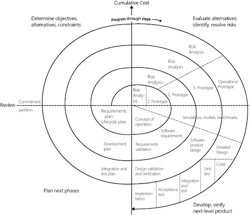
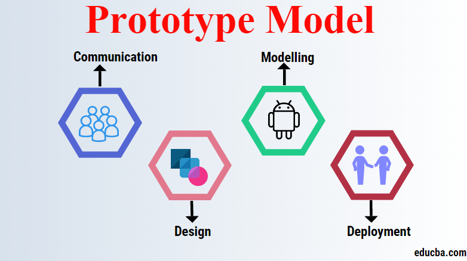
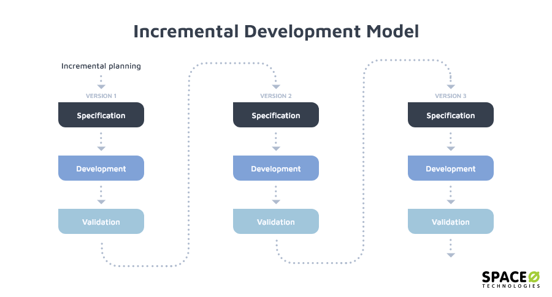

    <strong>Otázka 7</strong>

<nav style="
    position: sticky;
    top: 0;
    z-index: 100;
    background: rgba(0,0,0,0.8);
    padding: 8px 0 4px 0;
    box-shadow: 0 2px 8px rgba(0,0,0,0.1);
    text-align: center;
">
    <a href="06.md" style="color:white; text-decoration:none; margin: 0 16px;">⬅️ Předchozí</a>
    <a href="../README.md" style="color:white; text-decoration:none; margin: 0 16px;">🏠 Domů</a>
    <a href="08.md" style="color:white; text-decoration:none; margin: 0 16px;">Následující ➡️</a>
</nav>

# Životní cyklus informačního systému

🟡 Důležitá otázka 3  

[<kbd> 📄 PDF k této otázce](07.pdf)  

> [!TIP]Otázka
> Životní cyklus vývoje informačního systému; etapy vývoje a jejich obsah; modely životního cyklu (vodopád, spirála, iterativní a přírůstkový model, prototypování aj.)

---
Každý produkt/software by měl projít všemi fázemi životního cyklu. 
 
Životní cyklus se skládá: 
- specifikace problému  
- analýza 
- návrh 
- implementace 
- zavedení a testování, dokumentace 
- provoz, údržba, rozvoj produktu

## Modely životního cyklu

Modely určují postup při tvorbě softwaru. Popisují, jakým způsobem by měly být jednotlivé fáze cyklu realizovány. Zvolený model určuje manažer projektu (v závislosti i na charakteru týmu)

### Vodopád

U vodopádu je hlavníí myšlenkou nevracet se zpět. Držet danou posloupnost. Pokud se chci vrátit tak vše co následuje musím předělat. Fáze jsou prováděny v pořadí a žádné iterace 

Fáze:
- **definice problému** 
    - požadavky od zákazníků
    - výstupem je dokument Úvodní studie (základní a hrubý popis požadavků)
- **analýza a specifikace požadavků** 
    - zkoumání alternativních řešení, technická analýza. 
    - Tvoříme přesné poždavky na systém
- **návrh a tvorba architektury**
    - podle požadavků z analýzy tvoříme diagramy (když je potřeba tak wireframy), můžou to být i algoritmy, výpočty 
- **implementace**
    - návrh se převádí do kódu 
- **integrace a testování**
    - nasazení, různé typy testování podle typu systému
- **provoz a údržba, rozvoj produktu**
     - aktualizace podle potřeby

***Výhody***
- model je jednoduchý
- každá fáze má danou strukturu - co se během ní řeší
- důraz na dokumentaci 

***Nevýhody***
- testování je až po implementaci, což může být problém
- tento model není stavěný na velké změny během průběhu
- závislost na předchozích fázích

### Spirála
Oproti vodopádu přichází iterativní přístup - opakovaná a důsledná analýza rizik - v závislosti na výsledcích rizikových analýz se rpzhoduje o dalším postupu (náleží do skupiny tzv. přístupů řízených riziky)

Spirála svojí velikostí ukazuje časové a finanční náklady.

Spirála je kombinací vodopádového modelu a iterativního přístupu.

Cyklus je rozdělen do 4 hlavních částí: 
- Určení cílů, alternativ, omezení
- Vyhodnocení alternativ, identifikace a řešení rizik - analýza rizik, prototyp
- Vývoj a kontrola další úrovně produktu
- Plánování následujících fází

Tento cyklus se opakuje dokud není produkt hotový. Po každé fázi probíhá testování

 

***Výhody***

- iterativní přístup - rychlejší reakce na změny
- zaměření na rizika vkaždém cyklu - tím se snižuje šance na pravděpodobnost výskytu zásadních problémů
- vývojáři mohou pracovat velmi brzy
- cenové a časové odhady se v průběhu projektu stávají realističtějšími, protože důležité vlastnosti systému jsou objeveny brzy

***Nevýhody***

- složitější přístup než vodopád - vyžaduje zkušený tým, který dokáže identifikovat rizika
- tím že dost testujeme a plánujeme potřebujeme neustálou spolupráci zákazníků - není vhodný pro systémy vyvíjené na zakázku bez účasti budoucích uživatelů

### Prototyp

Prototyp je částečnou implementací produktu. Zaměřujeme se na funkcionalitu produktu - rychlé vytváření a testování funkčních prototypů produktu

Díky tomuto přístupu může zákazník vidět a interagovat s prototypem a poskytnout rychlou zpětnou vazbu - rychlejší iterace a zdokonalování 

Fáze: 

- sběr a analýze poždavků
- rychlý návrh
- vytvoření prototypu
- vyhodnocení prototypu zakazníkem
 - pokud není zákazník spokojen následuje fáze vylepšení návrhu prototypu a vracíme se zpět na rychlý návrh
- pokud je zákazník spokojen přechází se na specifikace systému
- návrh a implementace systému

***Výhody***
- rychlá a dobrá zpětná vazba od klientů - velká šance na spokojenost zákazníků
- nižší riziko na chyby
- nižší náklady

***Nevýhody***
- nehodí se na všechny typy projektů - pokud dokážeme určit jasnou specifikaci požadavků a není potřeba tolik diskutovat se zákazníky, je tento model zbytečný
- problém pokud zákazník není nikdy spokojen - strávení spousty času nad zdokonalování prototypu
- problém při špatné komunikaci se zákazníkem
  
### Iterativní přístup
Rozdělení fází životního cyklu na několik iterací (jedna iterace = malý vodopád). Každá fáze životního cyklu končí milníkem (schůzka a kontrola). Po schválení fáze se jde do další fáze

Fáze: 
- **počátek** - vize projektu, jeho rozsah systému a nákladů, porozumění požadavků, klíčové požadavky
- **elaborace** - funkční požadavky, use case, 
- **konstrukce** - průběžná budování funkcí (které jsou akceptované zákazníkem), milníkem je první (beta) verze systému v technickém prostředí
- **zavedení** - nasazení plně funkčního systému do prostředí zákazníka
  

***Výhody***
- Spolupráce s uživateli v průběhu celého projektu - vyšší komunikace s klientem i v týmu
- Snazší zapracování změn požadavků - flexibilita

***Nevýhody***
- Horší předvídatelnost kvůli změnám za pochodu
- Vyšší časová náročnost kvůli častější komunikaci
- Náročna implementace na novém pracovišti (relativně dlouho trvá než si na to všichni zvyknou)

### Iterativní vývoj vs inkrementální

Iterativní = Kroky směřující k vylepšení, zpřesnění nebo opravení části systému. 

Inkrementální = Jednotlivé části systému (přírůstky, inkrementy) vytváříme „nezávisle“ na zbytku a pak integrujeme. Vývoj jednotlivých přírůstků může probíhat iterativně, vodopádem, XP ...

Iterativní sice nevyžaduje inkrementální vývoj, ale velmi dobře s ním funguje a mnoho autorů pod pojmem iterativní vývoj zároveň předpokládá i inkrementální

## Metodika
model = více abstraktní, teoretický rámec, který říká jakým způsobem se provádí fáze životního cyklu

metodika = detailní a praktické techniky, které se využívají při realizaci jednotlivých fází podle daného modelu
