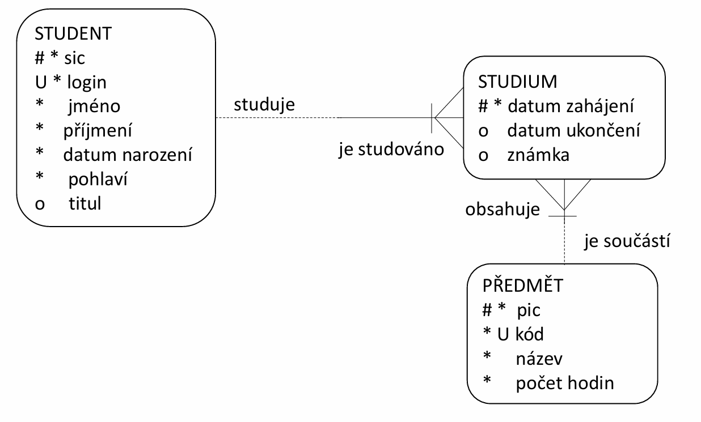

<div align="center" style="margin-top: 16px;">
    <strong>Otázka 9</strong>
</div>

<nav style="
    position: sticky;
    top: 0;
    z-index: 100;
    background: rgba(0,0,0,0.8);
    padding: 8px 0 4px 0;
    box-shadow: 0 2px 8px rgba(0,0,0,0.1);
    text-align: center;
">
    <a href="08.md" style="color:white; text-decoration:none; margin: 0 16px;">⬅️ Předchozí</a>
    <a href="../README.md" style="color:white; text-decoration:none; margin: 0 16px;">🏠 Domů</a>
    <a href="10.md" style="color:white; text-decoration:none; margin: 0 16px;">Následující ➡️</a>
</nav>

# Systémy řízení báze dat

**Otázka:** Určení vhodného databázového modelu, vytvoření entitně relačního diagramu, použití normálních forem pro optimalizaci datové struktury, fyzický model databáze a jeho převod z ERD; využití jazyka SQL pro získání relevantních dat, datový slovník, dotazování; využití transakčního zpracování dat, vlastnosti transakcí, rizika při zpracování transakcí a jejich řešení; součásti databázového systému v řešené aplikaci, postavení v třívrstvé architektuře, možnosti zapojení DBS při tvorbě aplikací

---

## Databázový systém

- **databáze** - strukturovaná množina homogenních souborů
- **systém řízení báze dat**
  - integrovaný softwarový prostředek řídící bázi dat
  - umožňuje nám provádět operace nad databází
  - je to kolekce programů, která tvoří rozhraní mezi aplikačními programy a uloženými daty
- **databázový systém** - spojení databáze a systému řízení báze dat

## Databázové modely

- síťový databázový model - historický
- hiearchický databázový model - speciální případ síťového - historický
- relační databázový model - používaný dnes

## Datové modely

Datový model popisuje data a jejich strukturu.

3 pohledy na data:

- vnější pohled - aplikační úroveň, uživatelský pohled. Je to pohled běžného uživatele, kterého nezajímají hlubší souvislosti mezi daty.
- konceptuální nebo logický pohled - logika modelu (co chceme), vybíráme objekty a vztahy. Modelujeme pomocí ERD (entitně relační diagram)
- fyzický pohled - jakým způsobem jsou uložena data (jak to bude realizováno), návrh implementace, integritní omezení

### Entitně relační diagram



Obsahuje entity a vazby mezi nimi.

Entita

- název
- atributy (povinné, volitelné, primární identifikátor, unikátní)

Vztahy

- kardinalita (násobnost) - 1:1, 1:N, M:N
- povinnost - povinné, nepovinné

Normální formy = pravidla pro správnou strukturu datového modelu

1. normální forma - atomičnost (neopakují se atributy stejného typu)
2. normální forma - musí platit 1 NF. Každý neklíčový atribut je plně závislý na každém kandidátním klíči - to se splní tak že každá entita má jeden primární identifikátor
3. normální forma - musí platit 2 NF. Všechny neklíčové atributy musí být vzájemně nezávislé - mám entitu sklad a objednávka, atributy patřící k objednávce nedávám do skladu

## Fyzický model

Model popisující fyzický pohled. Jak budeme data ukládat do relační databáze

Změna terminologie
|Konceptuální|Fyzický|
|------------|--------|
|entita | tabulka |
|instance | řádek |
| atribut | sloupec |
| primární identifikátor| primární klíč |
| sekundární identifikátor | unikátní klíč |
|vztah | cizí klíč |

- povinnost vazby se v rámci relační databáze dá vynutit pouze jedné straně vazby – té, která se promítne jako nový sloupec (ukládá cizí klíč)
- u vazeb M:N se provádí dekompozice - vznik asociační tabulky

## SQL

= Structured Query Language

- deklarativní, strukturovaný, dotazovací jazyk

dělí se na:

- DDL (Data Definition Language) - práce s datovými strukturami, jejich vytvářením, úpravou a odstraňováním (CREATE, ALTER, DROP)
- DML (Data Manipulation Language) - úprava datového obsahu. Umožňuje data vkládat, měnit a mazat (SELECT, UPDATE, DELETE)
- DQL (Data Query Language) - většinou zahrnuto do DML
- DCL (Data Control Language) - řízení transakcí a specifikaci přístupových oprávnění.

## Dotazování

Dotaz se skládá z `projekce` (povinné) a `selekce` (nepovinné)

- Projekce je výběr jednotlivých sloupců (SELECT sloupec FROM tabulka)

- Selekce nám filtruje dané řádky (WHERE)

Dále můžeme seskupovat (GROUP BY) nebo řadit (ORDER BY)

Celá anatomie příkazu SELECT:

```
SELECT zdrojová projekce
FROM datové zdroje
[ WHERE selekce ]
[ GROUP BY seskupení
  [ HAVING selekce seskupení] ]
[ ORDER BY řazení ]
```

používaná synonyma:

- selekce = restrikce

- seskupení = agregace

### Projekce

- povinná část dotazu
- výběr jednotlivých sloupců, které je potřeba vypsat. Nemusí se vždy jednat pouze o sloupce. Je zde možné uvést i konstanty či výrazy.
- sloupce uvedené v projekci je možné přejmenovat pomocí tzv. aliasů

```
(SELECT sloupec FROM tabulka)
```

### Selekce

- filtruje nám dané řádky pomocí podmínky
- srovnávacím operátorem bývají nejčastěji relační operátory (==, <, >, ...)
- kromě relačních operátorů můžeme použít operátory jako LIKE, BETWEEN, IN, ...
- poslední operátory, které můžeme použít jsou logické operátory (NOT, AND, OR)

```
WHERE název_sloupce srovnávací_podmínka název_sloupce | konstanta | výraz
```

### Řazení

- vždy na konci dotazu (ORDER BY)
- řadit můžeme vzestupně (ASC) nebo sestupně (DESC)
- NULL nelze řadit, je však možné určit, zda řádky s prázdnými hodnotami budou na začátku, nebo na konci

```
 SELECT *
FROM zamestnanci
ORDER BY plat DESC, prijmeni ASC NULLS LAST;
```

### Seskupení

- Využití agregačních funkcí (SUM, AVG, MIN, MAX) na podmnožiny
- výsledkem je logické rozdělení na skupiny, ve kterých je hodnota zvoleného kritéria pro všechny řádky stejná

```
SELECT id_oddeleni, AVG(plat)
FROM zamestnanci
GROUP BY id_oddeleni;
```

- seskupení je samozřejmě možné spojit i se selekcí

```
SELECT id_oddeleni, AVG(plat)
FROM zamestnanci
WHERE id_pracovni_pozice !=
      (SELECT id_pracovni_pozice
       FROM pracovni_pozice
       WHERE nazev='úklidový pracovník')
GROUP BY id_oddeleni;
```

### Selekce seskupení

- pokud použijeme seskupení (GROUP BY) a chceme v daných podmnožinách dále filtrovat řádky, použíjeme selekci seskupení (HAVING)

```
SELECT id_oddeleni, AVG(plat)
FROM zamestnanci
GROUP BY id_oddeleni
HAVING AVG(plat)> 20000;
```

## Datový slovník

= část databáze, která obsahuje systémové informace. Je automaticky udržován databázovým systémem (Oracle, MySQL)

- informace o struktuře databází
- informace o objektech uložených v databázi (tabulky, pohledy, indexy atd.)
- informace o uživatelích a jejich oprávněních (integritní omezení)
- triggery a procedury

účel:

- úložiště informací
- přehled o struktuře a vlastnostech dat - slouží jako automatizovaná forma dokumentace databázové struktury
- umožňuje sledovat a vynucovat integritní omezení a pravidla v databázi

## Transakce

= skupina příkazů, které převedou databázi z jednoho konzistentního stavu do druhého (jsou splněna všechna integritní omezení)

Transakční databázové systémy (DS podporující transakce) bývají také označovány jako `ACID` databáze:

- Atomičnost (Atomicity) - transakce je nedělitelná = pokud se transakce skládá z více operací, musí být splněny všechny nebo žádná
- Zajištění konzistence (Consistency) - v žádném okamžiku nesmí být porušeno integritní omezení
- Izolovanost (Isolation) - transakce musí být vzájemně nezávislé (dané operace jsou skryty, neovlivní další transakce, vrácením transakce není zasažena jiná transakce a pokud ano tak i zasažená transakce musí být vrácena)
- Trvalost (Durability) - změny po úspěšných transakcích, které jsou uloženy v databázy nesmí být ztraceny

### Řízení transakce

`COMMIT` - veškeré změny transakce jsou přijaty

`ROLLBACK` - situace se vrací do okamžiku před zahájením transakce

`SAVEPOINT` - vytvoří značku (záchytný bod) v transakci, která rozděluje transakci na menší části

`ROLLBACK TO SAVEPOINT` - vrácení zpět na savepoint. Zahodí se změny, které byly provedeny poté, co byl založen savepoint

### Problémy při průběhu transakcí

Ztráta aktualizace = aktualizace, kterou provede transakce T1, je ztracena, jakmile transakce T2 provede svou aktualizaci

Nepotvrzené čtení = transakce mohou číst změny provedené v další transakci, když ještě nejsou uložené/potvrzené

Neopakovatelné čtení = podobné jako nepotvrzené čtení. Transakce updatuje data během toho co jiná transakce tyto data čte - na stejný dotaz dostane transakce jiná data (méně dat)

Fantomové čtení = stejné jako neopakovatelné čtení. Na stejný dotaz během jedné transakce dostanu jiná data (více dat)

**_Řešení problémů_**
= vytvoření rozvrhu (posloupnost všech operací) - hledá se takové řešení, aby byly splněné všechny ACID vlastnosti (hlavně izolace). Problém je, že při velké izolaci dochází k serializaci (převedení do sekvenční podoby) - což snižuje možnost paralelního zpracování

Najít správnou míru mezi izolovaností a paralelním zpracováním může být obtížné. V databázových systémech je možné nastavit úroveň izolace na několik úrovní:

- `READ COMMITED` – běžný režim (není žádná izolace v rámci DQL)
- `READ UNCOMMITED` – nepotvrzené čtení
- `REPEATABLE READ` – čtecí stabilita
- `SERIALIZABLE` – vytváří větší prostor pro deadlock

**Deadlock (Uváznutí)**

pro každou transakci ze skupiny transakcí platí:

- každá transakce ze skupiny je blokována čekáním na objekt databáze (na jeho odemknutí)
- ukončení všech transakcí mimo uvedenou skupinu transakcí neumožní odblokování žádné transakce ve skupině

_uváznutí můžeme vyřešit:_

- detekcí uváznutí - pravidelná kontrola, aby se zjistilo, jestli nedošlo k deadlocku. Pokud se objeví, systém ho odstraní. Detekci uváznutí a následné odstranění užíváme při uzamykacím protokolu (soubor pravidel, které určují, jakým způsobem transakce mohou získávat a uvolňovat zámky na databázových objektech)
- předcházení uváznutí - používáme metodu časových razítek (každá operace dostane svoje časové razítko - podle času se pak orientujeme co je povolené a co není)

**_Postavení v třívrstvé architektuře_**
Databáze je součástí třívrstvé architektury (prezentační vrstva, funkční vrstva, datová vrstva - databáze)

Funkční vrstva pracuje s daty z databáze a ty pak předává prezentační vrstvě.

Moc nevím co jiného k tomu napsat :-D

---

## Rozšiřující a praktické příklady ke státnicím

### 1. Příklady pro každou normální formu

**1NF (atomičnost):**

- Špatně:

  | id  | jméno | telefon  |
  | --- | ----- | -------- |
  | 1   | Adam  | 123, 456 |

- Dobře:

  | id  | jméno | telefon |
  | --- | ----- | ------- |
  | 1   | Adam  | 123     |
  | 1   | Adam  | 456     |

**2NF (plná závislost na klíči):**

- **Špatně:**

  | id_obj | id_zak | jméno_zak | ... |
  | ------ | ------ | --------- | --- |
  | 1      | 10     | Novák     | ... |
  | 2      | 11     | Svoboda   | ... |

  > `jméno_zak` závisí pouze na `id_zak`, ne na celém složeném klíči (`id_obj`, `id_zak`).

- **Dobře:**  
  Rozdělit na dvě tabulky:

  **Objednávky**
  | id_obj | id_zak | ... |
  |--------|--------|-----|
  | 1 | 10 | ... |
  | 2 | 11 | ... |

  **Zákazníci**
  | id_zak | jméno_zak |
  |--------|-----------|
  | 10 | Novák |
  | 11 | Svoboda |

---

**3NF (žádné tranzitivní závislosti):**

- **Špatně:**

  | id  | jméno | psc   | město |
  | --- | ----- | ----- | ----- |
  | 1   | Adam  | 10000 | Praha |
  | 2   | Eva   | 60200 | Brno  |

  > `město` závisí na `psc`, ne přímo na primárním klíči.

- **Dobře:**  
  Rozdělit na dvě tabulky:

  **Osoby**
  | id | jméno | psc |
  |----|-------|-------|
  | 1 | Adam | 10000 |
  | 2 | Eva | 60200 |

  **Města**
  | psc | město |
  |-------|----------|
  | 10000 | Praha |
  | 60200 | Brno |

### 2. Příklady transakčních problémů

**Ztráta aktualizace:**

- T1: SELECT plat FROM zamestnanci WHERE id=1; (plat=20000)
- T2: SELECT plat FROM zamestnanci WHERE id=1; (plat=20000)
- T1: UPDATE zamestnanci SET plat=21000 WHERE id=1;
- T2: UPDATE zamestnanci SET plat=22000 WHERE id=1; (přepíše změnu T1)

**Špinavé čtení (dirty read):**

- T1: UPDATE zamestnanci SET plat=21000 WHERE id=1;
- T2: SELECT plat FROM zamestnanci WHERE id=1; (vidí neuloženou změnu)
- T1: ROLLBACK;

**Neopakovatelné čtení:**

- T1: SELECT plat FROM zamestnanci WHERE id=1; (plat=20000)
- T2: UPDATE zamestnanci SET plat=21000 WHERE id=1; COMMIT;
- T1: SELECT plat FROM zamestnanci WHERE id=1; (plat=21000)

**Fantomové čtení:**

- T1: SELECT \* FROM objednavky WHERE cena > 1000;
- T2: INSERT INTO objednavky (cena) VALUES (1500); COMMIT;
- T1: SELECT \* FROM objednavky WHERE cena > 1000; (nový řádek navíc)

### 3. Indexy a optimalizace dotazů

- **Index** je datová struktura pro rychlé vyhledávání v tabulce podle sloupce.
- Vytvoření indexu:
  ```sql
  CREATE INDEX idx_jmeno ON zamestnanci(jmeno);
  ```
- Indexy zrychlují SELECT, ale zpomalují INSERT/UPDATE/DELETE.

### 4. Relační vs. NoSQL databáze

- **Relační:** tabulky, SQL, pevné schéma, ACID (MySQL, PostgreSQL, Oracle)
- **NoSQL:** dokumentové (MongoDB), key-value (Redis), grafové (Neo4j), flexibilní schéma, BASE, vhodné pro velká data a nestandardní struktury

### 5. Příklady DDL, DML, DCL příkazů

- DDL:
  ```sql
  CREATE TABLE osoby (id INT PRIMARY KEY, jmeno VARCHAR(50));
  ALTER TABLE osoby ADD COLUMN prijmeni VARCHAR(50);
  DROP TABLE osoby;
  ```
- DML:
  ```sql
  INSERT INTO osoby (id, jmeno) VALUES (1, 'Adam');
  UPDATE osoby SET jmeno='Eva' WHERE id=1;
  DELETE FROM osoby WHERE id=1;
  ```
- DCL:
  ```sql
  GRANT SELECT ON osoby TO uzivatel1;
  REVOKE SELECT ON osoby FROM uzivatel1;
  ```

### 6. Pohled (view), trigger, uložená procedura

- **Pohled:**
  ```sql
  CREATE VIEW zamestnanci_vysoky_plat AS SELECT * FROM zamestnanci WHERE plat > 50000;
  ```
- **Trigger:**
  ```sql
  CREATE TRIGGER kontrola_platu BEFORE INSERT ON zamestnanci FOR EACH ROW
  BEGIN
    IF NEW.plat < 15000 THEN
      SIGNAL SQLSTATE '45000' SET MESSAGE_TEXT = 'Plat je příliš nízký';
    END IF;
  END;
  ```
- **Uložená procedura:**
  ```sql
  CREATE PROCEDURE zvys_plat(IN zam_id INT, IN castka DECIMAL(10,2))
  BEGIN
    UPDATE zamestnanci SET plat = plat + castka WHERE id = zam_id;
  END;
  ```

### 7. Správa uživatelů a práv

- Vytvoření uživatele:
  ```sql
  CREATE USER 'uzivatel1' IDENTIFIED BY 'heslo';
  ```
- Udělení práv:
  ```sql
  GRANT SELECT, INSERT ON databaze.* TO 'uzivatel1';
  ```
- Odebrání práv:
  ```sql
  REVOKE INSERT ON databaze.* FROM 'uzivatel1';
  ```
- Smazání uživatele:
  ```sql
  DROP USER 'uzivatel1';
  ```

### 8. Datový slovník v konkrétních SŘBD

- **Oracle:** tabulky ALL_TABLES, USER_TABLES, ALL_TAB_COLUMNS
- **PostgreSQL:** tabulka information_schema.tables, information_schema.columns
- **MySQL:** tabulka information_schema.tables, information_schema.columns

### 9. Význam dokumentace a datového slovníku

- Dokumentace a datový slovník jsou klíčové pro správu, rozvoj a předávání databáze dalším správcům.
- Umožňují rychlou orientaci v datech, kontrolu integrity a efektivní rozvoj systému.

### 10. Architektura klient-server a třívrstvá architektura

- **Klient-server:** klient (aplikace) posílá dotazy serveru (SŘBD), server zpracuje a vrací data.
- **Třívrstvá architektura:** prezentační vrstva (UI), aplikační logika (server), datová vrstva (databáze).

---

Tímto jsou pokryty všechny základní i rozšiřující pojmy ke státnicím k tématu SŘBD.
