

    <strong>Otázka 10</strong>

<nav style="
    position: sticky;
    top: 0;
    z-index: 100;
    background: rgba(0,0,0,0.8);
    padding: 8px 0 4px 0;
    box-shadow: 0 2px 8px rgba(0,0,0,0.1);
    text-align: center;
">
    <a href="10.md" style="color:white; text-decoration:none; margin: 0 16px;">⬅️ Předchozí</a>
    <a href="../README.md" style="color:white; text-decoration:none; margin: 0 16px;">🏠 Domů</a>
    <a href="11.md" style="color:white; text-decoration:none; margin: 0 16px;">Následující ➡️</a>
</nav>

## [Materialy z předmětu ZUI](https://carnation-airport-4a0.notion.site/ZUI-ZKOU-KA-172361e34903809dbc38dcdcf12096b8)

---

# Umělá inteligence a neuronové sítě

**Otázka:** Řešení problémů v oblasti závěrečné práce pomocí metod umělé inteligence (teorie hraní her, prohledávání stavového prostoru, evoluční algoritmy, strojové učení aj.), aspekty nasazení těchto metod (výhody, omezení); umělé neuronové sítě a jejich použitelnost v kontextu závěrečné práce, typické úlohy nasazení, typy neuronových sítí, matematický popis modelu, algoritmy a strategie učení, zhodnocení učících algoritmů

---

> **Poznámka:** Umělá inteligence je složité téma, takže tento soubor je o něco obsáhlejší než ostatní. Většina témat také obsahuje video na YouTube pro ty, kteří preferují vizuální způsob učení.

## 1. Definice umělé inteligence
Umělá inteligence je schopnost počítačových systémů vykonávat úkoly, které normálně vyžadují lidskou inteligenci, například:

- **Rozpoznávání řeči:** Schopnost AI systémů převádět mluvenou řeč do textu. (google asistent)
- **Vizuální vnímání:** Schopnost AI identifikovat a interpretovat vizuální informace z okolního prostředí (rozpoznávání obličejů).
- **Rozhodování:** Schopnost AI analyzovat data a dělat rozhodnutí na základě analýzy dat. (Doporučení produktů podle nákupní historie)

### 1.1. Historie a vývoj AI
Historie AI sahá do poloviny 20. století, kdy byla poprvé představena myšlenka strojů schopných vykonávat lidské úkoly. Prvními průkopníky byli Alan Turing a John McCarthy. V průběhu let se AI vyvinula od jednoduchých logických systémů k pokročilým neuronovým sítím a strojovému učení jak je zánme dnes.

## 2. Teorie hraní her
**(Wikipedie)** Teorie her je studium matematických modelů strategických interakcí mezi racionálními agenty s aplikacemi v ekonomii, logice, systémových vědách a informatice. Původně se zaměřovala na dvouosobé hry s nulovým součtem, kde zisk jednoho účastníka je vyvážen ztrátou druhého, ale v 50. letech 20. století se rozšířila na hry s nenulovým součtem a různé behaviorální vztahy. Moderní teorie her začala s důkazem smíšených strategií rovnováhy Johna von Neumanna, který použil Brouwerovu větu o pevném bodě, což vedlo k vlivné knize "Theory of Games and Economic Behavior" s Oskarem Morgensternem. Teorie her byla rozsáhle rozvinuta v 50. letech a aplikována na evoluci v 70. letech a nyní je klíčovým nástrojem v mnoha oborech, s řadou nositelů Nobelovy ceny mezi jejími přispěvateli.

**(Já)** Teorie her je studium toho, jak lidé dělají rozhodnutí v situacích, kde každá volba ovlivňujě ostatní. Pomáhá určit nejlepší strategie v adversáních i spolupracujících scénářích, jako je ekonomie, politika nebo IT. Zjednodušeně řečeno, předpovídá, co lidé udělají ve hrách, vyjednáváních a konfliktech.

### 2.1. Teorie her + AI
V AI se teorie her používá k vývoji algoritmů, které mohou řešit konfliktní situace a optimalizovat rozhodování. 

Příklady zahrnují vyjednávací systémy nebo aukce.

### 2.2. Příklady algoritmů (Minimax, Alpha-beta ořezávání)
- **Minimax:** Tento algoritmus se používá v rozhodovacích procesech, kde se střídají dva hráči. Cílem je minimalizovat maximální možnou ztrátu. (Doslova je to backtracking z rekurzivních algoritmů)

  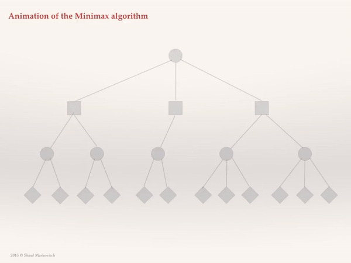
  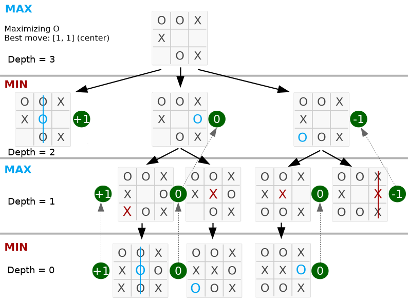

- **Alpha-beta prořezávání:** Optimalizace Minimax algoritmu, která zkracuje větve ve stromu možností, které nemohou ovlivnit konečné rozhodnutí (jsou redundantní), což zvyšuje efektivitu výpočtu.

  

[Alpha beta](https://tutorialforbeginner.com/alpha-beta-pruning-in-ai#what-is-alpha-beta-pruning)

---

Obě jsme dělali na cvikách takže počítám že se na to asi zeptaj. [Super video na vysvětlení](https://www.youtube.com/watch?v=l-hh51ncgDI).

## 3. Prohledávání stavového prostoru
### 3.1. Co je stavový prostor
Stavový prostor je abstraktní koncept, který představuje všechny možné stavy, do kterých se může systém dostat, a všechny možné cesty/přechody mezi těmito stavy. 

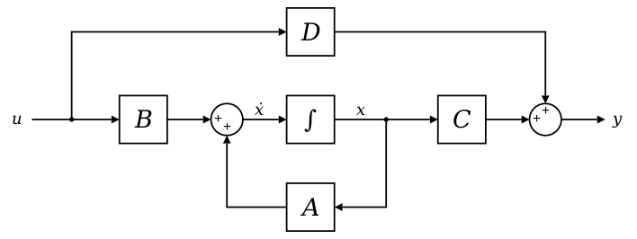

### 3.2. Metody prohledávání

- **BFS (Breadth-First Search)**: Metoda prohledávání do šířky. Prohledává všechny možné stavy na jedné úrovni před tím, než přejde na další úroveň. Je užitečná pro nalezení nejkratší cesty v neohodnoceném grafu = harny nemají přiřazené žádné váhy nebo hodnoty. [Super video na vysvětlení](https://www.youtube.com/watch?v=HZ5YTanv5QE).
  
- **DFS (Depth-First Search)**: Metoda prohledávání do hloubky. Prohledává co nejhlouběji v grafu, než se vrátí zpět a pokračuje na další větvi. Je efektivní pro prohledávání velkých stavových prostorů, ale nemusí najít nejkratší cestu. [Super video na vysvětlení](https://www.youtube.com/watch?v=Urx87-NMm6c).
  
  
  
- **A***: Heuristická metoda prohledávání, která kombinuje vlastnosti BFS a DFS a používá odhadovací funkci k nalezení nejefektivnější cesty. Je velmi efektivní pro hledání optimální cesty v ohodnocených grafech. 
  **POLOPATISMUS**: Algoritmus ví kterým směrem je cíl a preferuje nody, které jsou blíž k cíli. Proto na gifu jde vidět že algoritmus jede značně rychleji směrem k cíli.
  [Super video na vysvětlení](https://www.youtube.com/watch?v=71CEj4gKDnE)

  

### 3.3. Praktické aplikace a příklady

- **Robotika**: Roboti používají tyto algoritmy k navigaci ve svém prostředí a k nalezení optimálních tras k dosažení cílů.
  
- **Hry**: Hledání optimálních tahů ve hrách, jako jsou šachy nebo puzzle hry, kde algoritmy jako Minimax a A* pomáhají simulovat možné tahy a jejich důsledky. (Pokud si to chcete zkusit [tady je dost cool cvičení na implementaci N-Queens problému za použití backtrackingu. Jen pro nadšence.](https://leetcode.com/problems/n-queens/description/))
  
- **Logistika**: Optimalizace trasy pro doručovací služby (viz A* algoritmus na mapě), kde je třeba najít nejefektivnější způsob doručení zásilek.

## 4. Evoluční algoritmy

### 4.1. Základní principy evolučních algoritmů
Evoluční algoritmy (EA) jsou inspirovány přírodními evolučními procesy a jsou používány k řešení optimalizačních a hledacích problémů.

  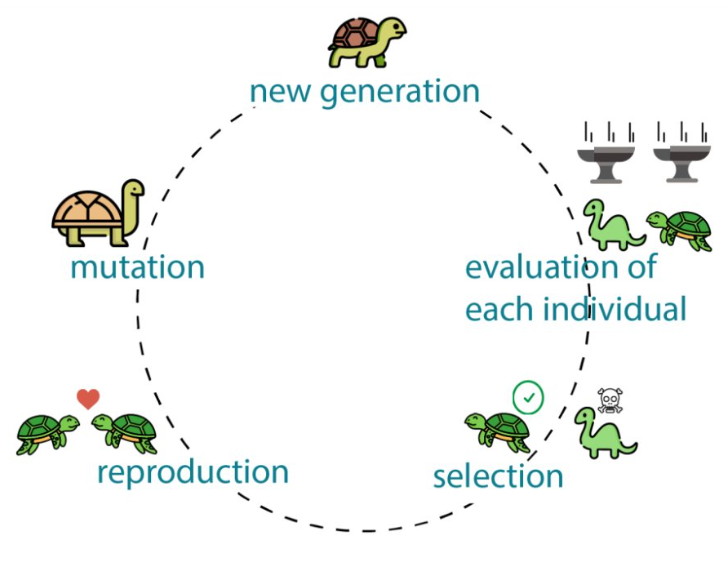

Klíčové principy:

- **Populace a generace**: Algoritmy pracují s populací jedinců, která se v průběhu generací vyvíjí.
- **Selektivní tlak**: Jedinci s vyšší kvalitou (fitness) mají vyšší pravděpodobnost výběru pro reprodukci.
- **Křížení (Crossover)**: Kombinace genetického materiálu dvou rodičů k vytvoření nového potomka.
- **Mutace**: Náhodné změny v genetickém materiálu jedince pro udržení genetické rozmanitosti.
- **Fitness funkce**: Hodnocení kvality jednotlivých jedinců v populaci, které určuje jejich pravděpodobnost přežití a reprodukce.

### 4.2. Genetické algoritmy
Genetické algoritmy (GA) jsou typem EA. Základní kroky genetického algoritmu zahrnují:

1. **Inicializace**: Vytvoření počáteční populace náhodných jedinců.
2. **Hodnocení**: Výpočet fitness hodnoty každého jedince v populaci.
3. **Výběr**: Výběr rodičů na základě jejich fitness hodnoty (např. ruletovým kolem nebo turnajovým výběrem).
4. **Křížení (Crossover)**: Kombinace genetických informací rodičů k vytvoření potomků.
5. **Mutace**: Náhodné úpravy genetického kódu potomků.
6. **Nahrazení**: Vytvoření nové generace nahrazením části nebo celé populace potomky.
7. **Iterace**: Opakování kroků hodnocení, výběru, křížení, mutace a nahrazení, dokud není dosaženo ukončovacího kritéria (např. dosažení určité kvality nebo maximální počet generací).
  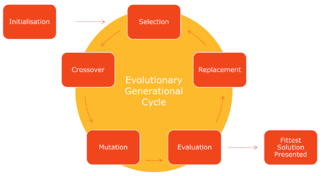

### 4.3. Příklady použití a jejich efektivita

- **Optimalizace**: **NEJDŮLEŽITĚJŠÍ BOD** Například optimalizace tvaru letadlových křídel, kde je cílem minimalizovat odpor vzduchu při zachování pevnosti konstrukce. Případně jakýchkoliv jiných komponent.
- **Strojové učení**: Trénování modelů neuronových sítí, kde evoluční algoritmy mohou pomoci najít optimální strukturu sítě a parametry.
- **Hry a umělá inteligence**: Vytváření strategií pro hráče v komplexních hrách, jako je šachy nebo GO.

Příklad kostry auta vytvořené GA (výsledek je o polovinu lehčí se stejnou robustností než bežná lisovaná kostra):

### 4.4. Specifika a příklad genetického algoritmu

Příklad batohu je klasickou optimalizační úlohou pro GA:

**Problém**: Máme batoh s omezenou nosností a soubor předmětů s různou hmotností a hodnotou. Cílem je vybrat takovou kombinaci předmětů, jejichž celková hodnota je maximální a zároveň nepřesahuje hmotnostní limit batohu.

1. **Inicializace**: Vytvoříme počáteční populaci náhodných řešení, kde každé řešení reprezentuje jednu kombinaci předmětů v batohu (například pomocí binárního vektoru, kde 1 znamená, že předmět je zahrnut v batohu a 0 ne).
2. **Hodnocení**: Každé řešení ohodnotíme podle celkové hodnoty předmětů v batohu, pokud splňuje hmotnostní limit.
3. **Selekce**: Vybereme nejlepší řešení na základě jejich fitness hodnot.
4. **Křížení a Mutace**: Aplikujeme křížení a mutace k vygenerování nových řešení z vybraných.
5. **Nahrazení a Iterace**: Nově vytvořená řešení nahradí některá stávající v populaci a proces se opakuje, dokud není dosaženo ukončovacího kritéria (např. počet generací nebo časový limit).

**Efektivita**:
- Evoluční algoritmy jsou efektivní pro problémy s velkým a složitým vyhledávacím prostorem, kde tradiční metody často selžou nebo jsou výpočetně náročné.
- Díky své paralelní povaze mohou být snadno škálovány na více procesorů nebo distribuované systémy. (PyGAD pro Keras/PyTorch používá defaultně GPU pro paralelní zpracování)
- Jsou robustní vůči lokálním extrémům díky náhodným mutacím a selektivnímu tlaku.

[Zase jedno krátké video](https://www.youtube.com/watch?v=-kpcAa-qKwY)

## 5. Strojové učení
Umožňění počítačovým systémům se automaticky učit a zlepšovat ze zkušeností bez explicitního naprogramování. Strojové učení se dělí na několik hlavních typů:

- **Supervizované učení (s učitelem)**: Algoritmy se učí z předem označených datových sad, kde každá vstupní data mají přiřazené správné výstupy (labely). Cílem je naučit model predikovat výstupy pro nové, neoznačené vstupy.

  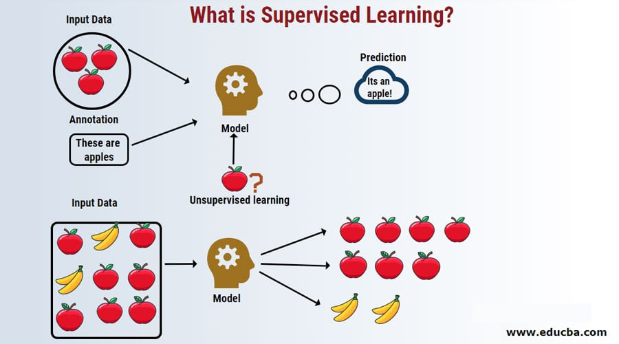
  
- **Nesupervizované učení (bez ucitele)**: Algoritmy se učí z neoznačených datových sad, kde neexistují žádné výstupní labely. Cílem je identifikovat skryté vzory nebo struktury v datech, kterých jsme si my nevšimli.

  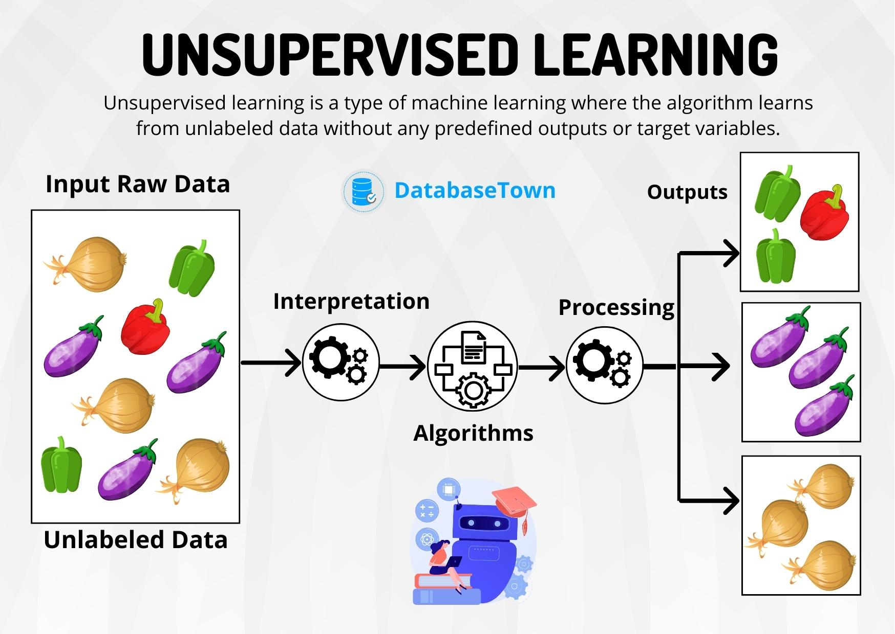

- **Polosupervizované učení (asi s poloučitelem? :D)**: Kombinace supervizovaného a nesupervizovaného učení, kde se algoritmus učí z malé množiny označených dat a velkého množství neoznačených dat.
  
- **Reinforcement Learning (Učení posílením)**: Algoritmy se učí skrze interakce s prostředím, kde dostávají zpětnou vazbu ve formě odměn nebo trestů. Cílem je naučit se optimální strategii jednání. Taky se tomu říká **"cukr a bič"**.

  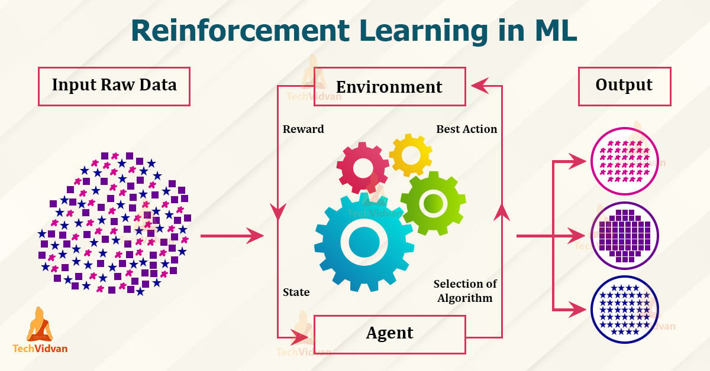

### 5.1. Supervizované vs. nesupervizované učení
- **Supervizované učení**:
  - **Příklady**: Regrese (předpověď číselných hodnot), klasifikace (rozdělení dat do kategorií).
  - **Výhody**: Vysoká přesnost při dostatku označených dat, snadná interpretace výsledků.
  - **Nevýhody**: Potřeba velkého množství označených dat, která mohou být nákladná na získání. (Viz náš pain s label studiem)

- **Nesupervizované učení**:
  - **Příklady**: Clustering (seskupování podobných datových bodů), asociace (nalezení vzorů a pravidel).
  - **Výhody**: Nevyžaduje označená data, vhodné pro průzkum a objevování nových vzorů.
  - **Nevýhody**: Výsledky mohou být hůře interpretovatelné, může být těžké zvolit správné metriky pro hodnocení kvality modelu. Algoritmus může najít jiné vztahy, než jsme chtěli.

### 5.2. Příklady algoritmů

  - **Lineární regrese**: Predikuje číselné hodnoty na základě lineárního vztahu mezi vstupními a výstupními daty. Jeden z nejjednoduších způsobů predikce. **Příklad:** Predikce ceny nemovitostí na základě velikosti, lokace a dalších faktorů. [Video](https://www.youtube.com/watch?v=CtsRRUddV2s)

    
  
  - **Logistická regrese**: Používá se pro klasifikaci, kde výstupy jsou klasifikovány do kategorií podle křivky (logistická funkce). [Video](https://www.youtube.com/watch?v=EKm0spFxFG4)
  
    
  
  - **K-nejbližších sousedů (K-NN)**: Klasifikuje data na základě jejich podobnosti s nejbližšími sousedy v trénovací sadě. **Příklad**: Detekce spamu v e-mailech, rozpoznávání rukopisných číslic. [Video](https://www.youtube.com/watch?v=0p0o5cmgLdE)

    

Položky níže jsou spíše navíc, nejsou v studijních materiálech ale v literatuře jsou spolu dost spojovány:
  - **K-means**: Skupinuje data do K klastrů. Je to podobné K-NN, ale místo nejbližšího souseda se hledá nejbližší střed. Středy se sami aktualizují, což algoritmu umožňuje adaptovat se dobře na nová data. [Video](https://www.youtube.com/watch?v=R2e3Ls9H_fc)

  - **Hierarchické clustering**: Vytváří hierarchii klastrů buď sloučením menších klastrů, nebo rozdělením větších. Hodně používané u heatmap a GA výsledků. [Video](https://www.youtube.com/watch?v=7xHsRkOdVwo)

## 6. Aspekty nasazení metod umělé inteligence

### 6.1. Teorie her
- **Výhody**:
  - Pomáhá modelovat a analyzovat strategické rozhodování v konkurenčních a kooperativních scénářích.
  - Užitečná v ekonomii, politice a sociálních vědách pro předpovídání chování účastníků.
- **Nevýhody**:
  - Komplexnost modelů může být vysoká, což může ztěžovat jejich praktické použití.
  - Vyžaduje přesné znalosti o preferencích a strategiích všech zúčastněných stran, jinak ztrácí přesnost.

### 6.2. Prohledávání stavového prostoru
- **Výhody**:
  - Efektivní pro nalezení optimálních řešení v různých problémech, jako jsou puzzle nebo hry (šachy).
  - Umožňuje systematické prozkoumání všech možných stavů a cest.
- **Nevýhody**:
  - Může být výpočetně náročné, zvláště u velkých stavových prostorů. 
  - Některé metody mohou být neefektivní bez správného heuristického vedení. (A*)

### 6.3. Evoluční algoritmy
- **Výhody**:
  - Schopné nalézt kvalitní řešení pro složité optimalizační problémy.
  - Robustní vůči lokálním minimům díky náhodným mutacím a selektivnímu tlaku.
- **Nevýhody**:
  - Vyžadují mnoho iterací, což může být časově a výpočetně náročné oproti alternativám.
  - Úspěšnost závisí na správném nastavení parametrů, jako jsou mutační rychlost a velikost populace. Může působit jako Black Box.

### 6.4. Strojové učení
- **Výhody**:
  - Schopnost automaticky se zlepšovat a adaptovat na nová data.
  - Široké spektrum aplikací, od predikce a klasifikace po rozpoznávání vzorů a rozhodování.
- **Nevýhody**:
  - Potřeba velkého množství kvalitních dat pro trénink. (Existuje použití syntetických dat co toto trochu odlehčuje)
  - Může být obtížné interpretovat modely a výsledky, zejména u složitých algoritmů jako hluboké učení.

## 7. Neuronové Sítě

Neuronové sítě (NN) jsou inspirovány biologickými neurony v lidském mozku a představují základní výpočetní jednotky, které přijímají vstupy, provádí výpočty a generují výstupy. Tyto výstupy mohou být předány do dalších neuronů, což umožňuje sítím učit se.

[Nejlepší mega pecka video1](https://www.youtube.com/watch?v=aircAruvnKk&t=984s)

### 7.1. Neuron

Neuron je základní stavební jednotkou neuronové sítě, inspirovanou biologickými neurony v lidském mozku. Každý neuron přijímá vstupy, provádí výpočty a generuje výstup, který může být předán do dalších neuronů. Tímto způsobem neuronové sítě mohou modelovat složité nelineární vztahy mezi vstupy a výstupy.

### 7.2. Struktura Neuronu

Neuron se skládá z několika klíčových komponent:

- **Vstupy (Inputs)**: Každý neuron přijímá signály z jiných neuronů nebo vstupních datových bodů. Tyto signály jsou vážené, což znamená, že každý vstup má přidruženou váhu, která určuje jeho důležitost.
- **Váhy (Weights)**: Váhy jsou nastavitelné parametry, které se během tréninku neuronové sítě upravují, aby se minimalizovala chyba (viz učení). Váhy určují, jak silně jednotlivé vstupy ovlivňují výstup.
- **Bias**: Bias je další parametr, který se přičítá k váženému součtu vstupů. Pomáhá modelu lépe se přizpůsobit tréninkovým datům.
- **Aktivační funkce (Activation Function)**: Po výpočtu váženého součtu vstupů a biasu je výsledná hodnota prohnána aktivační funkcí, která přidává nelinearitu do modelu a umožňuje neuronové síti modelovat složité vztahy.

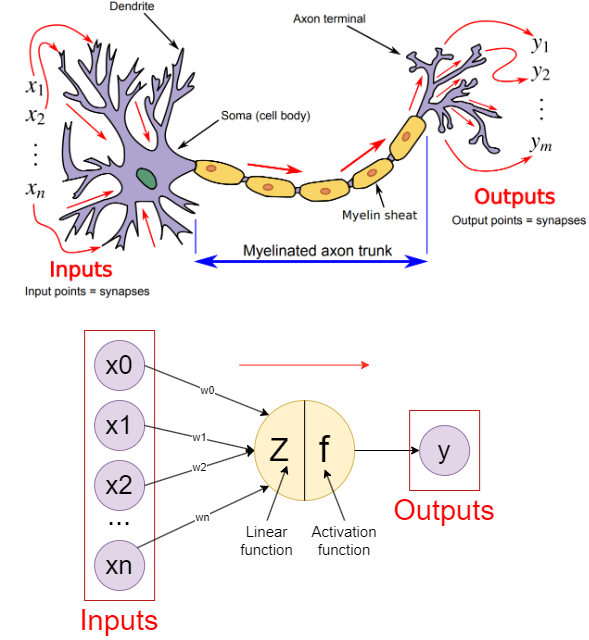

### 7.3. Výpočet v Neuronu

Výstup neuronu \(y\) se vypočítá následujícím způsobem:

1. **Vážený součet**: Nejprve se spočítá vážený součet vstupů a biasu.  
   $$z = \sum_{i=1}^{n} (x_i \cdot w_i) + b$$  
   kde \(x_i\) jsou vstupy, \(w_i\) jsou váhy a \(b\) je bias.

2. **Aktivační funkce**: Poté se na výsledek \(z\) aplikuje aktivační funkce \( \sigma(z) \), která určí finální výstup neuronu.  
   $$y = \sigma(z)$$

### 7.4. Typy aktivačních funkcí

   - **Sigmoid**: Produkuje výstupy v rozmezí (0, 1), často používaná v poslední vrstvě binárních klasifikačních problémů.  
     $$\sigma(z) = \frac{1}{1 + e^{-z}}$$

     
     
   - **ReLU (Rectified Linear Unit)**: Produkuje výstupy v rozmezí [0, ∞), často používaná pro skryté vrstvy v hlubokých neuronových sítích.  
     $$\sigma(z) = \max(0, z)$$

     

   - **Tanh (Hyperbolická tangenta)**: Produkuje výstupy v rozmezí (-1, 1), často používaná při normalizaci dat.  
     $$\sigma(z) = \tanh(z)$$

     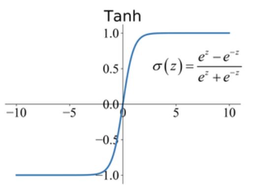

### 7.5. Struktura NN
Neuronové sítě se skládají z vrstev neuronů:

- **Vstupní vrstva**: Přijímá vstupy.
- **Skryté vrstvy**: Zpracovávají vstupy a učí se identifikovat složité vzory. Může mít různé množství neuronů a vrstev.
- **Výstupní vrstva**: Produkuje konečné výstupy. Počet (většinou) odpovídá počtu hledaných tříd.

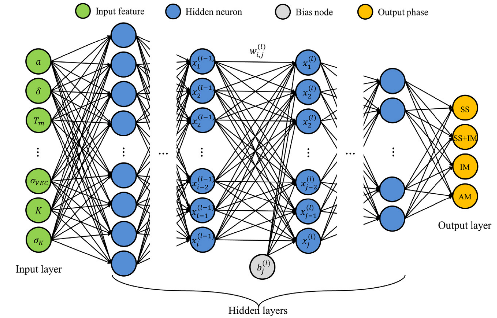

### 7.6. Proces učení

Učení v neuronových sítích probíhá v několika krocích:

1. **Načtení dat**: Přijetí vstupních dat.  
2. **Forward propagation**: Data prochází sítí a každá vrstva vypočítává výstup.  
3. **Výpočet ztráty (Loss Function)**: Loss funkce měří rozdíl mezi predikovaným a skutečným výstupem. Některé běžné loss funkce zahrnují:
   - **Mean Squared Error (MSE)**: Používá se pro regresi.  
     $$\text{MSE} = \frac{1}{n} \sum_{i=1}^{n} (y_i - \hat{y}_i)^2$$
   - **Cross-Entropy Loss**: Používá se pro klasifikaci.  
     $$H(p, q) = - \sum_{i} p(i) \log q(i)$$
4. **Backward propagation**: Výpočet gradientu loss funkce a úprava vah sítě.  
5. **Aktualizace vah**: Pomocí optimalizátoru se váhy upravují, aby se minimalizovala loss funkce.

  

## 8. Typy Neuronových Sítí

### 8.1. Konvoluční Neuronové Sítě (CNN)

Konvoluční neuronové sítě jsou specifické pro práci s obrazem a používají konvoluční vrstvy, které aplikují filtry na vstupní data. Mezi populární architektury patří:
- **LeNet**: Jednoduchá architektura s méně vrstvami.
- **VGG**: Používá homogenní konfiguraci 3x3 konvolučních vrstev.
- **Inception (GoogleNet)**: Využívá incepční bloky pro aplikaci filtrů různých velikostí.
- **ResNet**: Obsahuje reziduální spojení, které usnadňují trénink hlubokých sítí.
- **Wide ResNet**: Zvyšuje šířku sítě pro lepší výkon.

Zde lze vidět historii vývoje s některými co jsem zmínil highlightovanými:

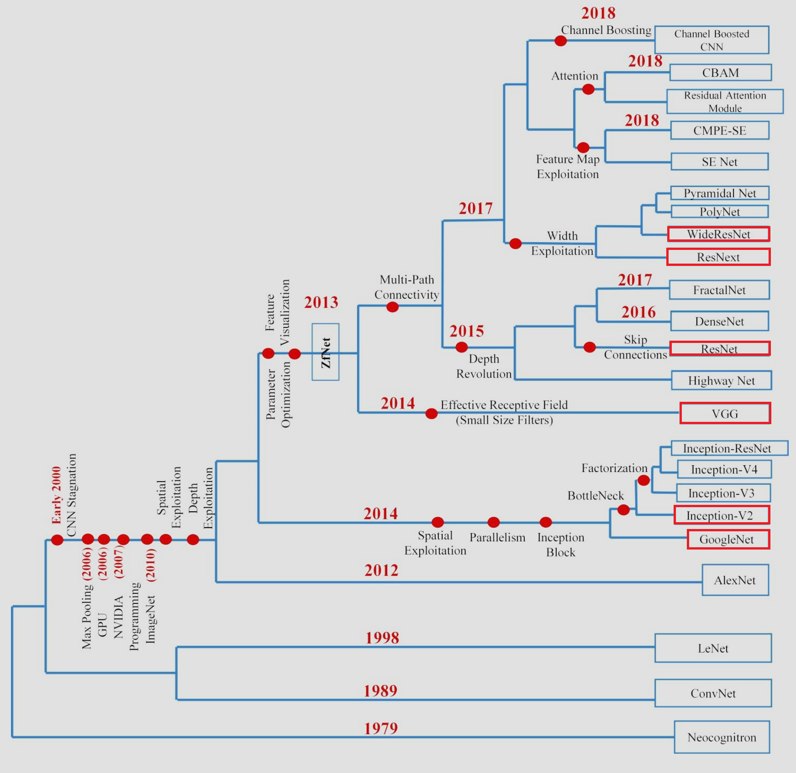

[Nejlepší mega pecka video2](https://youtu.be/KuXjwB4LzSA?si=9dbypH0UPSvOdBlC&t=514)

### 8.2. Generativní Adversariální Sítě (GAN)

GANy generují data podobná tréninkovým datům pomocí dvou sítí:
- **Generátor**: Vytváří data.
- **Diskriminátor**: Hodnotí, zda jsou data pravá nebo generovaná.

Adversární proces mezi těmito dvěma sítěmi vede k rychlému vylepšení a vysoké kvalitě generovaných výstupů. Generátor se snaží přechytračit diskriminátor a generovat lepší a lepší data a diskriminátor zase hodnotit lépe a lépe (oba se výsledně zlepšují).

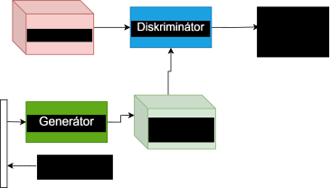

### 8.3. Samoorganizující se Mapy (Self-Organizing Maps, SOM)

Samoorganizující se mapy jsou typem nesupervizované neuronové sítě, která se používá k redukci dimenzionality a vizualizaci dat. Každý neuron v mřížce SOM odpovídá určitému segmentu datového prostoru a mapuje vstupní data na 2D nebo 3D prostor.

- **Použití**: 
  - Vizualizace vysokodimenzionálních dat.
  - Seskupování podobných datových bodů.

Model s 2D prostorem:

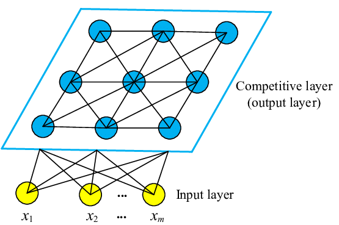

### 8.4. Hopfieldovy Sítě (Hopfield Networks)

Hopfieldovy sítě jsou typem rekurentní neuronové sítě. V této síti jsou všechny neurony propojeny se všemi ostatními (full-mesh) a pracují binárně. Síť se trénuje na vzory, které si má pamatovat, a při aktivaci se snaží najít nejbližší uložený vzor.

- **Použití**: 
  - Asociační paměť.
  - Optimalizační problémy.

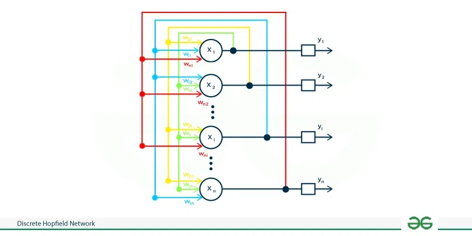

## 9. Hodnocení výkonu

Existují různé metriky hodnocení výkonu

[Video](https://www.youtube.com/watch?v=jJ7ff7Gcq34)

### 9.1. Přesnost (Accuracy)

Přesnost je nejčastěji používanou metrikou pro hodnocení modelů v klasifikačních problémech. Definuje se jako poměr správně klasifikovaných případů ku celkovému počtu pozorování.  
$$
\text{Accuracy} = \frac{TP + TN}{TP + TN + FP + FN}
$$

kde:
- TP (True Positives) jsou správně identifikované pozitivní případy.
- TN (True Negatives) jsou správně identifikované negativní případy.
- FP (False Positives) jsou chybně identifikované pozitivní případy.
- FN (False Negatives) jsou chybně identifikované negativní případy.

Přesnost může být nevhodná v situacích, kdy jsou třídy cílové proměnné nevyvážené.

### 9.2. Preciznost (Precision)

Preciznost je poměr správně pozitivních předpovědí z celkového počtu pozitivních předpovědí, které algoritmus učinil.  
$$
\text{Precision} = \frac{TP}{TP + FP}
$$

### 9.3. Úplnost (Recall)

Úplnost představuje, jaký počet relevantních datových položek je správně identifikován jako pozitivní. Jinými slovy, z datových položek, které jsou ve skutečnosti pozitivní, kolik z nich bylo správně identifikováno jako pozitivní algoritmem.  
$$
\text{Recall} = \frac{TP}{TP + FN}
$$

### 9.4. F1 Skóre (F1-Score)

F1 skóre je harmonický průměr preciznosti a úplnosti, který bere do úvahy obě tyto metriky pro vyhodnocení výkonu algoritmu.  
$$
\text{F1-Score} = 2 \times \frac{\text{Precision} \times \text{Recall}}{\text{Precision} + \text{Recall}}
$$

## 10. Algoritmy a strategie učení

### 10.1. Gradientní sestup a jeho varianty

[Video co je to gradient](https://www.youtube.com/watch?v=tIpKfDc295M)

[Video co je to gradientní sestup](https://www.youtube.com/watch?v=qg4PchTECck)

Gradientní sestup (Gradient Descent) je základní optimalizační algoritmus používaný pro trénink neuronových sítí. Cílem gradientního sestupu je minimalizovat chybu modelu iterativním upravováním vah směrem k minimální hodnotě chyby. Gradientní vektor je směr největší změny vypočítaný z parciálních derivací funkce. Tudíž u učení je gradientní sestup sestupování směrem který určuje gradientní vektor směrem k minimu. 

Gradientní sestup v prostoru

- **Stochastic Gradient Descent (SGD)**: Aktualizuje váhy na základě jednoho tréninkového vzorku v každé iteraci, což může urychlit konvergenci, ale zároveň může způsobit větší oscilace (menší stabilitu).
- **Mini-Batch Gradient Descent**: Aktualizuje váhy na základě malé náhodné podmnožiny dat (mini-batch), čímž se dosahuje lepší stability a rychlosti než u SGD.
- **Adam (Adaptive Moment Estimation)**: Pokročilý optimalizátor, který dynamicky upravuje učící rychlost pro každou váhu pomocí prvních a druhých momentů gradientů. Je v dnešní době naprosto DOMINUJÍCÍ jako optimalizátor. Existuje na něj samostatná práce na XX stránek takže detaily jsou trošku out of scope na bakalářovi. 

### 10.2. Backpropagation

Backpropagation je klíčový algoritmus pro trénink vícevrstvých neuronových sítí. Tento algoritmus počítá gradient chyby s ohledem na váhy sítě a používá gradientní sestup k aktualizaci těchto vah.

- **Forward pass**: Data procházejí sítí od vstupu k výstupu a vypočítá se predikce.
- **Backward pass**: Vypočítá se chyba mezi predikcí a skutečným výstupem, poté se chyba šíří zpět sítí, aby se vypočítaly gradienty.
- **Aktualizace vah**: Váhy se upraví pomocí gradientního sestupu podle vypočítaných gradientů.

### 10.3. Metody regularizace

Regularizace je technika používaná k prevenci přetrénování modelu tím, že penalizuje složitost modelu. Regularizace pomáhá modelu generalizovat lépe na neznámá data. (Brání overfittingu)

[Video](https://www.youtube.com/watch?v=CgbbvozFgXo)

- **L1 Regularizace (Lasso)**: Přidává penalizaci absolutní hodnoty vah do loss funkce. Má tendenci vytvářet řídké modely, kde některé váhy mohou být nulové.
  \[
  L1\_penalty = \lambda \sum_{i} |w_i|
  \]
  Příklad: V lineární regresi, L1 regularizace může vést k modelům, kde některé koeficienty jsou přesně nulové, což zjednodušuje model a umožňuje identifikaci nejdůležitějších proměnných.

- **L2 Regularizace (Ridge)**: Přidává penalizaci druhé mocniny vah do loss funkce. Pomáhá snižovat velikost vah a zabraňuje příliš vysokým hodnotám.
  \[
  L2\_penalty = \lambda \sum_{i} w_i^2
  \]
  Příklad: V lineární regresi, L2 regularizace rozprostírá váhy více rovnoměrně, což může zlepšit predikční výkon na nových datech.

- **Dropout**: Během tréninku náhodně vypíná určité procento neuronů v síti, což zabraňuje vzniku závislostí mezi neurony a zlepšuje generalizaci modelu.
  \[
  y = f(W \cdot (x \odot r) + b)
  \]
  kde \( r \) je maska dropoutu, která náhodně nastavuje některé vstupy na nulu.

- **Early Stopping**: Sleduje výkon modelu na validační sadě a zastavuje trénink, jakmile se výkon začne zhoršovat, aby se zabránilo přetrénování.
  Příklad: Pokud přesnost modelu na validační sadě přestane růst a začne klesat, trénink se zastaví, čímž se minimalizuje riziko přetrénování.

## 11. Křížová validace (Cross-Validation)

Jedná se o způsob, jak upravit učení dělením do různých podmnožin dat a snížení problémů spojených s přetrénováním.

[Video](https://www.youtube.com/watch?v=fSytzGwwBVw)

### 11.1. K-fold Cross-Validation

Jedna z nejběžnějších metod křížové validace je K-fold cross-validation, která rozdělí dataset na K stejných částí (foldů). Model je postupně trénován na K-1 částech a testován na zbývající části. Tento proces se opakuje K-krát, přičemž každá část je použita jednou jako testovací sada.

- **Proces**:
  1. Rozdělení dat na K částí.
  2. Trénink modelu na K-1 částech a testování na jedné části.
  3. Opakování procesu K-krát.
  4. Průměrování výsledků z K iterací pro získání konečného hodnocení modelu.

- **Výhody**:
  - Lepší využití dat pro trénink a testování.
  - Snížení rizika přetrénování a získání robustnějšího odhadu výkonu modelu.

- **Nevýhody**:
  - Vyšší výpočetní náročnost kvůli opakovanému trénování modelu.

### 11.2. Leave-One-Out Cross-Validation (LOOCV)

LOOCV je speciální případ K-fold cross-validation, kde K je rovno počtu vzorků v datasetu. Každý vzorek je použit jednou jako testovací sada a zbytek jako tréninková sada.

- **Proces**:
  1. Pro každý vzorek v datasetu: 
     - Použití vzorku jako testovací sady.
     - Použití zbytku dat jako tréninkové sady.
  2. Opakování procesu pro každý vzorek.

- **Výhody**:
  - Maximální využití dat pro trénink.
  - Snížení možnosti přetrénování.

- **Nevýhody**:
  - Vysoká výpočetní náročnost zejména u velkých datasetů.

