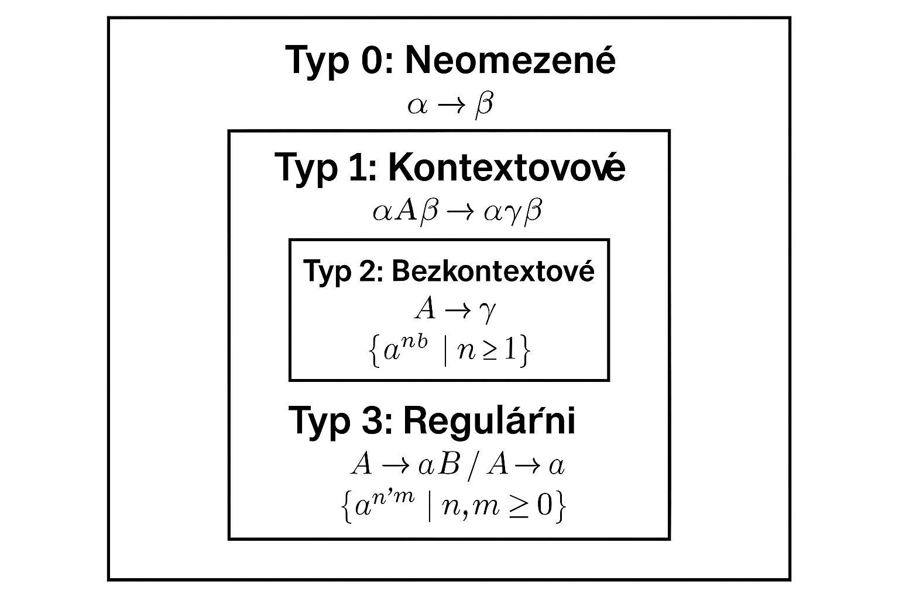
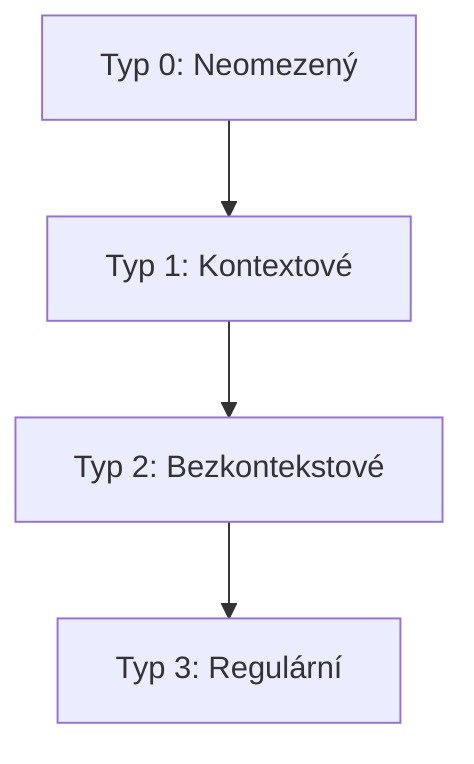
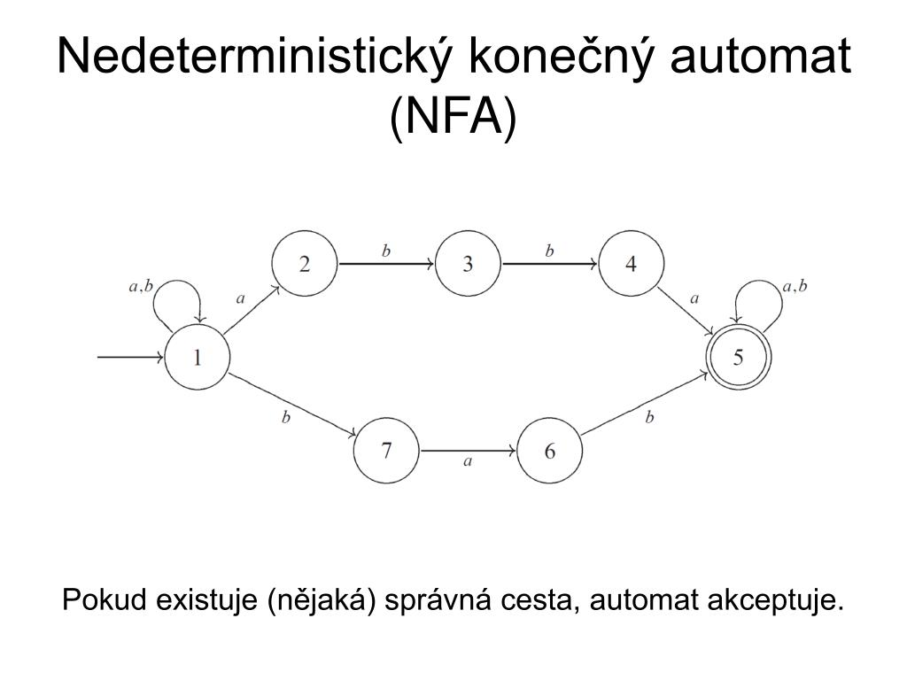
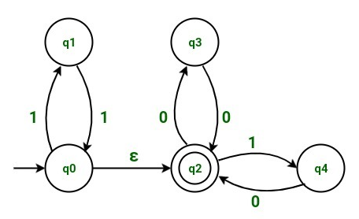

<div align="center" style="margin-top: 16px;">
    <strong>Otázka 11</strong>
</div>

<nav style="
    position: sticky;
    top: 0;
    z-index: 100;
    background: rgba(0,0,0,0.8);
    padding: 8px 0 4px 0;
    box-shadow: 0 2px 8px rgba(0,0,0,0.1);
    text-align: center;
">
    <a href="10.md" style="color:white; text-decoration:none; margin: 0 16px;">⬅️ Předchozí</a>
    <a href="../README.md" style="color:white; text-decoration:none; margin: 0 16px;">🏠 Domů</a>
    <a href="12.md" style="color:white; text-decoration:none; margin: 0 16px;">Následující ➡️</a>
</nav>

# 11. Programovací jazyky jako implementační nástroje

<span style="background:#fffde7; color:#f9a825; padding:2px 8px; border-radius:4px; font-weight:bold;">🟡 Důležitá otázka 2</span>  

> [!TIP]Otázka
> Programovací jazyk jako kategorie formálního jazyka; lexikální, syntaktická a sémantická analýza; překladače a interprety. Jejich využití v závěrečné práci (jaký jazyk a proč byl použit, jak se analyzují vstupní nebo přenášené formáty dat, jaké vlastnosti lze očekávat od různých formátů dat z hlediska jejich analýzy apod.)

---

## Obsah

- [11. Programovací jazyky jako implementační nástroje](#11-programovací-jazyky-jako-implementační-nástroje)
      - [Originální otázka](#originální-otázka)
  - [Obsah](#obsah)
  - [Základní pojmy teorie formálních jazyků](#základní-pojmy-teorie-formálních-jazyků)
    - [Formální jazyk](#formální-jazyk)
    - [Způsoby reprezentace jazyků](#způsoby-reprezentace-jazyků)
    - [Chomského hierarchie](#chomského-hierarchie)
  - [Lexikální analýza](#lexikální-analýza)
    - [Důležité nástroje a techniky:](#důležité-nástroje-a-techniky)
    - [Varianty konečných automatů:](#varianty-konečných-automatů)
  - [Syntaktická analýza](#syntaktická-analýza)
    - [Důležité nástroje a techniky:](#důležité-nástroje-a-techniky-1)
    - [Typy zásobníkových automatů:](#typy-zásobníkových-automatů)
  - [Sémantická analýza](#sémantická-analýza)
  - [Překladače a interprety](#překladače-a-interprety)
  - [Výběr programovacího jazyka](#výběr-programovacího-jazyka)
  - [Analýza vstupních nebo přenášených formátů dat](#analýza-vstupních-nebo-přenášených-formátů-dat)
  - [Vlastnosti různých datových formátů z hlediska analýzy](#vlastnosti-různých-datových-formátů-z-hlediska-analýzy)


Programovací jazyk je kategorie formálního jazyka, který slouží k zápisu algoritmů a programů.
Programovací jazyky se dělí na několik kategorií, například na vysokoúrovňové a nízkoúrovňové jazyky.
Vysokoúrovňové jazyky jsou blíže lidskému jazyku a umožňují programátorovi psát programy bez znalosti detailů o
konkrétním hardwaru.
Naopak nízkoúrovňové jazyky jsou blíže strojovému kódu a umožňují programátorovi přímo ovládat hardware.

Při zpracování programovacího jazyka se používají různé techniky analýzy.
[Lexikální analýza](#lexikální-analýza) se zabývá rozdělením zdrojového kódu na lexémy (tokeny), [syntaktická analýza](#syntaktická-analýza) se zabývá kontrolou správnosti syntaxe programu
a [sémantická analýza](#sémantická-analýza) se zabývá kontrolou správnosti významu programu.
Tyto analýzy jsou prováděny [překladači a interprety](#překladače-a-interprety).

## Základní pojmy teorie formálních jazyků

### Formální jazyk

**Formální jazyk:** je množina slov nad abecedou.<br>
**Abeceda:** je konečná množina symbolů.<br>
**Slovo (řetězec):** je konečná posloupnost symbolů z abecedy.<br>

## Způsob reprezentace jazyků

Níže najdeš jednoduchou ilustraci, která znázorňuje hlavní způsoby reprezentace jazyků v teorii formálních jazyků a automatů. Každý způsob je doplněn příkladem nebo schématem, jak může být jazyk reprezentován.

---

### 1. Výčet všech řetězců

Pro konečné jazyky malého rozsahu lze jazyk jednoduše vyjádřit výčtem všech jeho slov:

```
L = { ab, bb, aba, aab }
```

*(například jazyk generovaný gramatikou S → ab | bb | aba | aab)*[^4]

---

### 2. Matematický zápis množiny

Pro jazyky s jednoduchou strukturou lze použít zápis pomocí množinové notace:

$$
L = \{ a^n b^n \mid n \geq 0 \}
$$

*(všechna slova, kde je stejný počet a a b za sebou)*[^4]

---

### 3. Formální gramatika

Jazyk lze popsat pomocí množiny pravidel (například bezkontextová gramatika):

```
S → aSb | ε
```

Tato gramatika generuje jazyk všech slov, kde je stejný počet a a b v pořadí (např. "", "ab", "aabb", "aaabbb", ...)[^4].

---

#### Derivační strom (ilustrace derivace)

Derivace řetězce "aabb" podle výše uvedené gramatiky:

```
        S
       / \
      a   S
         / \
        a   S
           / \
          ε   b
```

*(Každý vnitřní uzel odpovídá neterminálu, listy odpovídají terminálům nebo prázdnému řetězci. Výsledný řetězec je získán čtením listů zleva doprava: "aabb")[^2][^4][^5]*

---

### 4. Automat

Automat (například konečný automat) lze graficky znázornit jako orientovaný graf:

```
(q0) --a--> (q1) --b--> (q2)
```

- q0: počáteční stav
- q2: koncový stav

Tento automat přijímá jazyk L = { ab }.

Vhodným omezením tvaru přepisovacích pravidel je možné gramatiky rozdělit do tříd a poté klasifikovat i příslušné jazyky
jimi generované.
Tyto jazyky se liší svou odvozovací možnosti a výjadrovací silou.

### 🧠 **Chomského hierarchie – přehled**

1. **Regulární jazyky** - generovány regulárními gramatikami, rozpoznatelné konečnými automaty
2. **Bezkontextové jazyky** - generovány bezkontextovými gramatikami, rozpoznatelné zásobníkovými automaty
3. **Kontextové jazyky** - generovány kontextovými gramatikami, rozpoznatelné lineárně omezenými automaty
4. **Rekurzivně spočetné jazyky** - generovány rekurzivně spočetnými gramatikami, rozpoznatelné Turingovými stroji

    

| Typ gramatiky | Typ jazyka              | Omezení pravidel      | Příklad jazyka           |
| ------------- | ----------------------- | --------------------- | ------------------------ |
| **Typ 0**     | Neomezená (Turingovská) | α → β                 | { aⁿbⁿcⁿ \| n ≥ 1 }      |
| **Typ 1**     | Kontextová              | αAβ → αγβ             | { aⁿbⁿcⁿ \| n ≥ 1 }      |
| **Typ 2**     | Bezkontekstová (CFG)    | A → γ                 | { aⁿbⁿ \| n ≥ 1 }        |
| **Typ 3**     | Regulární (regular)     | A → aB nebo A → a     | { aⁿbᵐ \| n, m ≥ 0 }     |

---

### 📘 **Vysvětlení a příklady**

#### 🔹 **Typ 3 – Regulární gramatika**

* **Pravidla:** A → aB, A → a (pravá nebo levá lineární)
* **Automat:** Konečný automat (DFA/NFA)
* **Příklad:** Jazyk všech řetězců nad {a, b}, kde `a` může být následováno jakýmkoliv počtem `b`:

  * Přijímá např. `abb`, `b`, `aaabbb`
  * Gramatika:

    ```
    S → aS | bS | ε
    ```

#### 🔸 **Typ 2 – Bezkontekstová gramatika (CFG)**

* **Pravidla:** A → γ (A je neterminál, γ je řetězec terminálů a/nebo neterminálů)
* **Automat:** Zásobníkový automat (PDA)
* **Příklad:** Jazyk vyvážených závorek:

  * Přijímá např. `()`, `(())`, `(()())`
  * Gramatika:

    ```
    S → SS | (S) | ε
    ```

#### 🔶 **Typ 1 – Kontextová gramatika**

* **Pravidla:** αAβ → αγβ (A lze přepsat jen v určitém kontextu)
* **Automat:** Lineárně omezený automat (LBA)
* **Příklad:** Jazyk {aⁿbⁿcⁿ | n ≥ 1}

  * Gramatika (částečně zjednodušená):

    ```
    S → aSBC | abc
    CB → HB, HB → HC, HC → BC
    ```

#### 🔷 **Typ 0 – Neomezená gramatika**

* **Pravidla:** α → β (bez omezení, kromě nutnosti délky α ≥ 1)
* **Automat:** Turingův stroj
* **Příklad:** Turingovsky rozpoznatelné jazyky – například jazyk všech programů, které se zastaví (Halting problem – nerozhodnutelné, ale rozpoznatelné)

---

### 🖼️ **Diagram Chomského hierarchie**

Vytvořím vizuální schéma pro lepší přehled:



> Diagram znázorňuje vnoření jazykových tříd – každý nižší typ je podmnožinou vyššího.

---

## 🧩 Lexikální analýza

Lexikální analýza je prvním krokem při zpracování programovacího jazyka.
Zdrojový kód je rozdělen na **tokeny** – konkrétní instance **lexémů**, což jsou základní jednotky jazyka (např. klíčová slova, identifikátory, literály).

K popisu a rozpoznávání lexémů se běžně používají **regulární výrazy** a **konečné automaty**.
Výstupem lexikální analýzy je **posloupnost tokenů**, která slouží jako vstup pro syntaktickou analýzu.
Lexikální analýza může odhalit chyby jako například neznámé symboly (`např. 12YT`).

### 🔧 Důležité nástroje a techniky:

* **Regulární výrazy** – Popisují množinu řetězců pomocí jednoduchých pravidel.
* **Konečný automat (DFA/NFA)** – Abstraktní model reprezentující chování lexikálního analyzátoru.

> **Kleeneho věta:** Jazyk je regulární právě tehdy, když ho rozpoznává konečný automat.


> Regulární výrazy, konečné automaty a regulární gramatiky jsou ekvivalentní – každý z těchto modelů lze převést na ostatní.

### ⚙️ Varianty konečných automatů:

* **Deterministický konečný automat (DFA)** – Pro každý stav a vstupní symbol existuje jednoznačný přechod.

  

* **Nedeterministický konečný automat (NFA)** – Pro některé vstupy může existovat více možných přechodů.

  

* **NFA s epsilon-přechody (ε-NFA)** – Umožňuje přechod mezi stavy i bez spotřebování vstupního symbolu.

  

* **Konečný automat s totální přechodovou funkcí** – Přechod je definován pro každý stav a každý symbol abecedy (automat nikdy „nezamrzne“).

---

## 🌲 Syntaktická analýza

Syntaktická analýza ověřuje, zda je zdrojový kód napsán podle **syntaktických pravidel** daného programovacího jazyka.
Typicky se provádí pomocí **bezkontekstových gramatik** (CFG) a **zásobníkových automatů (PDA)**.

Výstupem syntaktické analýzy je obvykle **syntaktický strom (derivační strom)**, který zachycuje strukturu a hierarchii programu.

Syntaktická analýza může odhalit chyby jako například **chybějící středník**, **neuzavřenou závorku** nebo **nesprávné pořadí příkazů**.

### 📚 Příklad bezkontextové gramatiky (BNF zápis)

```bnf
výraz ::= výraz "+" výraz | číslo  
číslo ::= [0–9]+
```

Tato gramatika popisuje jednoduché výrazy tvořené sčítáním čísel.

---

<div style="text-align: center;">
  
</div>

> **Syntaktický strom** vizuálně znázorňuje strukturu programu podle pravidel gramatiky. Kořen stromu odpovídá startovnímu symbolu a větve představují aplikace jednotlivých pravidel.

---

### Důležité nástroje a techniky:

- **LL a LR gramatiky**: Speciální třídy bezkontextových gramatik, které jsou vhodné pro syntaktickou analýzu. LL (Left
  to right parse), zatímco LR (Left to right parse).

### Typy zásobníkových automatů:

- Automat přijímající v koncovém stavu
- Automat přijímající prázdným zásobníkem
- Automat přijímající prázdným zásobníkem a koncovým stavem

## Sémantická analýza

Sémantická analýza se zabývá kontrolou správnosti významu programu.
Zkontroluje, zda jsou v programu použity správné typy proměnných, zda jsou proměnné deklarovány před použitím, zda jsou
dodržovány typové konverze apod.
Sémantická analýza se obvykle provádí po syntaktické analýze a využívá tabulku symbolu, která obsahuje informace o
deklarovaných proměnných a funkcích.
Sémantická analýza může odhalit chyby jako nesoulad typů proměnných nebo volání nedefinované funkce.

## Překladače a interprety

Překladač je program, který převádí zdrojový kód napsaný v jednom programovacím jazyce na ekvivalentní zdrojový kód v
jiném programovacím jazyce nebo na strojový kód.
Překladač se obvykle skládá z několika fází, jako je lexikální analýza, syntaktická analýza, sémantická analýza,
generování mezijazyka a generování cílového kódu.
Příkladem programovacího jazyka, který používá překladač, je C, C++, Java.

Interpret je program, který čte a vykonává zdrojový kód řádek po řádce.
Interpret nemusí generovat žádný mezikód nebo strojový kód, ale může přímo vykonávat instrukce zdrojového kódu.
Interpret může být pomalejší než překladač, protože provádí interpretaci za běhu.
Příkladem programovacího jazyka, který používá interpret, je Python, Ruby, JavaScript.

### Doporučená videa k tématu jedno jen tak

- [Formální jazyky a automaty (YouTube, cz)](https://youtu.be/I1f45REi3k4?si=WfImOCoTqrm5tEI-)
- [Překladače a interprety (YouTube, cz)](https://youtu.be/_C5AHaS1mOA?si=RKLk-v2PvTRV124Y)

## Výběr programovacího jazyka

Výběr programovacího jazyka závisí na konkrétních požadavcích projektu.
V závěrečné práci může být zvolen jazyk na základě jeho schopnosti efektivně řešit daný problém, dostupnosti knihoven a
nástrojů, osobních preferencí programátora nebo specifických vlastností jazyka, jako je rychlost, bezpečnost nebo
čitelnost kódu.

Například pro práci s velkými datovými soubory a provádění složitých analýz může být vhodný jazyk Python díky svým
rozsáhlým knihovnám pro data science (např. Pandas, NumPy, SciPy).
Na druhou stranu, pro implementaci systémů s vysokým výkonem může být vhodný jazyk C++ díky své rychlosti a efektivitě.

## Analýza vstupních nebo přenášených formátů dat

Analýza vstupních nebo přenášených formátů dat zahrnuje několik kroků a metod, které zajišťují správné zpracování dat:

1. **Parsování**: Tento krok zahrnuje rozložení datového formátu na jednotlivé části (např. rozložení JSON nebo XML na
   klíč-hodnota páry).
   Parsing lze provádět pomocí různých nástrojů a knihoven specifických pro daný formát.
2. **Validace**: Po parsování je důležité ověřit, zda data splňují očekávanou strukturu a pravidla.
   Validace může zahrnovat kontrolu schémat (např. JSON Schema pro JSON data) nebo kontrolu datových typů a hodnot.
3. **Chyby a jejich řešení**: Analýza by měla zahrnovat i mechanismy pro detekci a řešení chyb v datech, jako jsou
   neplatné hodnoty, chybějící údaje nebo nesprávné formátování.

## Vlastnosti různých datových formátů z hlediska analýzy

1. **JSON**: Jednoduchý, čitelný formát vhodný pro výměnu dat mezi webovými aplikacemi a servery. Dobře se parsuje a
   validuje, ale může být náchylný k chybám při manuální editaci.
2. **XML**: Flexibilní formát s možností definice vlastních značek a struktur. Je robustní a vhodný pro komplexní datové
   struktury, ale může být náročný na čtení a zpracování.
3. **CSV**: Jednoduchý formát pro ukládání tabulkových dat. Snadno se čte a zapisuje, ale omezená schopnost
   reprezentovat složitější datové struktury.
4. **YAML**: Lidsky čitelný formát, často používaný pro konfigurační soubory. Snadno se parsuje, ale může být náchylný k
   chybám v odsazování.

Každý formát má své výhody a nevýhody, které je třeba zvážit při výběru pro konkrétní účel.
Například JSON je často preferován pro webové aplikace kvůli své jednoduchosti a čitelnosti, zatímco XML může být
vhodnější pro komplexní datové struktury a přenos mezi různými systémy.