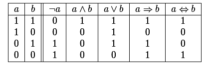
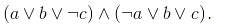
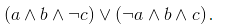
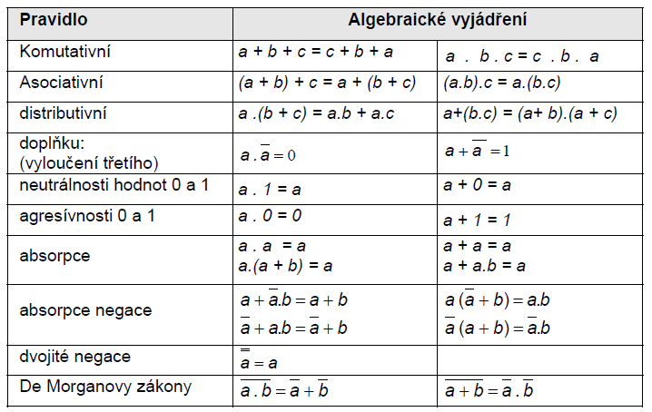
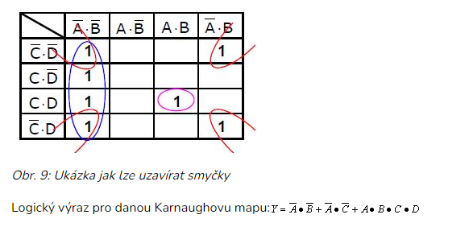

<div align="center" style="margin-top: 16px;">
    <strong>Otázka 12</strong>
</div>

<nav style="
    position: sticky;
    top: 0;
    z-index: 100;
    background: rgba(0,0,0,0.8);
    padding: 8px 0 4px 0;
    box-shadow: 0 2px 8px rgba(0,0,0,0.1);
    text-align: center;
">
    <a href="11.md" style="color:white; text-decoration:none; margin: 0 16px;">⬅️ Předchozí</a>
    <a href="../README.md" style="color:white; text-decoration:none; margin: 0 16px;">🏠 Domů</a>
    <a href="13.md" style="color:white; text-decoration:none; margin: 0 16px;">Následující ➡️</a>
</nav>

# Matematická logika

**Otázka:** Konstrukce, vyhodnocování a optimalizace logických výrazů v použitých algoritmech, SQL dotazech apod. s využitím poznatků matematické logiky; formalizace myšlenek

## Úvod a základní charakteristika

**Logika** představuje vědu o formách a zákonech vědomě odůvodněného myšlení. Je základním stavebním kamenem matematiky a poskytuje nám nástroje pro přesné vyjadřování a analyzování myšlenkových procesů.

**Formální (matematická) logika** je "matematizace" a formalizace zákonů vědomě odůvodněného myšlení. Na rozdíl od tradiční logiky používá matematické symboly a přesné definice.

### Historický kontext
- **Počátky:** Stará Čína a Indie (6. století př. n. l.)
- **Antické Řecko:** Aristoteles (384-321 př.n.l.) - zakladatel tradiční logiky
- **Moderní doba:** Rozvoj formální logiky v 19. a 20. století

## Praktické aplikace matematické logiky

Matematická logika není pouze teoretickou disciplínou, ale má široké praktické využití:

### 1. Programování a algoritmy
- **Formulace podmínek:** `if (x > 0 && y < 10) { ... }`
- **Optimalizace algoritmů:** Zjednodušování složitých podmínek
- **Debugování:** Analýza logických chyb v kódu
- **Verifikace programů:** Dokazování správnosti algoritmů

**Příklad:**
```
// Původní podmínka
if (!(x > 5 || y < 3) && z == 0)

// Po aplikaci De Morganových zákonů
if (x <= 5 && y >= 3 && z == 0)
```

### 2. Návrh digitálních obvodů
- **Logické hradla:** AND, OR, NOT, NAND, NOR
- **Minimalizace obvodů:** Snížení počtu hradel a spotřeby energie
- **Procesory:** Aritmeticko-logické jednotky (ALU)
- **Paměti:** Adresování a řízení přístupu

### 3. Databázové systémy a SQL
- **WHERE klauzule:** `SELECT * FROM users WHERE age > 18 AND status = 'active'`
- **Optimalizace dotazů:** Databázové engine optimalizují logické výrazy
- **Indexování:** Efektivní vyhledávání na základě logických podmínek

**Příklad SQL optimalizace:**
```sql
-- Neoptimalizováno
SELECT * FROM products WHERE NOT (price < 100 OR category != 'electronics')

-- Optimalizováno (De Morgan)
SELECT * FROM products WHERE price >= 100 AND category = 'electronics'
```

---

## Výroková logika - Základy

### Definice výroku
**Výrok** je jakékoli tvrzení, u kterého má smysl zabývat se otázkou, zda je či není pravdivé. V přirozeném jazyce odpovídá oznamovací větě.

**Příklady výroků:**
- ✅ "4 < 5" (pravdivý)
- ✅ "Paříž je hlavní město Francie" (pravdivý) 
- ✅ "2 + 2 = 5" (nepravdivý)
- ❌ "Kolik je hodin?" (otázka, není výrok)
- ❌ "Běž domů!" (rozkazovací věta, není výrok)

### Abeceda výrokového kalkulu

#### 1. Logické spojky



**Unární spojky:**
- `¬` (negace) - "ne", "není pravda, že"

**Binární spojky:**
- `∧` (konjunkce) - "a", "současně", "zároveň"
- `∨` (disjunkce) - "nebo" (včetně)
- `⇒` (implikace) - "jestliže..., pak...", "vyplývá"
- `⇔` (ekvivalence) - "právě tehdy, když", "tehdy a jen tehdy"

#### 2. Výrokové proměnné
Označují se písmeny: `a`, `b`, `c`, `p`, `q`, `r` nebo indexovaně `V₁`, `V₂`, `V₃`, ...

#### 3. Pomocné symboly
- Kulaté závorky `(`, `)` pro určení priority operací
- Pravdivostní hodnoty: `1` (pravda), `0` (nepravda)

### Výrokové formule

**Definice (rekurzivní):**
1. **Elementární formule:** Každá výroková proměnné je výroková formule
2. **Negace:** Je-li `A` výroková formule, pak `¬A` je také výroková formule
3. **Binární spojky:** Jsou-li `A` a `B` výrokové formule, pak `(A ∧ B)`, `(A ∨ B)`, `(A ⇒ B)`, `(A ⇔ B)` jsou také výrokové formule

**Příklady formulí:**
- Jednoduché: `a`, `¬b`, `c`
- Složené: `(a ∧ b)`, `(¬a ∨ c)`, `((a ∧ b) ⇒ c)`

### Podformule a struktura formulí
**Podformule** jsou části složitější formule oddělené logickými spojkami.

**Příklad:** Pro formuli `F = ((a ∨ b) ∧ ¬c)`
- Bezprostřední podformule: `(a ∨ b)` a `¬c`
- Všechny podformule: `a`, `b`, `c`, `¬c`, `(a ∨ b)`, `((a ∨ b) ∧ ¬c)`

### Pravdivostní ohodnocení
**Pravdivostní ohodnocení** je zobrazení `v: V₀ → {0,1}`, které každé výrokové proměnné přiřadí pravdivostní hodnotu.

---

## Logické spojky - Detailní rozbor

### Pravdivostní tabulky

| A | B | ¬A | A∧B | A∨B | A⇒B | A⇔B |
|---|---|----|----|----|----|---- |
| 0 | 0 | 1  | 0  | 0  | 1  | 1   |
| 0 | 1 | 1  | 0  | 1  | 1  | 0   |
| 1 | 0 | 0  | 0  | 1  | 0  | 0   |
| 1 | 1 | 0  | 1  | 1  | 1  | 1   |

### Důležité pozorování

#### Konjunkce (A ∧ B)
- **Význam:** "A a současně B"
- **Pravdivá pouze tehdy:** když jsou pravdivé oba výroky
- **Praktické použití:** Kombinování podmínek (`if (x > 0 && y < 10)`)

#### Disjunkce (A ∨ B)  
- **Význam:** "A nebo B" (nevylučující se)
- **Pravdivá tehdy:** když je pravdivý alespoň jeden výrok
- **Pozor:** V češtině "nebo" často znamená vylučující se alternativu, ale v logice ne!

#### Implikace (A ⇒ B)
- **Význam:** "Jestliže A, pak B"
- **Klíčové:** Nepravdivá pouze když A je pravdivé a B nepravdivé
- **Časté nepochopení:** I když A je nepravdivé, implikace může být pravdivá
- **Příklad:** "Jestliže prší, pak je mokro" - pokud neprší, tvrzení je stále pravdivé

#### Ekvivalence (A ⇔ B)
- **Význam:** "A právě tehdy, když B"
- **Pravdivá tehdy:** když mají A i B stejnou pravdivostní hodnotu
- **Silnější než implikace:** Vyžaduje platnost v obou směrech

### Speciální typy formulí

#### Tautologie
**Definice:** Formule pravdivá při každém ohodnocení proměnných.

**Příklady:**
- `a ∨ ¬a` (zákon vyloučeného třetího)
- `¬(a ∧ ¬a)` (zákon sporu)
- `(a ⇒ b) ⇔ (¬b ⇒ ¬a)` (kontrapozice)

#### Kontradikce
**Definice:** Formule nepravdivá při každém ohodnocení proměnných.

**Příklady:**
- `a ∧ ¬a` (spor)
- `(a ⇒ b) ∧ a ∧ ¬b` (porušení modus ponens)

#### Splnitelné formule
**Definice:** Formule pravdivá při alespoň jednom ohodnocení proměnných.

---

## Důležité logické zákony a pravidla

### De Morganovy zákony
Tyto zákony popisují, jak se negace vztahuje ke konjunkci a disjunkci:

1. **Negace konjunkce:** `¬(A ∧ B) ⇔ (¬A ∨ ¬B)`
2. **Negace disjunkce:** `¬(A ∨ B) ⇔ (¬A ∧ ¬B)`

**Intuitivní vysvětlení:**
- "Není pravda, že prší A svítí slunce" = "Neprší NEBO nesvítí slunce"
- "Není pravda, že prší NEBO svítí slunce" = "Neprší A nesvítí slunce"

**Praktické použití:**
```python
# Původní podmínka
if not (x > 0 and y > 0):
    # nějaký kód

# Po aplikaci De Morganových zákonů  
if x <= 0 or y <= 0:
    # stejný kód, ale čitelnější
```
### Základní zákony Booleovy algebry

Níže jsou uvedeny nejdůležitější zákony, které umožňují zjednodušovat a transformovat logické výrazy. Tyto zákony platí pro výrokovou logiku i pro práci s Booleovskými funkcemi v programování, elektronice a matematice.

#### Komutativní zákony
Komutativita znamená, že na pořadí operandů nezáleží – výsledek je stejný.
- **Konjunkce:** `A ∧ B ⇔ B ∧ A`  
    (A a B je totéž jako B a A)
- **Disjunkce:** `A ∨ B ⇔ B ∨ A`  
    (A nebo B je totéž jako B nebo A)
- **Ekvivalence:** `A ⇔ B ⇔ B ⇔ A`  
    (A právě tehdy, když B, platí i obráceně)

> **Pozor:** Implikace není komutativní! `A ⇒ B` není totéž jako `B ⇒ A`.

#### Asociativní zákony
Asociativita umožňuje libovolně seskupovat výrazy se stejnou operací bez ovlivnění výsledku.
- **Konjunkce:** `(A ∧ B) ∧ C ⇔ A ∧ (B ∧ C)`
- **Disjunkce:** `(A ∨ B) ∨ C ⇔ A ∨ (B ∨ C)`

#### Distributivní zákony
Distributivita umožňuje "roznásobit" jednu operaci přes druhou.
- `A ∧ (B ∨ C) ⇔ (A ∧ B) ∨ (A ∧ C)`
- `A ∨ (B ∧ C) ⇔ (A ∨ B) ∧ (A ∨ C)`

#### Absorpční zákony
Absorpce umožňuje zjednodušit výrazy, kde se stejná proměnná vyskytuje vícekrát.
- `A ∧ (A ∨ B) ⇔ A`
- `A ∨ (A ∧ B) ⇔ A`

Tyto zákony jsou základem pro algebraickou minimalizaci logických výrazů a často se používají při optimalizaci podmínek v kódu, návrhu digitálních obvodů i při dokazování v matematické logice.

## Vlastnosti implikace

#### Obrácení a obměna
Pro implikaci `A ⇒ B`:
- **Obrácení:** `B ⇒ A` (obecně nemá stejnou pravdivostní hodnotu)
- **Obměna (kontrapozice):** `¬B ⇒ ¬A` (má vždy stejnou pravdivostní hodnotu)

**Příklad:**
- Původní: "Jestliže je číslo dělitelné 4, pak je sudé"
- Obrácení: "Jestliže je číslo sudé, pak je dělitelné 4" (nepravda!)
- Obměna: "Jestliže číslo není sudé, pak není dělitelné 4" (pravda)

#### Tranzitivita
`(A ⇒ B) ∧ (B ⇒ C) ⇒ (A ⇒ C)`

---

## Úplné systémy logických spojek

**Definice:** Úplný systém logických spojek umožňuje vyjádřit jakoukoli logickou funkci.

### Základní úplné systémy
1. `{¬, ∧, ∨}` (negace, konjunkce, disjunkce)
2. `{¬, ∧}` (negace a konjunkce)
3. `{¬, ∨}` (negace a disjunkce)  
4. `{¬, ⇒}` (negace a implikace)

### Jednotlivé úplné spojky

#### Shefferova spojka (NAND)
**Definice:** `A ↑ B ⇔ ¬(A ∧ B)`

**Pravdivostní tabulka:**
| A | B | A↑B |
|---|---|-----|
| 0 | 0 |  1  |
| 0 | 1 |  1  |
| 1 | 0 |  1  |
| 1 | 1 |  0  |

**Vyjádření ostatních spojek:**
- `¬A ⇔ A ↑ A`
- `A ∧ B ⇔ (A ↑ B) ↑ (A ↑ B)`
- `A ∨ B ⇔ (A ↑ A) ↑ (B ↑ B)`

#### Peirceova spojka (NOR)
**Definice:** `A ↓ B ⇔ ¬(A ∨ B)`

**Praktický význam:** V elektronice se NAND a NOR hradla používají jako základní stavební prvky, protože jsou technicky nejjednodušší na implementaci.

---

## Predikátová logika

### Motivace a rozšíření
Výroková logika má omezení - nedokáže pracovat s obecnými tvrzeními o objektech. Predikátová logika toto řeší zavedením:
- **Predikátů** (vlastností objektů)
- **Kvantifikátorů** (obecných/existenčních tvrzení)
- **Proměnných** a **konstant**

### Základní pojmy

#### Predikáty
**Definice:** Funkce, která objektům přiřazuje pravdivostní hodnoty.

**Příklady:**
- `Sudé(x)` - "x je sudé číslo"
- `Větší(x,y)` - "x je větší než y"  
- `Student(x)` - "x je student"

#### Kvantifikátory

##### Univerzální kvantifikátor (∀)
**Význam:** "pro všechny", "každý"

**Příklady:**
- `∀x ∈ ℕ: x ≥ 0` - "každé přirozené číslo je nezáporné"
- `∀x: Student(x) ⇒ Osoba(x)` - "každý student je osoba"

##### Existenční kvantifikátor (∃)  
**Význam:** "existuje", "najde se", "alespoň jeden"

**Příklady:**
- `∃x ∈ ℕ: Sudé(x)` - "existuje přirozené číslo, které je sudé"
- `∃x: Student(x) ∧ Chytrý(x)` - "existuje student, který je chytrý"

##### Zesílený existenční kvantifikátor (∃!)
**Význam:** "existuje právě jeden", "jediný"

**Příklad:**
- `∃!x: Prezident(x)` - "existuje právě jeden prezident"

### Pravidla pro negování kvantifikátorů

Tato pravidla jsou obdobou De Morganových zákonů pro kvantifikátory:

1. `¬(∀x)P(x) ⇔ (∃x)¬P(x)`
   - "Není pravda, že pro všechny x platí P(x)" = "Existuje x, pro které neplatí P(x)"

2. `¬(∃x)P(x) ⇔ (∀x)¬P(x)`
   - "Neexistuje x, pro které platí P(x)" = "Pro všechny x neplatí P(x)"

**Praktické příklady:**
- `¬(∀x: Student(x) ⇒ Pilný(x))` = `∃x: Student(x) ∧ ¬Pilný(x)`
  - "Není pravda, že všichni studenti jsou pilní" = "Existuje student, který není pilný"

### Odvozovací pravidla predikátové logiky

1. **Pravidlo odloučení (Modus Ponens):**
   - `A, (A ⇒ B) ⊢ B`

2. **Pravidlo generalizace:**
   - `P(x) ⊢ (∀x)P(x)`
   - Pozor: Platí jen pokud x není volná proměnná v předpokladech

3. **Pravidlo specializace:**
   - `(∀x)P(x) ⊢ P(a)` pro libovolné konkrétní a

4. **Princip nepřímého důkazu:**
   - `A ⇒ B, ¬B ⊢ ¬A`

5. **Přidání existenčního kvantifikátoru:**
   - `P(a) ⊢ (∃x)P(x)` pro konkrétní a

### Pojmy v predikátové logice

- **Logicky platná formule (tautologie):** Pravdivá při libovolné realizaci jazyka
- **Logicky neplatná formule (kontradikce):** Nepravdivá při žádné realizaci  
- **Splnitelná formule:** Pravdivá alespoň při jedné realizaci
- **Splnitelná množina formulí:** Existuje realizace, v níž jsou všechny formule pravdivé

---

## Optimalizace a vyhodnocování logických výrazů

### Motivace
Efektivní vyhodnocování logických výrazů je klíčové pro:
- **Rychlost algoritmů** - méně operací = rychlejší běh
- **Úsporu energie** - méně logických hradel = nižší spotřeba
- **Menší složitost** - jednodušší výrazy = méně chyb

### Normální formy

#### Konjunktivní normální forma (KNF)
**Definice:** Formule je v KNF, je-li konjunkcí klauzulí, kde každá klauzule je disjunkcí literálů.

**Obecný tvar:** `(L₁₁ ∨ L₁₂ ∨ ... ∨ L₁ₖ₁) ∧ (L₂₁ ∨ L₂₂ ∨ ... ∨ L₂ₖ₂) ∧ ... ∧ (Lₙ₁ ∨ Lₙ₂ ∨ ... ∨ Lₙₖₙ)`

**Příklady:**
- `(a ∨ b ∨ ¬c) ∧ (¬a ∨ c) ∧ (b ∨ c)`
- `(p ∨ ¬q) ∧ (¬p ∨ q ∨ r)`

    

**Vlastnosti:**
- Každá formule má ekvivalentní KNF
- Užitečná pro automatizované dokazování
- Používá se v SAT solverech

#### Disjunktivní normální forma (DNF)
**Definice:** Formule je v DNF, je-li disjunkcí klauzulí, kde každá klauzule je konjunkcí literálů.

**Obecný tvar:** `(L₁₁ ∧ L₁₂ ∧ ... ∧ L₁ₖ₁) ∨ (L₂₁ ∧ L₂₂ ∧ ... ∧ L₂ₖ₂) ∨ ... ∨ (Lₙ₁ ∧ Lₙ₂ ∧ ... ∧ Lₙₖₙ)`

**Příklady:**
- `(a ∧ b ∧ ¬c) ∨ (¬a ∧ c) ∨ (b ∧ c)`
- `(p ∧ ¬q) ∨ (¬p ∧ q ∧ r)`

    

**Vlastnosti:**
- Přirozenější pro člověka (seznam případů, kdy je formule pravdivá)
- Snadno čitelná z pravdivostní tabulky
- Používá se pro reprezentaci logických funkcí

**Poznámka:** Literál je atomická formule nebo její negace (např. `a`, `¬b`, `c`).

### Minimalizace pomocí Booleovy algebry

Booleova algebra poskytuje sadu zákonů pro algebraické zjednodušování logických výrazů:

    

#### Základní zákony
1. **Komutativní:** `A ∧ B = B ∧ A`, `A ∨ B = B ∨ A`
2. **Asociativní:** `(A ∧ B) ∧ C = A ∧ (B ∧ C)`, `(A ∨ B) ∨ C = A ∨ (B ∨ C)`
3. **Distributivní:** `A ∧ (B ∨ C) = (A ∧ B) ∨ (A ∧ C)`
4. **De Morganovy:** `¬(A ∧ B) = ¬A ∨ ¬B`, `¬(A ∨ B) = ¬A ∧ ¬B`
5. **Idempotence:** `A ∧ A = A`, `A ∨ A = A`
6. **Absorpce:** `A ∧ (A ∨ B) = A`, `A ∨ (A ∧ B) = A`
7. **Komplementarita:** `A ∧ ¬A = 0`, `A ∨ ¬A = 1`
8. **Identita:** `A ∧ 1 = A`, `A ∨ 0 = A`
9. **Nulové prvky:** `A ∧ 0 = 0`, `A ∨ 1 = 1`

#### Příklad minimalizace
```
Původní výraz: (a ∧ b) ∨ (a ∧ ¬b) ∨ (¬a ∧ b)

Krok 1: Použiji distributivitu na první dva členy
(a ∧ b) ∨ (a ∧ ¬b) = a ∧ (b ∨ ¬b) = a ∧ 1 = a

Krok 2: Výraz se zjednoduší na
a ∨ (¬a ∧ b)

Krok 3: Použiji absorpční zákon obráceně
a ∨ (¬a ∧ b) = (a ∨ ¬a) ∧ (a ∨ b) = 1 ∧ (a ∨ b) = a ∨ b

Výsledek: a ∨ b
```

### Karnaughova mapa

**Doporučené video:**  
[Optimalizace logických výrazů a Karnaughova mapa (YouTube)](https://youtu.be/N8E9psq2Ieo?si=jaBZL8kPP-nR_2NY)

Karnaughova mapa je grafická metoda pro minimalizaci logických funkcí, která nahrazuje algebraické manipulace geometrickými postupy.

#### Postup použití Karnaughovy mapy

1. **Vytvoření tabulky:** Počet buněk = 2ⁿ (n = počet proměnných)
2. **Vyplnění:** Do buněk odpovídajících pravdivým kombinacím vložíme 1, jinak 0
3. **Hledání smyček:** Seskupujeme sousední jedničky do skupin o velikosti 2ᵏ (1, 2, 4, 8, 16...)
4. **Čtení výsledku:** Každá smyčka odpovídá jednomu členu zjednodušené funkce

#### Příklad pro 3 proměnné (a, b, c)

Pravdivostní tabulka:
| a | b | c | f(a,b,c) |
|---|---|---|----------|
| 0 | 0 | 0 |    0     |
| 0 | 0 | 1 |    1     |
| 0 | 1 | 0 |    0     |
| 0 | 1 | 1 |    1     |
| 1 | 0 | 0 |    1     |
| 1 | 0 | 1 |    1     |
| 1 | 1 | 0 |    0     |
| 1 | 1 | 1 |    1     |

Karnaughova mapa:
```
    ab\c | 0 | 1
    -------------
     00  | 0 | 1
     01  | 0 | 1
     11  | 0 | 1
     10  | 1 | 1
```

**Smyčky:**
- Spodní řádek (c=1): tvoří smyčku 4 políček → výsledek: `c`
- Pravý sloupec pro a=1, c=0: jedno políčko → výsledek: `a ∧ ¬b ∧ ¬c`

**Zjednodušená funkce:** `f(a,b,c) = c ∨ (a ∧ ¬b ∧ ¬c)`

#### Pravidla pro Karnaughovy mapy
- **Sousednost:** Buňky sousedí i "přes okraj" (mapa je topologicky torus)
- **Velikost smyček:** Pouze mocniny 2 (1, 2, 4, 8, 16...)
- **Překrývání:** Smyčky se mohou překrývat
- **Cíl:** Pokrýt všechny jedničky minimálním počtem největších možných smyček



### Praktické aplikace optimalizace

#### V programování
```python
# Neoptimalizováno
if not (x > 0 and y > 0) and not (x < 0 and y < 0):
    return True

# Optimalizováno pomocí De Morganových zákonů
if (x <= 0 or y <= 0) and (x >= 0 or y >= 0):
    return True

# Ještě více optimalizováno
if (x == 0) or (y == 0) or (x > 0) != (y > 0):
    return True
```

#### V databázích
```sql
-- Neoptimalizováno
SELECT * FROM users 
WHERE NOT (age < 18 OR status != 'active') 
AND NOT (country != 'CZ' AND city != 'Prague');

-- Optimalizováno
SELECT * FROM users 
WHERE age >= 18 AND status = 'active' 
AND (country = 'CZ' OR city = 'Prague');
```

#### V elektronice
- **Před optimalizací:** 10 logických hradel
- **Po optimalizaci:** 4 logická hradla
- **Výsledek:** Menší spotřeba, vyšší rychlost, nižší cena

---

## Shrnutí a praktické tipy

### Klíčové koncepty k zapamatování

1. **Logické spojky a jejich chování** - zejména implikace a její vlastnosti
2. **De Morganovy zákony** - nejčastěji používané pro optimalizaci
3. **Rozdíl mezi syntaxí a sémantikou** - formule vs. její význam
4. **Kvantifikátory** - univerzální vs. existenční a jejich negace
5. **Normální formy** - KNF pro automatizované dokazování, DNF pro čitelnost
6. **Optimalizační techniky** - algebraické i grafické (Karnaughova mapa)

### Praktické rady pro aplikaci

1. **Při programování:**
   - Vždy zkontrolujte složité podmínky pomocí pravdivostních tabulek
   - Používejte De Morganovy zákony pro zjednodušení negací
   - Minimalizujte počet porovnání v kritických částech kódu

2. **Při návrhu databází:**
   - Optimalizujte WHERE klauzule pro rychlejší dotazy
   - Používejte indexy na sloupcích, které se často vyskytují v logických podmínkách
   - Testujte různé formulace stejného dotazu

3. **Při studiu:**
   - Procvičujte převody mezi různými normálními formami
   - Používejte Karnaughovy mapy pro vizualizaci optimalizace
   - Propojujte teoretické koncepty s praktickými příklady

Matematická logika tak poskytuje pevný teoretický základ s mnoha praktickými aplikacemi v informatice, elektronice a dalších oborech.