

    <strong>Otázka 13</strong>

<nav style="
    position: sticky;
    top: 0;
    z-index: 100;
    background: rgba(0,0,0,0.8);
    padding: 8px 0 4px 0;
    box-shadow: 0 2px 8px rgba(0,0,0,0.1);
    text-align: center;
">
    <a href="12.md" style="color:white; text-decoration:none; margin: 0 16px;">⬅️ Předchozí</a>
    <a href="../README.md" style="color:white; text-decoration:none; margin: 0 16px;">🏠 Domů</a>
</nav>

# Teorie grafů 

**Otázka:** Aplikace teorie grafů při zpracování dat (vyhledávání, třídění, řazení, kódování apod.) v kontextu závěrečné práce; možnosti, vlastnosti a využití statické a dynamické reprezentace grafových dat

<!-- TOC start (generated with https://github.com/derlin/bitdowntoc) -->

- [Teorie grafů](#teorie-grafů)
  - [Definice grafu](#definice-grafu)
    - [Alternativní definice grafu](#alternativní-definice-grafu)
  - [Typy grafů](#typy-grafů)
    - [Orientovaný graf](#orientovaný-graf)
    - [Neorientovaný graf](#neorientovaný-graf)
    - [Vážený graf](#vážený-graf)
    - [Prostý graf](#prostý-graf)
    - [Multi graf](#multi-graf)
    - [Jednoduchý graf](#jednoduchý-graf)
    - [Speciální případy grafů](#speciální-případy-grafů)
    - [Úplný graf](#úplný-graf)
    - [Bipartitní grafy](#bipartitní-grafy)
    - [Podgraf](#podgraf)
  - [Další pojmy](#další-pojmy)
    - [Sled (walk)](#sled-walk)
    - [Tah (trail)](#tah-trail)
    - [Cesta (path)](#cesta-path)
    - [Kružnice a cyklus](#kružnice-a-cyklus)
    - [Eulerovský tah](#eulerovský-tah)
    - [Hamiltonovská cesta](#hamiltonovská-cesta)
    - [Les a strom](#les-a-strom)
    - [Kořenový strom](#kořenový-strom)
    - [Binární vyhledávací strom](#binární-vyhledávací-strom)
    - [Halda (heap)](#halda-heap)
    - [Kódovací strom](#kódovací-strom)
  - [Statické vs. dynamické grafy](#statické-vs-dynamické-grafy)
    - [Statické](#statické)
    - [Dynamické](#dynamické)
    - [Matice sousednosti](#matice-sousednosti)
    - [Matice incidence](#matice-incidence)
    - [Matice délek](#matice-délek)
    - [Matice vzdáleností](#matice-vzdáleností)
    - [Matice předchůdců](#matice-předchůdců)
    - [Dynamický seznam sousedů](#dynamický-seznam-sousedů)
    - [Dynamický seznam uzlů a hran](#dynamický-seznam-uzlů-a-hran)
- [Grafové algoritmy](#grafové-algoritmy)
  - [Prohledávání grafu](#prohledávání-grafu)
    - [Prohledávání do šířky (breadth first)](#prohledávání-do-šířky-breadth-first)
    - [Prohledávání do hloubky (depth first)](#prohledávání-do-hloubky-depth-first)
    - [Rozdíl mezi prohledáváním do šířky a do hloubky:](#rozdíl-mezi-prohledáváním-do-šířky-a-do-hloubky)
  - [Hledání nejkratší cesty](#hledání-nejkratší-cesty)
  - [Dijkstrův algoritmus](#dijkstrův-algoritmus)
    - [Formální popis kroků](#formální-popis-kroků)
    - [Intuitivní popis (free-style)](#intuitivní-popis-free-style)
    - [Video](#video)
  - [Bellmanův-Fordův algoritmus](#bellmanův-fordův-algoritmus)
    - [Formální popis kroků](#formální-popis-kroků-1)
    - [Intuitivní popis](#intuitivní-popis)
    - [Video](#video-1)
  - [Floydův-Warshallův algoritmus](#floydův-warshallův-algoritmus)
    - [Formální popis kroků](#formální-popis-kroků-2)
    - [Intuitivní popis](#intuitivní-popis-1)
    - [Video](#video-2)
  - [Hledání minimální kostry](#hledání-minimální-kostry)
  - [Kruskalův algoritmus](#kruskalův-algoritmus)
    - [Formální popis kroků](#formální-popis-kroků-3)
    - [Intuitivní popis](#intuitivní-popis-2)
    - [Video](#video-3)

<!-- TOC end -->

<!-- TOC -->

Teorie grafů je matematická disciplína zabývající se studiem grafů, což jsou struktury sestávající z uzlů (také nazývaných vrcholy) a hran (spojujících dvojice uzlů). Tato teorie má široké využití v různých oblastech vědy, techniky a společenských věd. Níže jsou uvedeny některé klíčové problémy a aplikace teorie grafů:
- Síťová analýza
- Dopravní sítě
- Sociální sítě
- Bioinformatika
- Optimalizace a logistika
- Elektrotechnika a obvody

<!-- TOC -->
## Definice grafu
Graf je uspořádáná trojice (𝑈 , 𝐻 , 𝑓 ), kde:
- 𝑈 je množina uzlů,
- 𝐻 je množina hran,
- 𝑓 ∶ 𝐻 → 𝑈2 je incidenční zobrazení (které hraně předěluje dvojici uzlů)

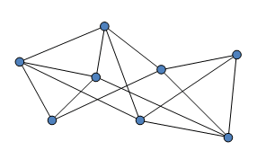

<!-- TOC -->
### Alternativní definice grafu
Graf je uspořádáná dvojice (𝑈 , 𝐻 ), kde:
- 𝑈 je množina uzlů,
- 𝐻 ⊆ 𝑈2 je množina hran (daná dvojicemi uzlů)

<!-- TOC -->
## Typy grafů

<!-- TOC -->
### Orientovaný graf
- = hrany mají daný směr

<!-- TOC -->
### Neorientovaný graf
- = všechny hrany jsou obousměrné
- (pozn: podle úvodní definice jsou hrany jednosměrné, tedy aby byl graf neorientovaný hrany musí být definovány v obou směrech)

<!-- TOC -->
### Vážený graf
- hrany, nebo vrcholy mají bodové ohodnocení
- Uzlové ohodnocení grafu je zobrazení 𝑘 ∶ 𝑈 → ℝ
  - řazení
  – vyhledávání
  – kódování
- Hranové ohodnocení grafu je zobrazení 𝑑 ∶ 𝐻 → ℝ+
  - minimální kostra
  – nejkratší cesta
  – toky v sítích

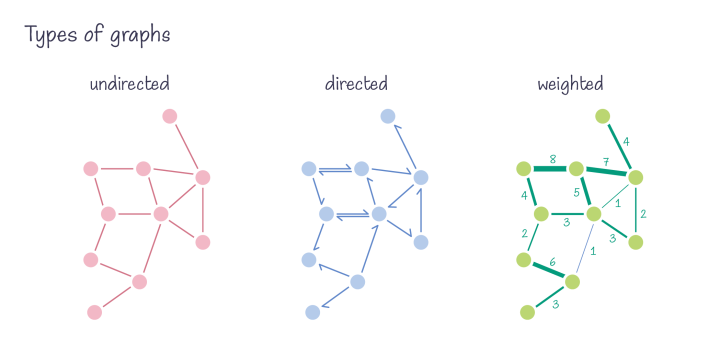

<!-- TOC -->
### Prostý graf
- = mezi dvěma vrcholy není více hran
- 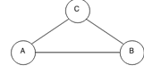

<!-- TOC -->
### Multi graf
- = mezi dvěma vrcholy existuje více hran
- 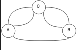

<!-- TOC -->
### Jednoduchý graf
- = neobsahuje smičky
- (Hrana, která vede z vrcholu _u_ do téhož vrcholu _u_, se nazývá smyčka)
- 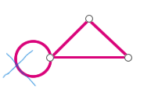

<!-- TOC -->
### Speciální případy grafů
- Nekonečný graf = množina uzlů 𝑈 je nekonečná
- Prázdný (nulový) graf = množina uzlů a hran je prázdná
- Diskrétní graf = graf obsahuje pouze izolované uzly, bez hran

<!-- TOC -->
### Úplný graf
- V úplném grafu je každý uzel spojen se všemi ostatními uzly právě jednou neorientovanou hranou
- 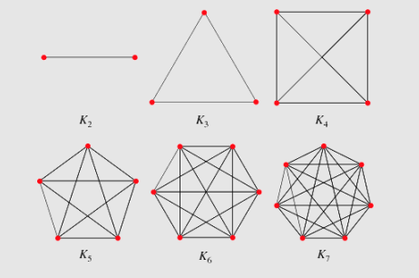

<!-- TOC -->
### Bipartitní grafy
- Množina uzlů je rozložena na dvě disjunktní třídy
- Hrany spojují jen uzly z různých tříd
- 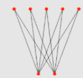

<!-- TOC -->
### Podgraf
- = podmnožina vrcholů grafu a podmožina příslušných hran
- „část grafu“
- 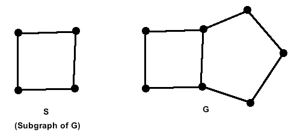
- **faktor** je podgraf, který má stejnou množinu uzlů, ale méně hran
- 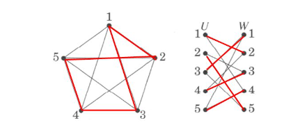

<!-- TOC -->
## Další pojmy

<!-- TOC -->
### Sled (walk)
- = střídavá posloupnost uzlů a hran
- uzly na sebe musí navazovat
- hrany i uzly se mohou opakovat
- délka sledu odpovídá počtu hran
- uzavřený sled začíná a končí ve stejném uzlu

<!-- TOC -->
### Tah (trail)
- = sled, v němž se žádná hrana neopakuje

<!-- TOC -->
### Cesta (path)
- = sled, v němž se neopakuje žádný vnitřní uzel.

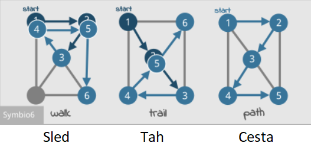

<!-- TOC -->
### Kružnice a cyklus
- **Kružnice** – uzavřená cesta v neorientovaném grafu
- **Cyklus** – uzavřená orientovaná cesta
- **Graf** neobsahující kružnice (cykly) se nazývá **acyklický**

<!-- TOC -->
### Eulerovský tah
- Eulerovský tah je takový tah, který obsahuje každou hranu právě jednou
- Graf je **eulerovský**, když v něm existuje eulerovský tah
- 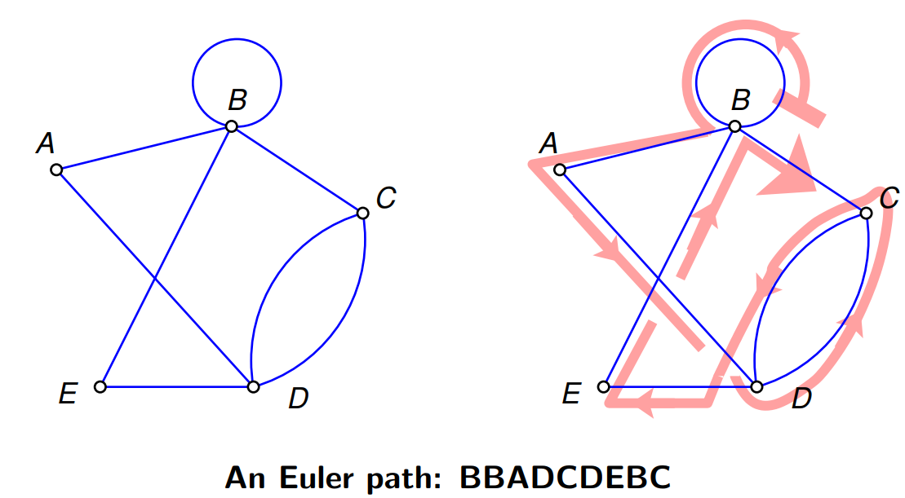
- př: trasa popelářů, sypačů, pošťáků, blokový úklid

<!-- TOC -->
### Hamiltonovská cesta
- Hamiltonovská cesta prochází každým uzlem, uzly se neopakují (každým projde právě jednou)
- Graf je hamiltonovský, když v něm existuje hamiltonovská cesta
- použítí: Problém obchodního cestujícího (algoritmicky těžko řešitelné)

<!-- TOC -->
### Les a strom
- Prostý graf bez kružnic se nazývá **les**
- Souvislý les se nazývá **strom**
  - Uzel se stupněm 1 nazveme list
   
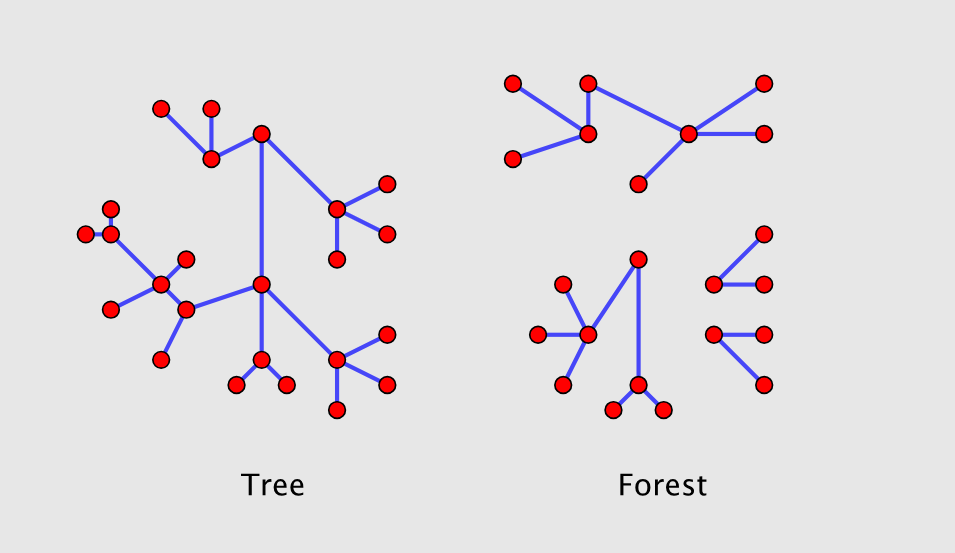

<!-- TOC -->
### Kořenový strom
- = orientovaný stromový graf
- Pro daný uzel pak rozlišujeme: rodiče, potomky, sourozence
 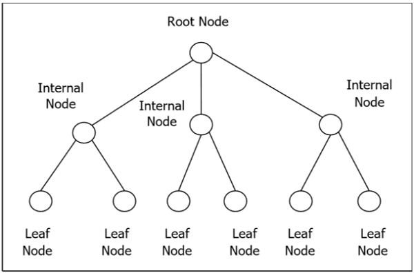

<!-- TOC -->
### Binární vyhledávací strom
- Binární vyhledávací strom (BST) je uspořádaný binární strom s ohodnocenými uzly
  - začíná se kořenem stromu
  - hodnoty v levém potomkovi jsou menší
  - hodnoty v pravém potomkovi jsou větší rovny
- použití: Heap sort

 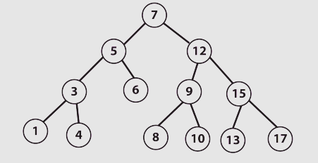

<!-- TOC -->
### Halda (heap)
- Statická reprezentace prioritního stromu
- zleva úplný vyvážený binární strom (neplést s BVS!)
- každý uzel nese vyšší hodnotu než všichni jeho potomci (maximální hodnota je v kořeni)
- Indexy v poli, které haldu reprezentuje
  - kořen má index 1
  - levý potomek uzlu s indexem 𝑛 má index 2𝑛
  - pravý potomek uzlu s indexem 𝑛 má index 2𝑛 + 1
  - rodič uzlu s indexem 𝑛 má index 𝑛

 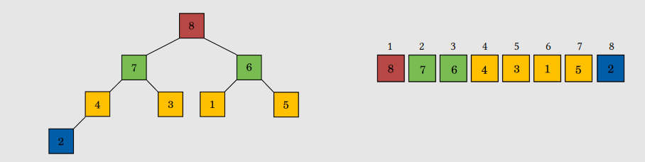

<!-- TOC -->
### Kódovací strom
- Morseovka

  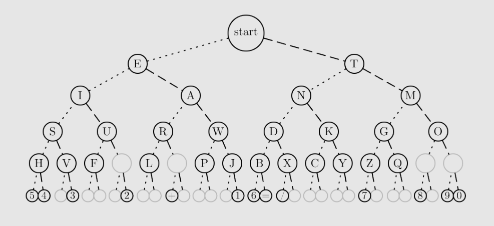
  
- Huffmanovo kódování

  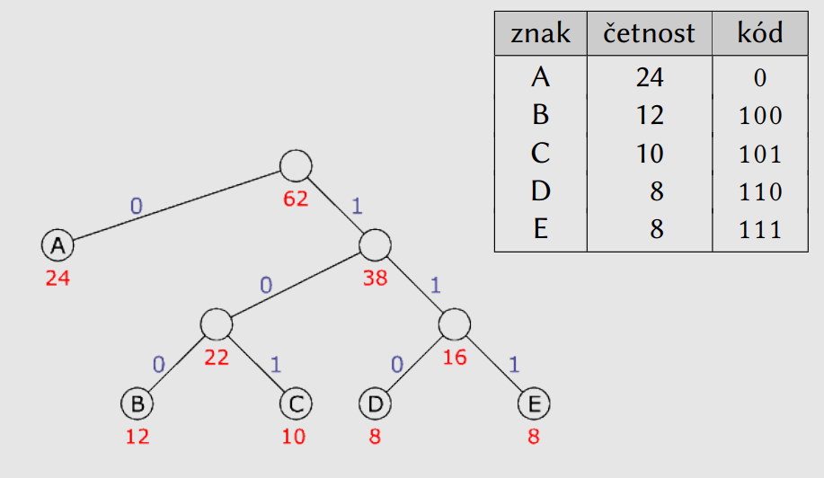

<!-- TOC -->
## Statické vs. dynamické grafy
Volba mezi statickou a dynamickou reprezentací grafových dat závisí na specifických potřebách aplikace, frekvenci změn dat a požadavcích na výkon a flexibilitu.
<!-- TOC -->
### Statické
- Aktualizace vyžaduje vytvoření nového grafu nebo manuální zásahy.
- Může být optimalizováno pro rychlý přístup k pevným datům.
- Vhodné pro scénáře, kde data nejsou často měněna a analýza může být provedena na pevně daných datech.
- Historické analýzy, pevné schémata (např. mapy, organizační diagramy, elektrické obvody, rodokmeny).
- **implementace**:
  - matice sousednosti, matice incidence, matice délek, matice vzdáleností, matice předchůdců  

<!-- TOC -->
### Dynamické
- Aktualizace se provádějí automaticky a okamžitě reagují na změny.
- Vyžaduje mechanismy pro efektivní aktualizace a správu změn, což může být výpočetně náročnější.
- Vhodné pro scénáře, kde je nutné často aktualizovat a analyzovat měnící se data.
- Realtime aplikace, kde se struktura a obsah grafu mění (např. sledování pohybu vozidel, dynamické sociální sítě, finanční trhy, senzory IoT).
- **implementace**:
  - seznam sousedů, seznam uzlů a hran, objektová reprezentace, reprezentace pomocí relační databáze

<!-- TOC -->
### Matice sousednosti
 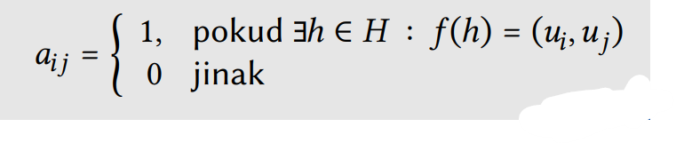

**Intuitivně**:
- řádky představují výchozí uzel hrany
- sloupce představují konečný uzel hrany
- je-li na pozici [n, m] číslo 1 značí to, že z n-tého uzlu vede hrana do m-tého úzlu.

- příklad:
  - v 1. řádku je číslo 1 ve 2. a 3. sloupci  =>  z uzlu číslo 1 (zde A) vede hrana do uzlů číslo 2 (zde B) a 3 (zde C)

- hranově ohodnocený graf lze získat dosazením jiných čísel, než 1 

 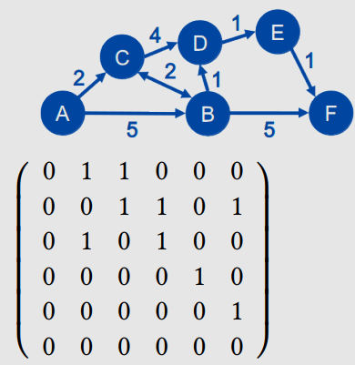

 **Vizualizace toho stejného** (obrázek by Magda):
  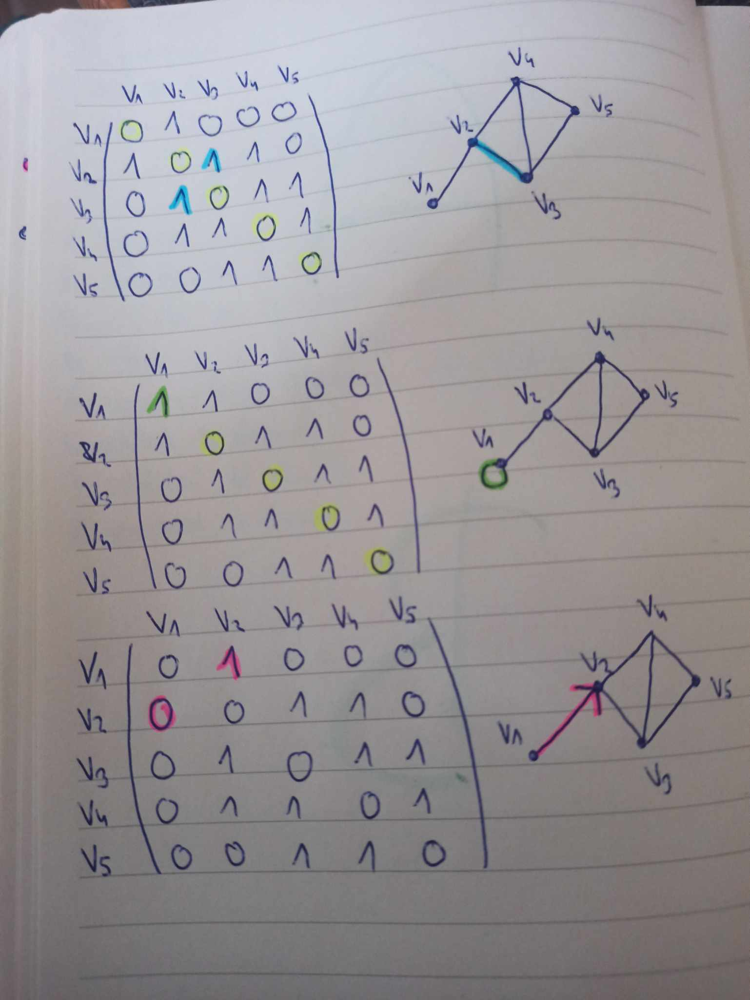

<!-- TOC -->
### Matice incidence
 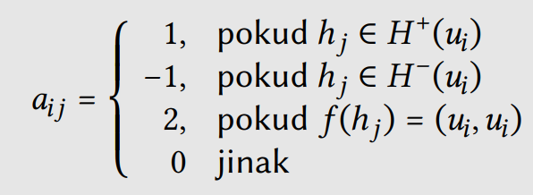

**Intuitivně**:
- řádky představují uzly
- sloupce představují hrany
- je-li na pozici [n, m] číslo 1 znamená to, že m-tá hrana vede z n-tého uzlu
- je-li na pozici [n, m] číslo -1 znamená to, že m-tá hrana vede do n-tého uzlu
- tedy dvojce čísel v každém sloupci 1 a -1 značí odkud kam hrana vede

- přiklad:
  - na pozici [1,2] je číslo 1  =>  hrana 2 (zde h) vede z uzlu 1 (zde A)
  - na pozici [2,2] je číslo -1  =>  hrana 2 (zde h) vede do uzlu 2 (zde B)
- číslo 2 značí smičku z uzlu zpět do něj, 0 značí prázdno 

 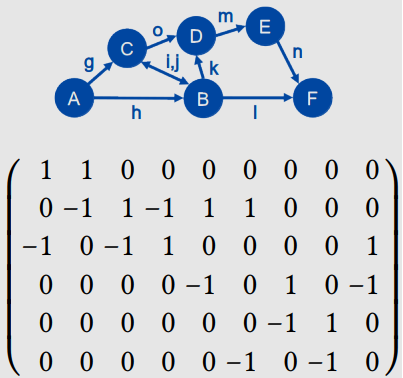

<!-- TOC -->
### Matice délek
 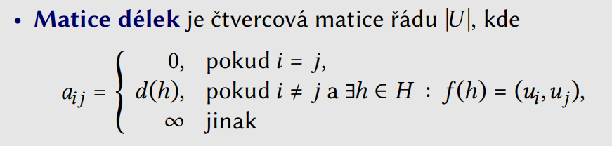
 
 - skoro stejná jako matice sousednosti, místo jedniček jsou v matici zaneseny váhy hran mezi jednotlivými vrcholy
 - je-li na pozici [n, m] číslo x značí to, že z n-tého uzlu vede hrana do m-tého úzlu a má delku x.
 - příklad:
   - na pozici [2,5] je číslo 3  =>  z druhého vrcholu vede hrana délky 3 do pátého vrcholu

<!-- TOC -->
### Matice vzdáleností
 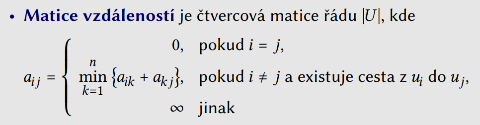

 - opět stejný princip, avšak číslo v matici zde udává, že mezi vrcholy vede **cesta** dané délky
 - příklad:
   - na pozici [1,4] je číslo 6  =>  z prvního vrcholu vede do čtvrtého vrcholu cesta délky 6 (cesta se skládá z více hran!!)

<!-- TOC -->
### Matice předchůdců
 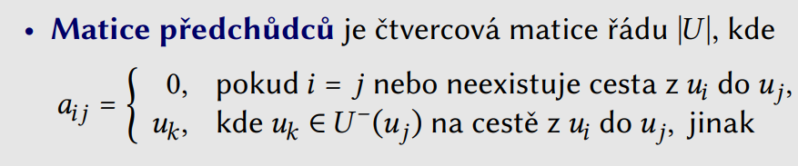

 - matici čteme následujícím způsobem: pokud hledáme cestu mezi uzly _i_ a _j_, pak se podíváme na záznam na řádek i, sloupec j. Pokud je pole nulové, pak cesta neexistuje, v opačném případě udává předchůdce koncového uzlu j na této cestě. Tento postup lze rekurzivně opakovat tak dlouho, dokud není předchůdce roven počátečnímu uzlu i a tím je nalezena celá cesta.
 - příklad:
   - na pozici [1, 5] je číslo 4  =>  cesta z vrcholu 1 do vrcholu 5 existuje a předposlední vrchol cesty je vrchol 4 (při cestě zpět do 1 se tedy vydáme z vrcholu 5 do vrcholu 4)  

<!-- TOC -->
### Dynamický seznam sousedů
- využívá objektovou reprezentaci
  - objekt uzel udržuje seznam všech sousedních uzlů a svoje jméno
  - objekt graf udržuje seznam všech uzlů

 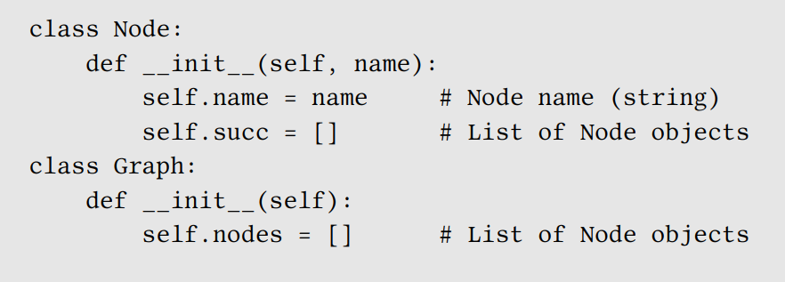

<!-- TOC -->
### Dynamický seznam uzlů a hran
- využívá objektovou reprezentaci
  - objekt uzel udržuje jen své jméno
  - objekt hrana udržuje dvojici: výchozí a konečný uzel
  - objekt graf udržuje seznam uzlů a hran
- lze implementovat i pomocí relační databáze

 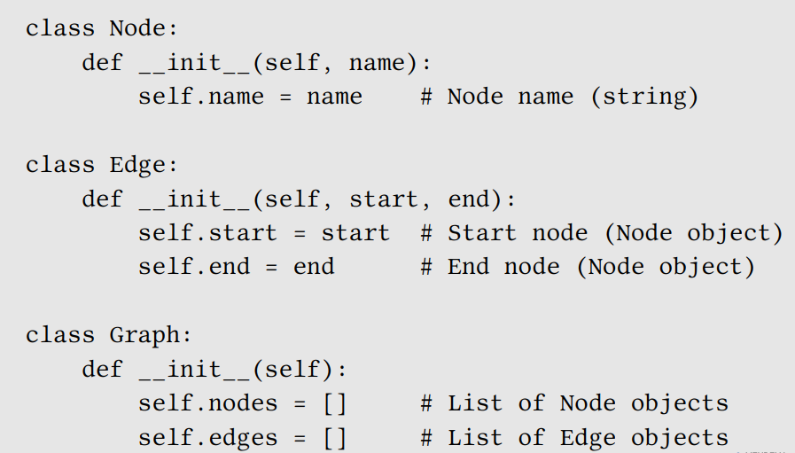

<!-- TOC -->
# Grafové algoritmy

<!-- TOC -->
## Prohledávání grafu
- Cílem je systematická „návštěva“ všech uzlů v grafu (provést operaci: vypis, srovnání, atd.)
- Prohledávání do šířky a do hloubky

<!-- TOC -->
### Prohledávání do šířky (breadth first)
- Provadí se pomocí fronty (FIFO)

1. začíná v počátečním uzlu (je vložen do fronty)
2. provede akci, oznáčí uzel jako navštívený
3. vloží do fronty všechny nenavštívené následníky uzlu
4. opakuje od bodu 1.

Video: https://youtu.be/oDqjPvD54Ss

<!-- TOC -->
### Prohledávání do hloubky (depth first)
- Provadí se pomocí zásobníku (LIFO)

1. začíná v počátečním uzlu (je vložen do zásobníku)
2. provede akci, oznáčí uzel jako navštívený
3. vloží do zásobníku všechny nenavštívené následníky uzlu
4. opakuje od bodu 1.

Video: https://youtu.be/Urx87-NMm6c

<!-- TOC -->
### Rozdíl mezi prohledáváním do šířky a do hloubky:
 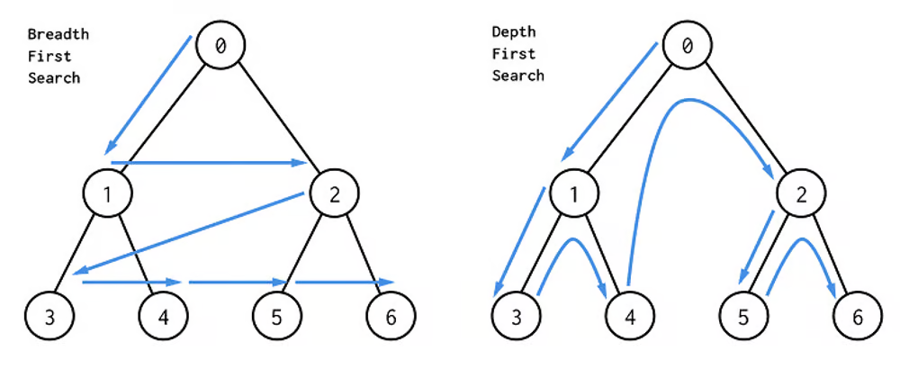

<!-- TOC -->
## Hledání nejkratší cesty
Cílem algoritmu je najít nejkratší cestu z uzlu 𝑠 do uzlu 𝑐 (součet hranových ohodnocení je minimální)
- Dijkstrův algoritmus
- Bellmanův-Fordův algoritmus
- Floydův-Warshallův algoritmus
Srovnání algoritmů:

 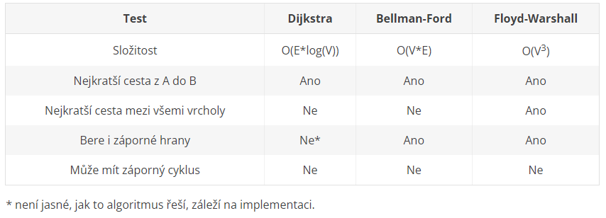

<!-- TOC -->
## Dijkstrův algoritmus
Algoritmus najde cesty z uzlu 𝑠 do všech uzlů v grafu. Nalezenou cestu je možno rekonstruovat odzadu pomocí
značek.
- Použitelný pouze pro grafy s nezáporným ohodnocením hran
<!-- TOC -->
### Formální popis kroků
- Udržujeme množiny
  -  zpracovaných uzlů (𝑍)
  - nezpracovaných uzlů (𝑁)
- U každého uzlu udržujeme značku (𝑑, 𝑝), kde
  – 𝑑 je délka nejkratší dosud nalezené cesty z uzlu 𝑠 (počáteční uzel)
  – 𝑝 je bezprostředně předcházející uzel na této cestě
- Je dána hrana ℎ ∈ 𝐻
  - delka(ℎ) značí délku hrany ℎ
  - zacatek(ℎ) značí počáteční uzel hrany ℎ
  - konec(ℎ) značí koncový uzel hrany ℎ
- Relaxace hrany = přepočítání značky (d,p)
- Je-li zacatek(ℎ).𝑑 + delka(ℎ) < konec(ℎ).𝑑
  - konec(ℎ).𝑑 = zacatek(ℎ).𝑑 + delka(ℎ)
  - konec(ℎ).𝑝 = zacatek(ℎ)

- Inicializace
  - nastav všechny uzly jako nezpracované
  - nastav značku uzlu 𝑠 na (0, −)
  - nastav značky ostatních uzlů na (∞, −)
- Iterace – dokud existují nezpracované uzly
  - vyber nezpracovaný uzel 𝑤 s minimálním 𝑑
  - proveď relaxaci všech hran vedoucích z uzlu 𝑤 do jeho nezpracovaných následníků
  - nastav uzel 𝑤 jako zpracovaný
- Běh algoritmu je možno ukončit ve chvíli, kdy zpracujeme cílový uzel
 
<!-- TOC -->
### Intuitivní popis (free-style)
- Algoritmus udržuje seznam zatím nenavštívených uzlů
- Začne ve startovacím uzlu a postupně po hranách navštěvuje další uzly
- vždy když přijde do nového uzlu, poznačí si z jakého uzlu do něj přišel a jak byla cesta ze startu dlouhá
- pokud přijde do již navštíveného uzlu, podívá se jestli je nová cesta kratší, pokud ano, přepíše informaci o nejkratší cestě do uzlu
- prioritně prověřuje uzly, kam vedla zatím nejkratší cesta
- uzel je "prověřený", když algoritmus navštívil všechny jeho sousedy
- když jsou "prověřeny" všechny uzly, je hotovo
- cesta ze startu do jakéhokoliv uzlu jde sestavit z poznačených informaci o uzlech (odoku do nich přišel)

<!-- TOC -->
### Video
Algoritmus: https://youtu.be/bZkzH5x0SKU

<!-- TOC -->
## Bellmanův-Fordův algoritmus
Algoritmus najde cesty z uzlu 𝑠 do všech uzlů v grafu. Nalezenou cestu je možno rekonstruovat odzadu pomocí
značek.
- Připouští hrany se záporným ohodnocením
- Nesmí existovat cyklus záporné délky

<!-- TOC -->
### Formální popis kroků
- Každý uzel dostává značku (𝑑, 𝑝, ℎ), kde
  - 𝑑 je délka nejkratší dosud nalezené cesty z uzlu 𝑠
  - 𝑝 je bezprostředně předcházející uzel na této cestě
  - ℎ je počet hran na této cestě
- Inicializace
  - nastav značku uzlu 𝑠 na (0, −, 0)
  - nastav značky ostatních uzlů na (∞, −, 0)
  - nastav 𝑘 = 0
- Iterace – dokud je 𝑘 < |𝑈 |
  - u každého uzlu s počtem hran 𝑘 proveď relaxaci všech výstupních hran a nastav počet hran na 𝑘 + 1
  - nastav 𝑘 = 𝑘 + 1

<!-- TOC -->
### Intuitivní popis
- Pro graf o n vrcholech provede n iterací
- v každé iteraci postupně provede relaxaci všech hran (aktualizaci všech bodů)
- n iterací by mělo stačit k objevení nejkratší cesty, protože  v grafu, kde je n vrcholů, vede mezi každými dvěma body přímá cesta o maximálně n-1 hranách

<!-- TOC -->
### Video
Vlastnosti a teorie: https://youtu.be/9PHkk0UavIM 
Algoritmus: https://youtu.be/obWXjtg0L64

<!-- TOC -->
## Floydův-Warshallův algoritmus
Nalezení nejkratších cest mezi všemi dvojicemi uzlů
- Připouští hrany se záporným ohodnocením
- Nesmí existovat cyklus záporné délky
- Vstupem matice délek, výstupem matice vzdáleností
- K rekonstrukci cesty je nutná matice předchůdců

<!-- TOC -->
### Formální popis kroků
Rekurentní vztah:

 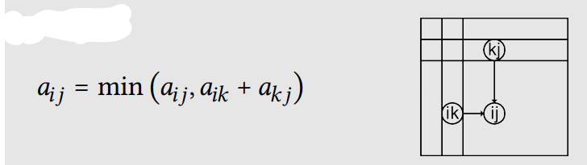

Algoritmus:

 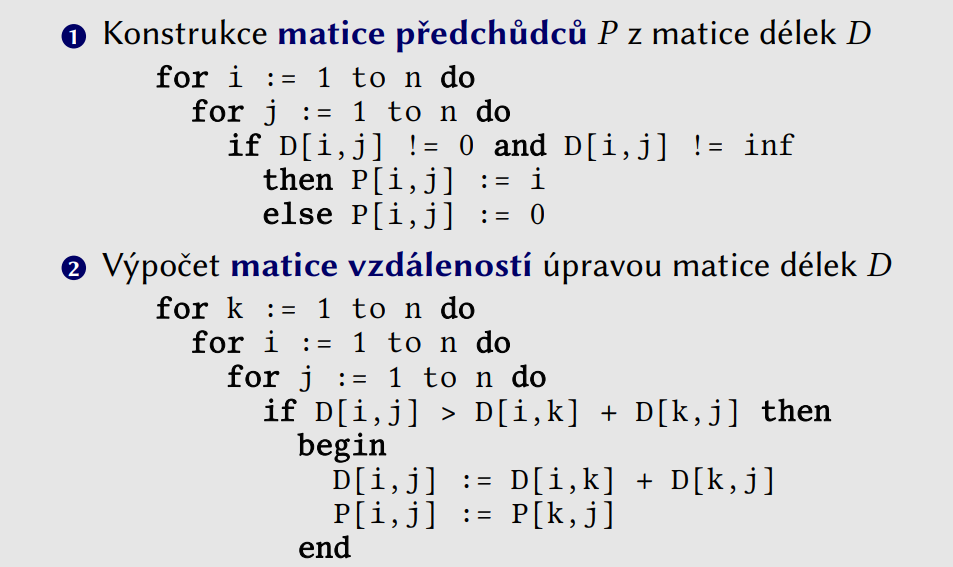

<!-- TOC -->
### Intuitivní popis
Floyd-Warshallův algoritmus má na vstupu matici délek, říkejme jí D0. Pokud mezi dvěma uzly (i, j) vede hrana délky l, tak tato matice obsahuje na indexu [i; j] právě tuto hodnotu. Na diagonále má tato matice samé nuly a na ostatních indexech, které neodpovídají hraně nekonečno. Jinými slovy tato matice obsahuje vzálenosti uzlů, které nevedou skrze žádného prostředníka.

V každé iteraci Floyd-Washallova algoritmu se tato matice přepočítá tak, aby vyjadřovala vzdálenost všech dvojic uzlů skrze postupně se zvětšující množinu přípustných prostředníků. Jednoduše řečeno matice D1 bude vyjadřovat vzdálenost všech uzlů s možností využití jednoho (daného) prostředníka, D2 vzdálenost při možném využití dvou (daných) mezilehlých uzlů, Dm při možnosti využití m mezilehlých uzlů.

<!-- TOC -->
### Video
Algoritmus: https://youtu.be/4OQeCuLYj-4

<!-- TOC -->
## Hledání minimální kostry
**Kostra grafu**: je takový podgraf, který obsahuje všechny uzly a zároveň je to strom (neobsahuje cykly).
**Minimální kostra grafu** je kostra grafu, která má nejmenší možný součet ohodnocení hran.

 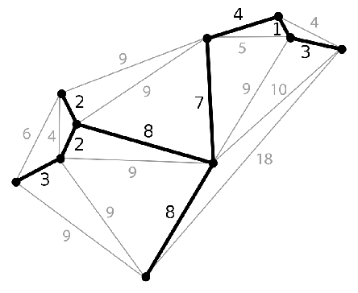

-Využití:
  - dráty elektrického vedení mezi městy
  - silnice
  - zasíťování (sítě)

- Algoritmy:
  - Borůvkův-Sollinův algoritmus
  - Jarníkův-Primův-Dijkstrův algoritmus
  - Kruskalův algoritmus

<!-- TOC -->
## Kruskalův algoritmus
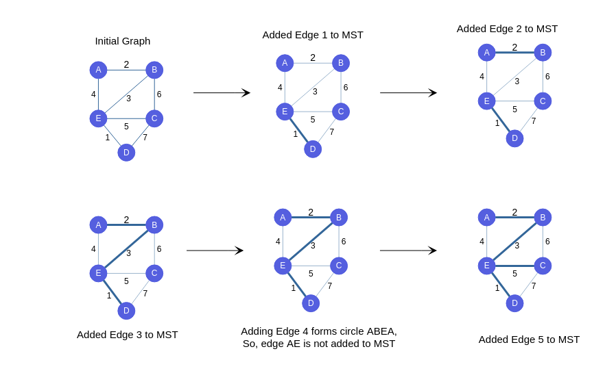

<!-- TOC -->
### Formální popis kroků

- Inicializace
  - vytvoř graf 𝐺′ tvořený pouze izolovanými uzly 𝐺
  - seřaď hrany vzestupně podle hranového ohodnocení
- Iterace – pro každou hranu grafu 𝐺
  - přidej hranu do 𝐺′, pokud tím nevznikne v 𝐺′ cyklus
- Přidáním každé hrany se sníží počet komponent grafu
- Lze řešit přidělením identifikátoru každé komponentě
  - hranu přidáme jen tehdy, pokud identifikátory počátečního a koncového uzlu hrany jsou různé
  - po přidání hrany je nutné sjednotit identifikátory uzlů v dané komponentě

<!-- TOC -->
### Intuitivní popis
- hrany přidáváme postupně od těch s nejmenší hodnotou
- pokud by přidáním některé hrany vznil cyklus, hranu přeskočíme
- ve chvíli, kdy jsou propojeny všechny vrcholy, zastavíme přidávání hran a máme minimální kostru grafu

<!-- TOC -->
### Video
- algoritmus: https://youtu.be/71UQH7Pr9kU

