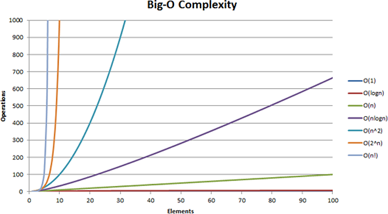
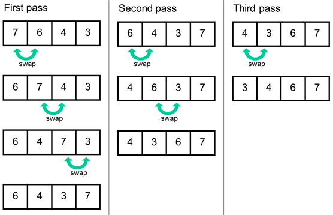
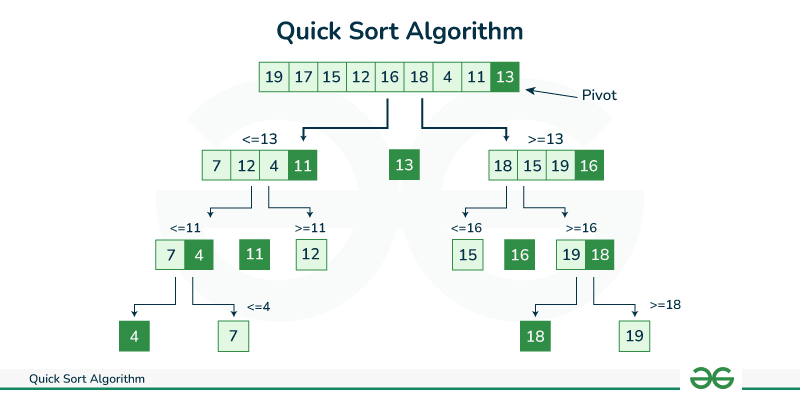
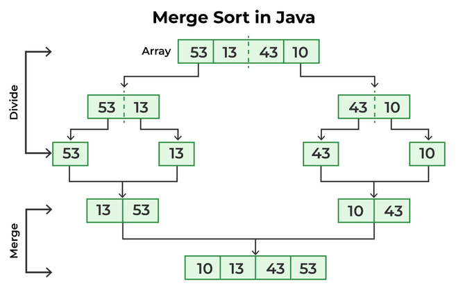
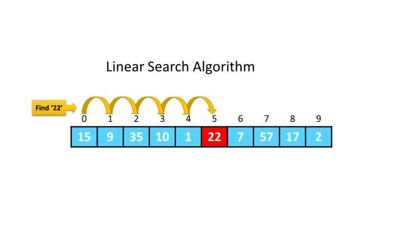
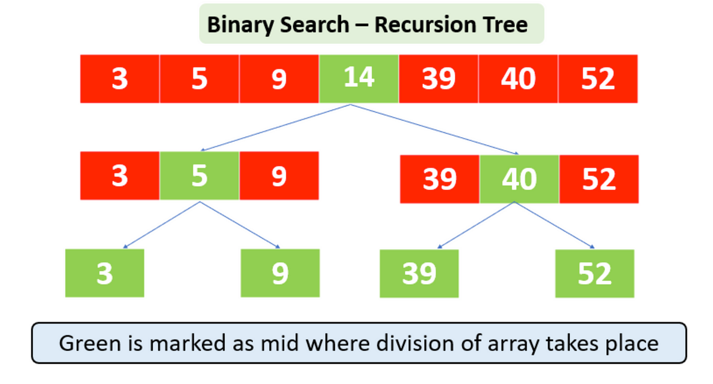
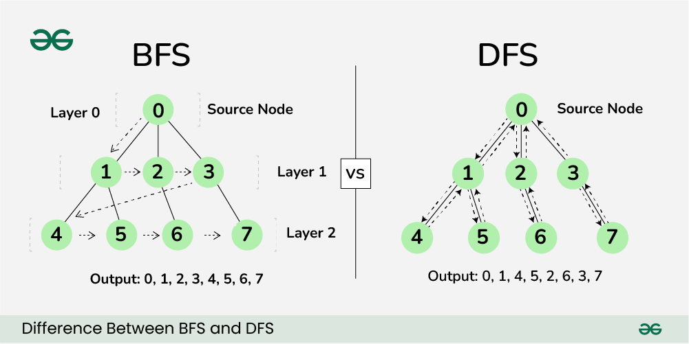

# 1. Algoritmy a jejich implementace, typy dat

## Složitost
Vyjadřuje náročnost algoritmu na výpočetní prostředky počítače v závislosti na délce vstupních dat

### Časová složitost
Udává jak se doba běhu algoritmu mění s velikostí vstupních dat
Získává se analýzou algoritmů, jejimž výsledkem je časová složitost
Značíme pomocí **O()**

#### 1. Konstantní
- O(1)
- Doba běhu nezavísí na velikosti vstupu
```Python
def get_first_element(elements):
    return elements[0] if elements else None
```


#### 2. Logaritmická
- O(log n)
- Doba běhu roste logaritmicky s velikostí vstupu
```Python
def binary_search(arr, target):
    low, high = 0, len(arr) - 1
    while low <= high:
        mid = (low + high) // 2
        if arr[mid] < target:
            low = mid + 1
        elif arr[mid] > target:
            high = mid - 1
        else:
            return mid
    return -1
```

#### 3. Lineární
- O(n)
- Doba běhu roste lineárně s velikostí vstupu
```Python
def find_max(arr):
    max_value = arr[0]
    for num in arr:
        if num > max_value:
            max_value = num
    return max_value
```

#### 4. Lineárně-logaritmická
- O(n*log n)
- Doba běhu roste podle n*log n
```Python
def sort_array(arr):
    return sorted(arr)
```

#### 5. Kvadratická
- O(n<sup>2</sup>)
- Doba běhu roste kvadraticky s velikostní vstupu
```Python
def bubble_sort(arr):
    n = len(arr)
    for i in range(n):
        for j in range(0, n-i-1):
            if arr[j] > arr[j+1]:
                arr[j], arr[j+1] = arr[j+1], arr[j]
    return arr
```

#### 6. Exponenciální
- O(2<sup>n</sup>)
- Doba běhu roste exponenciálně
```Python
def fibonacci(n):
    if n <= 1:
        return n
    else:
        return fibonacci(n-1) + fibonacci(n-2)
```



Obecně rozlišujeme časovou složitost v nejlepším, nejhorším a průměrném případě
**Příklad:**
- **Nejlepší případ**
  - O(1)
  - Hledaný prvek je na prvním místě v poli
- **Nejhorší případ**
  - O(n)
  - Prvek se nachází na posledním místě v poli nebo se nenachází vůbec
- **Průměrná**
  - O(n/2)
  - asymptoticky O(n)
```Java
static int find(int[] arr, int x) {
  for (int i = 0; i < arr.length; i++) {
    if (x==arr[i]) return i;
  return -1;
  }
}
```

### Prostorová složitost
Udává kolik paměti algoritmus potřebuje vzhledem k velikosti vstupních dat

#### 1. Konstantní
- O(1)
- Potřebuje konstantní množství pamětu

#### 2. Lineární
- O(n)
- Potřebuje paměť úměrnou velikostí vstupu

#### 3. Kvadratická
- O(n<sup>2</sup>)
- Potřebuje pamět úměrnou druhé mocnině velikosti vstupu

## Standardní algoritmy

### Řadící algoritmy

#### 1. Bubble Sort
- Opakované prochází seznam, porovnává sousední prvky a vyměňuje je, pokud nejsou ve správnem pořadí
- Složitost O(n<sup>2</sup>)


#### 2. Quick Sort
- Rozdělí seznam na dvě části podle pivotního prvku a rekurzivně třídí obě části
- Pivot se může volit náhodně, prostřední prvek v seznamu, poslední prvek nebo první prvek
- Složitost O(n*log n), nejhůře O(n<sup>2</sup>)


#### 3. Merge Sort
- Rekurzivně rozděluje seznam na poloviny a poté je vloží do seřazeného seznamu
- Složitost O(n*log n)


#### 4. Selection Sort
- Rozdělí si pole na dvě částí (setříděná a nesetříděná)
- Opakovaně hledá nejmenší prvek v nesetříděné části a přesouvá ho na správnou pozici v setříděné části
- Složitost O(n<sup>2</sup>)


#### 5. Insertion Sort
- Postupně se vytváří setříděná část a přidává do ní prvky jeden po druhém a umisťuje je na správné místo
- Prvek je porovnán s předchozími prvky a přesunut na správnou pozici
- Složitost O(n) v nejlepším případě, O(n<sup>2</sup>) v nejhorším a průměrném


### Hledací algoritmy

#### 1. Sekvenční
- Prochází všechny prvky, dokud nenalezne hledaný prvek
- Složitost O(n)


#### 2. Binární
- Funguje pouze na seřazeném poli
- Dělí seznam na poloviny a rozhoduje, ve které části hledát dál
- Složitost O(n*log n)


### Grafové algoritmy

#### 1. Hledání do hloubky (DFS)
- Prochází graf do hloubky
- Používá se zásobník nebo rekurze
- Složitost O(V+E), V - počet vrcholů, E - počet hran

#### 2. Hledání do šířky (BFS)
- Prochází graf do šířky
- Používá se fronta
- Složitost O(V+E)



## Programové moduly
Programové moduly umožňují rozdělení kódu do malých, snadno spravitelných a znovupoužitelných částí.
Jsou často poskytovány ve formě knihoven nebo frameworků, které poskytují předdefinované funkce a služby.

### Vlastnosti
- **Modularita**
  - Rozdělení velkých programů na menší části
  - Každý modul je samostatná jednotka, která implementuje specifickou část aplikace

- **Zapouzdření**
  - Moduly skrývají svou interní implementaci a posyktují veřejné rozhraní (API)
  - Zvyšuje bezpečnost

- **Opakovaná použitelnost**
  - Pokud je modul napsaný obecně, můžeme ho použít ve více projektech bez nutnosti změny kódu

- **Testovatelnost**
  - Testování jednotlivých částí aplikace nezávisle na zbytku systému

### Použití
- **Modulární architektura**
  - Rozdělení funkčnosti aplikace do malých modůlu, které spravují jednu část
  - Usnadňuje škálování a správu
  - Moduly umožňují rozdělit vývoj mezi jednotlivce, kteří budou pracovat jen na daném modulu

- **Knihovna**
  - Knihovny jsou soubory předem definovaného kódu, které poskytují sady funkcí
  - Můžeme je jednoduše vložit do projektu
  - Většínou jsou volné přístupné a můžeme se podílet na jejich vylepšeních (např. když reportneme bug)
  - **Příklady:**
    - **Python**
     ```python
     import numpy as np # Knihovna pro práci s vektory a maticemi

     # Vytvoření pole
     a = np.array([1, 2, 3, 4, 5])
     print("Pole a:", a)

     # Výpočet průměru
     mean = np.mean(a)
     print("Průměr:", mean)
     ```

    - **Java**
    ```Java
     import java.util.Random; // Import generování pseudonáhodných čísel

     public class Main {
         public static void main(String[] args) {
             Random random = new Random();

             // Generování náhodného celého čísla
             int randomInt = random.nextInt(100); // náhodné číslo mezi 0 (včetně) a 100
             System.out.println("Náhodné celé číslo: " + randomInt);
        }
     }
    ```

    - **C++**
    ```C++
     #include <iostream>
     #include <vector> // Import vektoru - pole, které můžeme zvětšovat a zmenšovat
     #include <algorithm> // Import standardních algoritmů

     int main() {
         std::vector<int> vec = {5, 2, 8, 1, 3};

         // Seřazení vektoru
         std::sort(vec.begin(), vec.end());
         std::cout << "Seřazený vektor: ";
         for(int n : vec) {
             std::cout << n << " ";
         }
         std::cout << std::endl;

         return 0;
     }
    ```

- **Framework**
  - Framework je struktorované prostředí, které poskytuje nástroje pro vývoj softwárových aplikací
  - Obsahují sadu předpřipravených modulů
  - **Příklady**
    - **Flask**
      - Framework pro webové aplikace v Pythonu
      - Vhodný pro malé a střední webové aplikace
      ```Python
      # Vytváří jednoduchou web aplikaci, která na localhost:5000 zobrazí "Hello World!"
      from flask import Flask

      app = Flask(__name__)

      @app.route('/')
      def hello_world():
        return 'Hello World!'

      if __name__ == '__main__':
        app.run(debug=True)
      ```

    - **Spring**
      - Framework pro vývoj backendu v Java
      ```Java
      // Vytvoří web aplikaci, která na localhost:8080 zobrazí text "Hello World!"
      import org.springframework.boot.SpringApplication;
      import org.springframework.boot.autoconfigure.SpringBootApplication;
      import org.springframework.web.bind.annotation.GetMapping;
      import org.springframework.web.bind.annotation.RestController;

      @SpringBootApplication
      public class DemoApplication {

        public static void main(String[] args) {
          SpringApplication.run(DemoApplication.class, args);
        }
      }

      @RestController
      class HelloController {
        @GetMapping("/")
          public String hello() {
            return "Hello World!";
          }
      }
      ```

    - **React**
      - Framework pro tvorbu uživatelského rozhraní (front-end)
      ```javascript
      // Na stránce se zobrazí "Hello World!"
      import React from 'react';
      import ReactDOM from 'react-dom';

      function App() {
        return (
          <div>
            <h1>Hello World!</h1>
          </div>
        );
      }

      ReactDOM.render(<App />, document.getElementById('root'));
      ```


 
