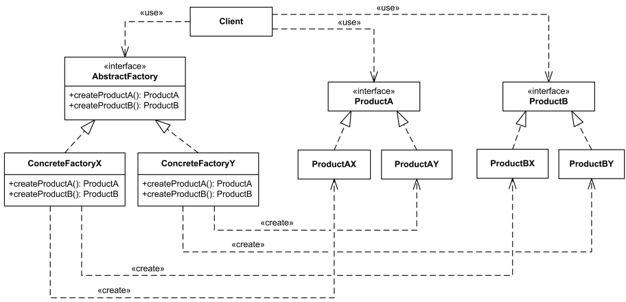

# Objektová analýza a návrh software

dva přístupy k analýze: 
- strukturovaná analýza
- objektově orientovaná analýza

### Strukturovaná analýza

Strukturovaná analýza se zabývá strukturou systému a hloubka/hierarchie. Zabývá se **STRUKTUROU** systému

Má 4 modely:
  - model funkční
  - model vnějšího chování
  - datový model
  - model řízení	

## Objektová analýza

Objektová analýza vychází z objektově orientovaného programování. Zajímá se o objekty a vlastnostmi informačního systému. Zabývá se **VLASTNOSTMI** systému

Při objektové analýze využíváme jazyk UML (Unified Modeling Language) = grafický jazyk pro modelování a vizualizaci systémů. Vizualizaci provádíme prostřednictvím diagramů

Úplně jednoduše UML je: jednotný jazyk pro tvorbu diagramů. Definuje standardy pro jednotnou strukturu diagramů

***Diagramy UML***

rozdělují se na:

- strukturované diagramy
  - diagram tříd
  - diagram komponent
  - diagram nasazení
  - objektový diagram 
- diagramy chování
  - diagram aktivit
  - use case diagram
  - interakční diagramy
    - sekvenční diagram
    - časový diagram

## Use Case

= poskytuje funkční náhled systému (kdo se systémem pracuje a jak). Vychází z funkčních požadavků

*Komponenty:*
- aktor
  - ten kdo pracuje se systémem
- případ užití
  - konkrétní funkcionalita 
- vazby
  - asociace
  - extended (rozšíření use case o další use case - volitelně), included (rozšíření use case o další use case - povinně)
  - generalizace (dědičnost)
- hranice systému
  - v use case diagramu může být více systémů a proto je potřeba je ohraničit. Aktoři jsou za hranicí

## Diagram tříd
= diagram tříd poskytuje logický náhled na systém. Znázorňuje datové struktury, operace u objektů a také jejich vazby.

*Komponenty:*
- třída
- vazba
  - kardinalita (násobnost)
    - 1:1, 1:N, M:N
  - typ vazby
    - asociace - třídy na sebe nejsou závislé
    - agregace - jedna třída je nadřazená, ale mohou bez sebe existovat
    - kompozice - pevná vazba. Třídy bez sebe nemohou existovat
    - generalize (dědičnost)
 

## Diagram nasazení
= Říká, co všechno je potřeba udělat k nasazení aplikace – na straně klienta i serveru. Zobrazuje technologie – software i hardware
- jedná se o popis HW i SW požadavek
- může zahrnovat i některé nefunkční požadavky

*Komponenty:*
- Uzel - má stereotyp, ten může být:
    - device - fyzické nebo virutální zařízení
    - executionEnvironment - software    
- Komponenta - nejnižší úroveň. Dílčí části uvnitř softwaru
- Komunikační linky - jakým způsobem uzly komunikují

### Sekvenční diagram 
= znázorňuje komunikaci mezi objekty v čase
- popis hlavního scénáře, posloupnost kroků které vedou k úspěšnému ukončení UC
- sekvenční diagram pracuje s třídami
- šipka znázorňuje zprávu (message)

*Komponenty:*
- lifeline
- aktor
- zpráva
- fragment

### Diagram aktivit
= grafické znázornění algoritmů. Každý proces v diagramu aktivit je reprezentován sekvencí jednotlivých kroků, které určují řídící tok. 
- pracuje s hlavním i alternativním scénářem

*Komponenty:*
- začátek
- konec
- plavecká dráha (swimline)
- rozhodnutí
- aktivita

### Stavový diagram
= zobrazuje životní cyklus objektů a stavy do kterých se během svého života dostávají
- může se modelovat buď ke třídě nebo k nějakému případu užití

### Diagram komponent
= zobrazuje závislosti mezi softwarovými komponentami. Zdrojové komponenty tvoří soubory vytvořené použitým programovacím jazykem.

## CASE
= Computer Aided Software Engineering -  Software pro podporu vývoje v softwarovém inženýrství

***Oblasti použití:***
- Pomáhá při vytvoření grafického modelu systému  
- Poskytuje datové slovníky pro správu a manipulaci s entitami
- Nástroje pro ladění kódu
- Grafický nástroj pro vytvoření uživatelského rozhraní
- Automatizační nástroje pro hromadné úpravy kódu

***Co CASE neumí:***

Softwarové inženýrství vyžaduje kreativní myšlení => nedá se automatizovat

Vývoj software vyžaduje týmovou spolupráci, CASE nástroje nebyly primárně
zaměřeny na interakce lidí v týmu, nyní se pozvolna situace mění (on-line kreslící
nástroje, integrace klientů pro repozitáře do IDE)

### CASE nástroje

= Integrovaná sada programů. Užívají centrální databázi, kde jsou informace o všech prvcích, ze kterých se model skládá

CASE nástroje pomáhají při různých fázích vývoje softwaru, jako je analýza, návrh, implementace, testování a údržba

*co umožňují CASE nástroje:*
- z modelu se vygeneruje kód
- reverse engineering - z kódu se zpětně vygeneruje model
- automatiké testy
- automatická dokumentace
- možnost prototypu

*příklady CASE nástrojů:* 
- Enterprise Architect - kompletní CASE nástroj pro systémovou analýzu a návrh
- Rational Rose - už není mezi námi

Celkově CASE nástroje jsou stará záležitost a už se moc nepoužívají. Každý pocítil utrpení s Enterprise Architect s paní Rábovou. 
 
