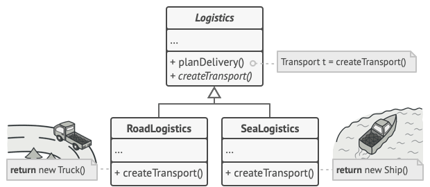
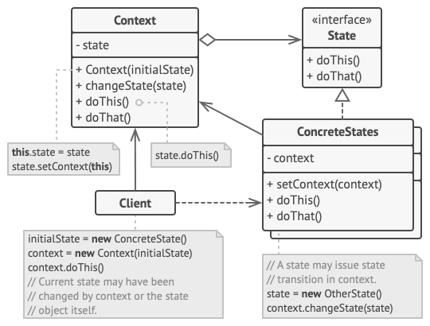

    <strong>Otázka 4</strong>

<nav style="
    position: sticky;
    top: 0;
    z-index: 100;
    background: rgba(0,0,0,0.8);
    padding: 8px 0 4px 0;
    box-shadow: 0 2px 8px rgba(0,0,0,0.1);
    text-align: center;
">
    <a href="03.md" style="color:white; text-decoration:none; margin: 0 16px;">⬅️ Předchozí</a>
    <a href="../README.md" style="color:white; text-decoration:none; margin: 0 16px;">🏠 Domů</a>
    <a href="05.md" style="color:white; text-decoration:none; margin: 0 16px;">Následující ➡️</a>
</nav>

# Návrhové vzory a jejich využití pro zlepšení objektového návrhu aplikací

**Otázka:** Použití návrhových vzorů pro vytváření instancí objektů (např. Abstraktní továrna, Stavitel) a omezení množství
objektů (např. Jedináček); využití návrhových vzorů řešících chování systému (např. Stav, Příkaz); návrhové vzory týkající se struktury aplikace (např. Dekorátor)

---

### Návrhové vzory
Návrhové vzory jsou metodiky (šablony) pro řešení různých problémů, se kterými se vývojář může setkat.
Existuje 23 základních vzorů, od kterých se odvozují další.
Vzorem může být jakékoliv řešení problému.

Velmi často se užívají při objektově orientovaném programování, kdy je třeba řešit programátorské postupy a dojít ke
vhodným návrhům (Best practise), abychom se později vyhnuli nutnosti přepisovat náš kód kvůli špatnému návrhu.
Nejedná se o knihovnu nebo část zdrojového kódu, která by se dala přímo vložit do našeho programu.
Objektově orientované návrhové vzory typicky ukazují vztahy a interakce mezi třídami a objekty, aniž by určovaly
implementaci konkrétní třídy.

Návrhové vzory dělíme do tří základních skupin:

- `Tvořivé vzory` - řeší problémy okolo vytváření objektů čili jako zajištění
  správného počtu instancí, výběr vhodné třídy nového objektu atp.
- `Strukturální vzory` - snahou je zpřehlednit, resp. vhodně
  strukturovat systém. Zabývají se uspořádáním a propojením objektů
- `Vzory chování` - zapouzdří určité procesy prováděné v systému.
  Např. jak zajistit spolupráci několika tříd při řešení problému.

### Tvořivé vzory

1. **Tovární metoda** (Factory method)

- nahrazuje přímé volání konstruktoru třídy (operátor `new`) voláním speciální tovární metody
- objekty vrácené tovární metodou se označují jako produkty
- konstruktor může požadovat spoustu argumentů a různá nastavení, to nechám na tovární metodě a instance tříd si
  vytvářím zjednodušeně pomocí ní
- občas ani nepotřebuji nebo nechci znát, jaké konkrétní objekty mi metoda vytváří

2. **Továrna** (Factory)

- poskytuje rozhraní pro vytváření instancí objektů v nadtřídě, přičemž podtřídy mohou měnit typ vytvářených objektů
- továrna se často implementuje jako samostatná třída s jednou nebo více továrními metodami
- umožňuje vytváření objektů bez specifikace přesné třídy, která má být vytvořena
- logika rozhodující, který objekt vytvořit je centralizována právě v továrně
  factory

3. **Abstraktní továrna** (Abstract factory)

- vzor dovolující vytvářet rodiny příbuzných objektů bez určení jejich konkrétních tříd
- umožňuje vytvoření skupiny souvisejících objektů (např. různé druhy widgetů v GUI) s použitím jediné továrny
- nikdo nemůže vytvořit chybnou instanci
- abstraktní továrna ani neví, který typ instancí vytváří
- stejně jako obyčejná továrna vnitřně operuje pomocí továrních metod, tak abstraktní továrna vnitřně operuje pomocí
  obyčejných továren

4. **Stavitel** (Builder)

- návrhový vzor, který se používá pro konstrukci opravdu složitých objektů
- pomocí něj se objekt vytváří po jednotlivých krocích
- jednotlivé konečné objekty mohou vypadat různě podle toho, které kroky při tvorbě budou vykonány

- builder se implementuje tak, že uděláme několik samostatných tříd, které se budou
  specializovat na tvorbu různých variant vytvářeného objektu
- každá třída bude implementovat všechny kroky nezbytné k jeho vytvoření
- řídící třída dostane řečeno, kterého buildera použije a zavolá metody pro vytvoření produktu

- na rozdíl od továrny, která vyprodukuje produkt hned, tak builder jej vytváří postupně voláním jednotlivých metod
- není to tedy alternativa továrny
- tady se nevyrábí různí potomci produktu, ale stále jen jeden a ten samý produkt, jen může
  vypadat různě

5. **Jedináček** (Singleton)

- jedináček je objekt jediný svého druhu v celé aplikaci
- je to návrhový vzor, který umožňuje zajistit, aby třída měla pouze jednu instanci a zároveň poskytovala globální
  přístupový bod k této instanci
- jedináček se implementuje tak, že označíme konstruktor třídy jako *private* a vytvoříme statickou metodu, která nám
  bude zastupovat konstruktor
- metoda bude kontrolovat, jestli už jedináček existuje, pokud ne, tak ho vytvoří pomocí skrytého konstruktoru
- pokud jedináček už bude existovat, tak jej vrátí

### Strukturální vzory

1. **Stav**

- dovoluje objektu změnit jeho vnitřní chování na základně vnitřní stavové změny
- pokud řešíme v několika metodách série obdobných podmínek, porušujeme princip DRY
- jedná se často o řetězce podmínek např.: je student prezenční pak…, pokud je dálkový, tak…
- implementačně se tento problém často řeší pomocí různých zanořených switch příkazů

- tyto podmínky je možné rozdělit do stavů
- stavy jsou pak uloženy jako samostatné třídy
- tyto třídy neobsahují většinou žádné atributy, ale pouze metody, v jistých jazycích (Java, Kotlin) lze pak stavy
  implementovat čistě pomocí rozhraní
- každá metoda vnořené stavové třídy implementuje jen jednu část
  podmínky což je velmi přehledné a rozšiřitelné

- stav se implementuje tak, že máme kontextovou třídu, která v sobě stav drží jako atribut
- na základě toho, v jakém stavu se nachází, se vykonávají různé metody
- kontextová třída potom své vlastní metody založené na stavech volá tak, že použije metodu stavu
- podle toho, jaký zrovna stav bude uložený v atributu třídy, podle toho se zavolá konkrétní implementace
- long live polymorfismus a dědičnost, díky kterým je toto vůbec možné

### Vzory chování

1. **Dekorátor**

- návrhový vzor, který umožňuje připojit k objektům nové chování
- dokáže umístit objekty do speciálních obalů (jiných objektů), které obsahují nové chování
- při implementaci tedy třídu obalíme do jiné třídy, která bude většinou volat původní metody a jen doplní požadovanou
  novou funkcionalitu
- toto obalení je implementováno pomocí agregační vazby, takže je dynamické a lze ho měnit za běhu programu
- zkráceně tedy dekorátor obalí objekt místo aby se dědilo a to přináší dynamické rozšiřování funkcionality
  