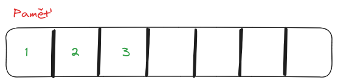
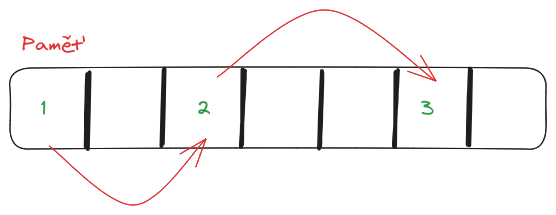
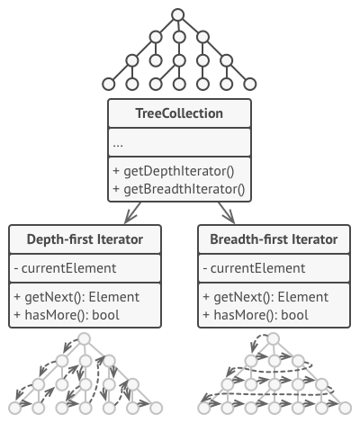

## 5. Generické programování v C++/Javě

_Využití šablon abstraktních datových struktur pro uložení dat (rozdíly mezi strukturami, výběr vhodné abstraktní datové
struktury, práce s iterátory); aplikace generických algoritmů a jejich rozšiřitelnost prostřednictvím lambda výrazů_

### Datové struktury

Datová struktura je způsob organizace dat v paměti počítače, který zajišťuje, aby mohla data být používána efektivně.
Datová struktura umožňuje uchovávat a zpracovávat množinu dat buď stejného typu nebo různorodých, ale logicky
souvisejících.

**Pole**

Pole je skupina dat stejného typu.
Při inicializaci dostane svou délku a ta je dále neměnná.
Neměnnost délky je nutná, protože při své inicializace pole alokuje v paměti buňky, které jdou hned za sebou (podle
datového typu se změří velikost buňky a podle délky pole se vypočítá jak velký úsek paměti je k uchování pole nutný).
Proto nelze pole po vytvoření zvětšovat nebo zmenšovat.
Některé programovací jazyky umožňují zvětšení pole, takový úkon je ovšem velice časově náročný (realokace paměti).

K jednotlivým prvkům pole můžeme přistupovat přímo pomocí indexů.
Pole je vhodná datová struktura, pokud předem známe počet prvků, který do něj chceme umístit a nebudeme počet těchto
prvků moc často měnit.



**Lineární seznam**

Též znám jako spojový seznam, je datová struktura určená k ukládání dat předem neznámé délky.
Seznamy jsou tvořeny vzájemně propojenými uzly.
Každý uzel obsahuje jednu hodnotu a jeden nebo více ukazatelů na další uzly.
V paměti není seznam tedy uložený v buňkách jdoucích přímo za sebou, ale jeho prvky jsou rozmístěny různě po paměti.
Pokud hledáme specifický prvek seznamu, musíme ho projít celý dokud nenarazíme na prvek, který hledáme.
Na základě použitých ukazatelů rozlišujeme několik druhů spojových seznamů:

- jednosměrně zřetězený spojový seznam: každý prvek obsahuje odkaz na následující
- obousměrně zřetězený spojový seznam: každý prvek obsahuje odkaz na následující a předchozí
- kruhový spojový seznam: obousměrně zřetězený s tím, že první odkazuje na poslední a poslední na první



**Strom**

Strom je datová struktura, která slouží pro uchovávání hierarchicky uspořádaných dat.
Strom je souvislý graf neobsahující cyklus.
Nejvyšší prvek stromu se nazývá **kořen** - je to jediný prvek stromu, který nemá předka.
Prvek, který nemá žádného potomka se nazývá **list** a je to tedy poslední prvek ve větvi.
**Větev** je cesta mezi kořenem a listem stromu.
Každý prvek, který není ani listem a ani kořenem se nazývá **vnitřní uzel**.

V paměti je strom uložen podobně jako lineární seznam - pomocí ukazatelů.

Strom může obsahovat i podstrom, stačí si označit jiný prvek jako kořen.
Pokud každý vnitřní prvek stromu má maximálně dva další syny, nazýváme ho **binární strom**.
Prvky takového stromku mají svou levou a pravou větev.

Binární strom má svůj speciální případ: **Binární vyhledávací strom**.
To je datová struktura velmi vhodná pro hledání prvku podle hodnoty, jak již napovídá její název.
Abychom mohli binární strom označit za BVS, musí mít tyto vlastnosti:
- Levý podstrom každého uzlu obsahuje pouze klíče menší než je klíč tohoto uzlu
- Pravý podstrom uzlu obsahuje pouze klíče větší než je klíč tohoto uzlu

Strom můžeme procházet dvěma různými algoritmy:
- `BFS` (Breadth First Search) – prohledávání do šířky, prohledává strom po celých patrech)
- `DFS` (Depth First Search) – prohledávání do hloubky, prohledává strom po jednotlivých větvích. Implementace tohoto algoritmu má několik variant podle pořadí operací:
    - _Inorder_: projde se levý podstrom, provede se akce a projde se pravý podstrom
    - _Preorder_: provede se akce, projde se levý podstrom, projde se pravý podstrom
    - _Postorder_: projde levý podstrom, projde pravý podstrom, provede akci

**Halda**

Halda je stromová datová struktura.
Od obyčejného stromu se líší tím, že jsou její prvky seřazeny.
Platí zde pravidlo pravidlo haldy a to může být různé buď se jedná o max-heap nebo min-heap.
V případě max-heap vždy platí, že každý uzel větší nebo roven uzlům, kteří se nacházejí pod ním.
U min-heap je to obráceně a tedy každý uzel je menší nebo roven uzlům pod ním.

U max-heap tedy platí, že v kořenu je nejvyšší číslo.
U min-heap je v kořenu číslo nejmenší.

Halda má několik využití:
- řadící algoritmus heapsort
- tvorba prioritních front
- implementace grafových algoritmů (Dijkstrův nebo Primovův algoritmsu)

**Fronta**

Fronta (queue) je datová struktura podporující vkládání a odebírání prvků.
Využívá princip **FIFO** (first in – first out), tedy prvek, který byl vložen jako první, bude i jako první odebrán.
Rozlišujeme tedy začátek a konec neboli hlavu a ocásek fronty.
Na začátku je prvek připravený k odebrání, naopak operaci vložení vykonáváme na konci fronty.
Nelze vkládat ani číst z prostředka fronty.

**Zásobník**

Zásobník (stack) je datová struktura podporující vkládání a odebírání prvků.
Zásobník má vrchol a dno.
Specifický je v tom, že uplatňuje metodu **LIFO** (last in – first out), tedy při odebírání z něj můžeme vždy vybrat
pouze ten prvek, který byl vložen jako poslední a nachází se na vrcholu.

Nový prvek dáme na vrchol a necháme ho spadnout na zbylé prvky v zásobníku.
Prvek vložený jako první je tedy na dně a přečteme ho, až když vytáhneme všechny prvky nad ním.
Na rozdíl od lineárního seznamu, není možné vkládat nové prvky doprostřed zásobníku, ani odtud číst.

Zásobník používá čtyři základní operace:

- vložení prvku (push)
- odebrání prvku (pop)
- nahlédnutí na vrchol zásobníku (peek)
- test prázdnoty (isEmpty)

**Hašovací tabulka**

Hašovací tabulka je datová struktura, která se skládá z unikátních klíčů a hodnot.
Každý klíč je zde mapován na hodnotu.
Někdy se též nazývá slovník, hash map nebo jen mapa.

Na rozdíl od pole zde ke konkrétní hodnotě nepřistupujeme pomocí indexu, ale pomocí unikátního klíče.
Klíče tabulky musí být obvykle jednoduché typy (například celá čísla nebo řetězce), zatímco hodnoty mohou být jakéhokoli typu.

Klíče ve slovníku musí být jedinečné; pokus o vytvoření duplicitního klíče obvykle končí přepsáním hodnoty pod stávajícím klíčem.

**Množina**

Množina je datová struktura, která je schopna uložit určité hodnoty bez jakéhokoliv pořadí a bez opakujících se hodnot.
Stejně jako v matematice se v množině nemohou nacházet duplikáty.
Na rozdíl od jiných datových struktur se množina používá spíše pro testování, zdali se konkrétní hodnota nachází v množině dat nežli pro získávání specifických prvků z množiny.

Některé množiny jsou navrženy jako statické a s jejich vytvořením se žádné prvky už dále nepřidávají ani neodebírají.

### Iterátory

Iterátor je návrhový vzor, který umožňuje sekvenčně procházet prvky nějaké složité datové struktury (kolekce) aniž by
znal vnitřní strukturu této struktury.
Používá se například, když procházíme kolekci a zároveň ji při tom potřebujeme modifikovat (odebrat prvek nebo nějaký
přidat).
pomocí klasického `for` nebo `while` cyklu nebylo možné.



### Generické programování

Generické programování je tvorba algoritmů univerzálním způsobem.
V programovacích jazycích je generičnost implementována různě a ne všechny jazyky ji podporují.
Generičnosti kódu dosáhneme tak, že místo konkrétních definic datových typů dosadíme pouze parametry.
Vytvoříme tím tzv. šablonu.
Za šablonu poté můžeme v kódu později dosadit konkrétní datový typ.

Použitím genericity lze dosáhnout nejlepšího možného zobecnění kódu.
Genericitu používají i složitější datové struktury.
Ze světa Javy lze zmínit například většinu tříd pro správu kolekcí z balíčku `java.util` a tedy:

- List\<T> a jeho implementace ArrayList\<T> a LinkedList\<T>
- Set\<T> a jeho implementace HashSet\<T> a TreeSet\<T>
- Map\<T> a jeho implementace HashMap\<T> a TreeMap\<T>

Tyto předpisy jsou tedy **generické** datové struktury a umějí pracovat s jakýmkoliv typem dat.
Pokud tedy chceme použít datovou strukturu s konkrétním typem, uděláme to takto:

```java
List<Car> cars = new ArrayList<Car>();
```

### Lambda výrazy

Lambda výrazy jsou součástí funkcionálního programovacího paradigmatu.
Jedná se o tzv. anonymní podprogramy tedy podprogramy bez jména.
Nedefinují se s hlavičkou pro opakovatelné použití, ale zapisují se pouze jako tělo podprogramu.
Jsou velmi užitečné a používají se na zjednodušení čitelnosti kódu.
Často se stane, že máme nějakou opravdu krátkou a jednoduchou funkcionalitu a nechceme kvůli ní definovat celý blok i s
hlavičkou.
Proto místo dlouhé definice pouze zapíšeme krátké tělo.
Podprogram je zpracován a chová se tak jako každý jiný výraz.

Jako lambda výraz můžeme implementovat jak podprogramy typu funkce tak podprogramy typu procedury.
Lambda výraz tedy ani nemusí nic vracet.
Ve stručnosti je tedy lambda výraz pouze zkrácený zápis podprogramu.

**Lambda v Javě**

Pro definici lambda výrazu se používá operátor šipky `->`, na levé straně stojí parametry výrazu a na pravé straně výraz
samotný.
Syntaxe lambda výrazu má svá omezení.
Jednoduché výrazy nemusejí obsahovat klíčové slovo `return`.
Jednoduchý výraz za šipkou nesmí obsahovat složitější struktury jako jsou podmínky nebo cykly.
Pokud je chceme použít, musíme mu explicitně definovat tělo pomocí složených závorek `{ }`.

```java
// lambda s jedním parametrem
parameter -> expression

// lambda s více parametry
(parameter1, parameter2) -> expression

// složitejší lambda výraz
(parameter1, parameter2) -> {code block }
```

**Ukázka použití lambda výrazu**

```java
ArrayList<Integer> numbers = new ArrayList<Integer>();
numbers.forEach( (n) -> {System.out.println(n); });
```

Lambdy lze v Javě typicky využít u `Stream` API, které nabízí funkce:
- map
- filter
- forEach
- sorted
- a spoustu dalších, kde se dá lambda použít
```java
// použití lambdy u Stream API
Stream<String> values = Stream
        .generate(() -> randomString())
        .limit(10)
        .filter(s -> s.contains("f"))
        .map(s -> s.toLowerCase())
        .sorted((o1, o2) -> o1.compareTo(o2));
```