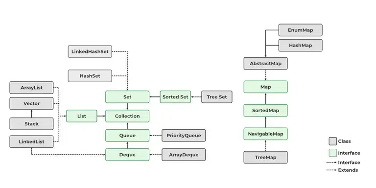

## Kolekce v jazyce ~~C#~~ Java

*Využití datových kolekcí (třídy reprezentující dynamické seznamy a jejich vnitřní implementace, List, SortedList,
Dictionary, Queue, Stack), rozdíl mezi generickými a negenerickými strukturami, možnosti užití pro řešení parciálních
problémů v bakalářské práci*

> [!WARNING]
> Z důvodu absence vyučování předmětu C# je vše vysvětleno na programovacím jazyce Java.
> Ten je stejně lepší, protože na něj nemá monopol ďábelská firma Microsoft - poznámka redakce.

Kolekce jsou kontejnery sloužící k ukládání objektů.
Jsou dynamickými alternativami k polím, oproti nimž mají řadu výhod, např.:

- proměnnou velikost,
- přístup nejen podle číselného indexu,
- možnost manipulace s objekty (řazení, zjišťování přítomnosti prvku apod.).

Většinou se používají kontejnery hotové, vestavěné, tj. ty, jež jsou součásti standardní knihovny Java Core API.
Kontejnerové třídy najdeme v balíku `java.util`.

Primárně existují tři typy kontejnerů:

- **Množiny** (implementují rozhraní `Set`)
- **Seznamy** (implementují rozhraní `List`)
- **Mapy** (implementují rozhraní `Map`)

Množiny a seznamy implementují rozhraní `Collection` a řadí se tak mezi tzv. kolekce.
Rozhraní kolekce popisuje velmi obecný kontejner, disponující operacemi: přidávání, rušení prvku, získání iterátoru,
zjišťování prázdnosti atd.

Všechny kolekce v diagramu jsou dnes již generické a měly by se tak i používat.
Dříve, před verzí Java SE05, než byla zavedena genericita, exitovaly i negenerické kolekce.
I dnes je možné je stále použít.
Ty ovšem pracují pouze s datovým typem `Object` a je nevhodné je používat.
I překladač jazyka nás bude varovat a nadávat nám, pokud použijeme negenerické kolekce.

### Množiny

Jsou struktury standardně bez uspořádání prvků (ale existují i uspořádané, viz níže).
Implementují rozhraní `Set` (což je rozšíření Collection).
Cílem množin je mít možnost rychle provádět atomické operace:

- vkládání prvku,
- odebírání prvku,
- dotaz na přítomnost prvku.

#### HashSet

Neuspořádaná množina.
Implementačně provedena pomocí struktury hašovací tabulky.

#### TreeSet

Implementuje rozhraní `SortedSet`.
V TreeSet se průběžně udržují prvky seřazené (využívá stromovou strukturu).
Již v okamžiku vložení se vkládaný prvek zařadí do odpovídajícího pořadí vzhledem ke stávajícím prvkům.
Vkládání do TreeSet je tak pomalejší, než do HashSet.
Kupodivu pomalejší je i jakákoliv další práce s TreeSet, kromě vyhledávání prvku (kde však rozdíl rychlostí není
významný).

Jednotlivé prvky lze tedy iterátorem procházet v přesně definovaném pořadí – uspořádání podle hodnot prvků.
Uspořádání je dáno buďto:

- standardním chováním metody `compareTo()` vkládaných objektů, pokud implementují rozhraní `Comperable`
- nebo je možné uspořádání definovat pomocí tzv. komparátoru (rozhraní `Comparator`) poskytnutého při tvorbě množiny

### Seznamy

Jedná se o lineární struktury.
Implementují rozhraní `List`.
Prvky seznamů lze adresovat pomocí číselného indexu.
Seznamy poskytují možnost získat dopředný i zpětný iterátor.
Lze pracovat i s podseznamy pomocí metody `sublist()`.
Nejpoužívanějším seznamem je třída `ArrayList`.

#### LinkedList

Třída LinkedList představuje spojový seznam prvků s možností přidávat/odebírat prvky na začátku nebo konci seznamu.
V Javě je tato třída implementována jako **obousměrně zřetězený lineární seznam**.
Implementace pomocí dvojitě zřetězeného seznam umožňuje rychlé vkládání a mazání, ale pomalý náhodný přístup.

#### Vector

Třída Vector je součástí standardní knihovny již od verze 1.0 jazyka.
Dnes se místo něj používá ArrayList.
Má podtřídu `Stack` reprezentující zásobník (strukturu typu LIFO) s metodami `push()`, `pop()` a `empty()`.
Vector je vláknově bezpečná datová struktura.
Tato její vlastnost ovšem snižuje její výkon, je pomalejší a proto je preferovanější ArrayList.

#### ArrayList

Připomíná klasické pole, ovšem s proměnnou délkou.
Pro přístup k jednotlivým prvkům lze používat indexy, protože prvky jsou udržovány v určitém pořadí.
Může obsahovat stejné (duplicitní) prvky.

Vnitřně je implementován jako **pole** s výchozí velikostí 10.
Jakmile v poli dojde místo, zvětší seznam svoji velikosti vytvořením nového pole, které má o 50 % větší velikost.
Všechny prvky ze starého pole jsou přemístěny do nového pole.

ArrayList je vhodný pro rychlé čtení.
Kvůli realokaci vnitřně použitého pole je ovšem nevhodný pro časté vkládání a odebírání prvků.

#### PriorityQueue
PriorityQueue je fronta s prioritami, kde prvky mají přirozené pořadí nebo pořadí definované porovnávacím objektem (Comparator).
Fronta je implementována pomocí datové struktury halda (heap).

### Mapy

Mapy (asociativní pole, nepřesně také hašovací tabulky nebo haše) fungují v podstatě na stejných principech a
požadavcích jako Set.
Ukládají ovšem dvojice (klíč, hodnota) a umožňují rychlé vyhledání dvojice podle hodnoty klíče.
Pomocí klíče, který je neměnný a unikátní, se vyhledává hodnota.
Hodnota je proměnná a může být duplicitní, tj. dva různé klíče mohou mít stejnou hodnotu.
Nejpoužívanější třídou je zde HashMap.
Možné operace jsou:

- vložení prvku
- odstranění prvku podle hodnoty klíče
- dotaz na přítomnost klíče v mapě
- dotaz na přítomnost hodnoty v mapě
- výběr hodnoty odpovídající zadanému klíči

#### HashMap

Nejpoužívanější třídou implementující rozhraní Map.
Implementována pomocí hašovací tabulky.

#### EnumMap

EnumMap je implementace mapy, která jako klíče přijímá výhradně nějaký výčet (enum).
Stejně jako ostatní kontejnery je generická.
Používá 2 generické parametry: typ klíče a typ uložený v mapě.

#### TreeMap

V TreeMap jsou jednotlivé prvky seřazeny podle hodnoty klíče.
TreeMap se používá (stejně jako TreeSet) méně, když potřebujeme mít prvky seřazené.
Seřazení klíčů je nezbytné v tom případě, kdy potřebujeme získat z mapy:

- největší či nejmenší klíč,
- „podmapu“ v závislosti na hodnotě klíče.

TreeMap podporuje všechny operace ze třídy HashMap a přidává k nim ještě:

- získání nejmenšího klíče
- získání největšího klíče