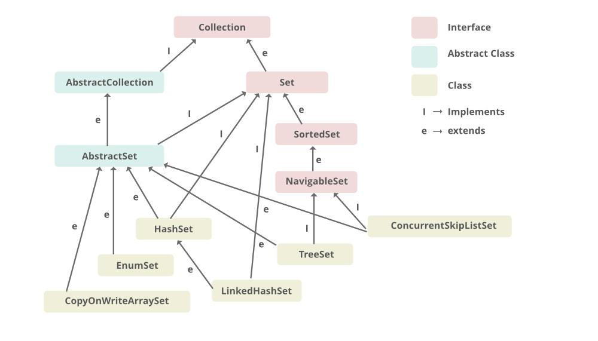
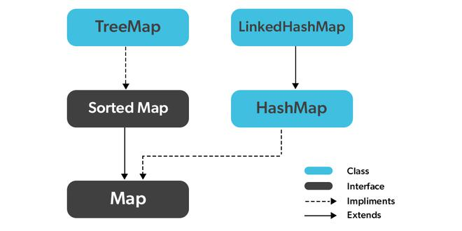

<div align="center" style="margin-top: 16px;">
    <strong>Otázka 6</strong>
</div>

<nav style="
    position: sticky;
    top: 0;
    z-index: 100;
    background: rgba(0,0,0,0.8);
    padding: 8px 0 4px 0;
    box-shadow: 0 2px 8px rgba(0,0,0,0.1);
    text-align: center;
">
    <a href="05.md" style="color:white; text-decoration:none; margin: 0 16px;">⬅️ Předchozí</a>
    <a href="../README.md" style="color:white; text-decoration:none; margin: 0 16px;">🏠 Domů</a>
    <a href="07.md" style="color:white; text-decoration:none; margin: 0 16px;">Následující ➡️</a>
</nav>

> [!WARNING]
> Z důvodu absence vyučování předmětu C# je vše vysvětleno na programovacím jazyce Java.

# Kolekce v jazyce ~~C#~~ Java

<div align="center">

[<kbd>🌐 Vizualizace (EN)</kbd>](https://visualgo.net/en)  

</div>


> [!TIP]Otázka
> Využití datových kolekcí (třídy reprezentující dynamické seznamy a jejich vnitřní implementace, List, SortedList, Dictionary, Queue, Stack), rozdíl mezi generickými a negenerickými strukturami, možnosti užití pro řešení parciálních problémů v bakalářské práci

---

Kolekce jsou kontejnery sloužící k ukládání objektů.Jsou dynamickými alternativami k polím, oproti nimž mají řadu výhod, např.:

- proměnnou velikost,
- přístup nejen podle číselného indexu,
- možnost manipulace s objekty (řazení, zjišťování přítomnosti prvku apod.).

Většinou se používají kontejnery hotové, vestavěné, tj. ty, jež jsou součásti standardní knihovny Java Core API. Kontejnerové třídy najdeme v balíku `java.util`.

Primárně existují tři typy kontejnerů:

- **Množiny** (implementují rozhraní `Set`)
- **Seznamy** (implementují rozhraní `List`)
- **Mapy** (implementují rozhraní `Map`)

Množiny a seznamy implementují rozhraní `Collection` a řadí se tak mezi tzv. kolekce.
Rozhraní kolekce popisuje velmi obecný kontejner, disponující operacemi: přidávání, rušení prvku, získání iterátoru,
zjišťování prázdnosti atd.


Všechny kolekce v diagramu jsou dnes již generické a měly by se tak i používat.
Dříve, před verzí Java SE05, než byla zavedena genericita, exitovaly i negenerické kolekce.
I dnes je možné je stále použít.
Ty ovšem pracují pouze s datovým typem `Object` a je nevhodné je používat.
I překladač jazyka nás bude varovat a nadávat nám, pokud použijeme negenerické kolekce.

## Množiny [<kbd>Set</kbd>](https://www.geeksforgeeks.org/set-in-java/)



Jsou struktury standardně bez uspořádání prvků (ale existují i uspořádané, viz níže).
Implementují rozhraní `Set` (což je rozšíření Collection).
Cílem množin je mít možnost rychle provádět atomické operace:

- vkládání prvku,
- odebírání prvku,
- dotaz na přítomnost prvku.

### HashSet [<kbd>Link</kbd>](https://www.geeksforgeeks.org/hashset-in-java/)

Neuspořádaná množina.
Implementačně provedena pomocí struktury **hašovací tabulky**.

### TreeSet [<kbd>Link</kbd>](https://www.geeksforgeeks.org/treeset-in-java-with-examples/)

Implementuje rozhraní `SortedSet`. V TreeSet se průběžně udržují prvky seřazené (využívá stromovou strukturu). Již v okamžiku vložení se vkládaný prvek zařadí do odpovídajícího pořadí vzhledem ke stávajícím prvkům. Vkládání do TreeSet je tak pomalejší, než do HashSet. Kupodivu pomalejší je i jakákoliv další práce s TreeSet, kromě vyhledávání prvku (kde však rozdíl rychlostí není významný).

Jednotlivé prvky lze tedy iterátorem procházet v přesně definovaném pořadí – uspořádání podle hodnot prvků.

Uspořádání je dáno buďto:

- standardním chováním metody `compareTo()` vkládaných objektů, pokud implementují rozhraní `Comperable`
- nebo je možné uspořádání definovat pomocí tzv. komparátoru (rozhraní `Comparator`) poskytnutého při tvorbě množiny

## Seznamy [<kbd>List</kbd>](https://www.geeksforgeeks.org/list-interface-java-examples/)

Jedná se o lineární struktury. Implementují rozhraní `List`. Prvky seznamů lze adresovat pomocí číselného indexu. Seznamy poskytují možnost získat dopředný i zpětný iterátor. Lze pracovat i s podseznamy pomocí metody `sublist()`. Nejpoužívanějším seznamem je třída `ArrayList`.

### LinkedList [<kbd>Link</kbd>](https://www.geeksforgeeks.org/linked-list-in-java/)

Třída LinkedList představuje spojový seznam prvků s možností přidávat/odebírat prvky na začátku nebo konci seznamu.
V Javě je tato třída implementována jako **obousměrně zřetězený lineární seznam**.
Implementace pomocí dvojitě zřetězeného seznam umožňuje rychlé vkládání a mazání, ale pomalý náhodný přístup.

#### Příklad použití

``` java
// Java program to add elements to a LinkedList
import java.util.LinkedList;

public class Geeks {

    // Main driver method
    public static void main(String[] args) {
        // Creating a LinkedList
        LinkedList<String> l = new LinkedList<String>();

        // Adding elements to the LinkedList using add() method
        l.add("One");
        l.add("Two");
        l.add("Three");
        l.add("Four");
        l.add("Five");

        // Printing the LinkedList
        System.out.println(l);
    }
}
```

##### Výstup programu:
```
[One, Two, Three, Four, Five]
```

### Vector [<kbd>Link</kbd>](https://www.geeksforgeeks.org/java-util-vector-class-java/)

Třída Vector je součástí standardní knihovny již od verze 1.0 jazyka. Dnes se místo něj používá ArrayList. Má podtřídu `Stack` reprezentující zásobník (strukturu typu LIFO) s metodami `push()`, `pop()` a `empty()`. Vector je vláknově bezpečná datová struktura. Tato její vlastnost ovšem snižuje její výkon, je pomalejší a proto je preferovanější ArrayList.


### Příklad použití

``` java
*// Java Program Implementing Vector
import java.util.Vector;

public class Geeks
{
    public static void main(String[] args) 
    {
        // Create a new vector
        Vector<Integer> v = new Vector<>(3, 2);

        // Add elements to the vector
        v.addElement(1);
        v.addElement(2);
        v.addElement(3);

        // Insert an element at index 1
        v.insertElementAt(0, 1);

        // Remove the element at index 2
        v.removeElementAt(2);

        // Print the elements of the vector
        for (int i : v) {
            System.out.println(i);
        }
    }
}*
```

#### Výstup programu:
```
1
0
3
```

### ArrayList [<kbd>Link</kbd>](https://www.geeksforgeeks.org/arraylist-in-java/)

Připomíná klasické pole, ovšem s proměnnou délkou.
Pro přístup k jednotlivým prvkům lze používat indexy, protože prvky jsou udržovány v určitém pořadí. Může obsahovat stejné (duplicitní) prvky.

Vnitřně je implementován jako **pole** s výchozí velikostí 10. Jakmile v poli dojde místo, zvětší seznam svoji velikosti vytvořením nového pole, které má o 50 % větší velikost. Všechny prvky ze starého pole jsou přemístěny do nového pole.

ArrayList je vhodný pro rychlé čtení. Kvůli realokaci vnitřně použitého pole je ovšem nevhodný pro časté vkládání a odebírání prvků.

#### Příklad použití

``` java
// Java Program to demonstrate ArrayList
import java.util.ArrayList;

class Main {
    public static void main (String[] args) {
        
      	// Creating an ArrayList
      	ArrayList<Integer> a = new ArrayList<Integer>();
      	
      	// Adding Element in ArrayList
      	a.add(1);
      	a.add(2);
      	a.add(3);
      
      	// Printing ArrayList
      	System.out.println(a);
      	
    }
}
```

#### Výstup programu:
```
[1, 2, 3]
```

### PriorityQueue [<kbd>Link</kbd>](https://www.geeksforgeeks.org/priority-queue-in-java/)

PriorityQueue je fronta s prioritami, kde prvky mají přirozené pořadí nebo pořadí definované porovnávacím objektem (Comparator). Fronta je implementována pomocí datové struktury halda (heap).

#### Příklad použití

``` java
// Java Program for PriorityQueue
import java.util.PriorityQueue;

public class Geeks 
{
    public static void main(String[] args) 
    {
      	// Priority Queue Min Type
        PriorityQueue<Integer> p = new PriorityQueue<>();

        // Add elements to the queue
        p.add(3);
        p.add(10);
        p.add(7);
        p.add(2);

        // Print the head of the queue
        System.out.println("Head of Queue: " + p.peek());

    }
}
```

#### Výstup programu:
```
Head of Queue: 2
```

## Mapy [<kbd>Map</kbd>](https://www.geeksforgeeks.org/map-interface-java-examples/)



Mapy (asociativní pole, nepřesně také hašovací tabulky nebo haše) fungují v podstatě na stejných principech a
požadavcích jako Set.
Ukládají ovšem dvojice (klíč, hodnota) a umožňují rychlé vyhledání dvojice podle hodnoty klíče.
Pomocí klíče, který je neměnný a unikátní, se vyhledává hodnota.
Hodnota je proměnná a může být duplicitní, tj. dva různé klíče mohou mít stejnou hodnotu.
Nejpoužívanější třídou je zde HashMap.
Možné operace jsou:

- vložení prvku
- odstranění prvku podle hodnoty klíče
- dotaz na přítomnost klíče v mapě
- dotaz na přítomnost hodnoty v mapě
- výběr hodnoty odpovídající zadanému klíči

### HashMap

`HashMap` je jedna z nejčastěji používaných implementací rozhraní `Map`. Slouží k ukládání dvojic **klíč – hodnota** a je založena na **hašovací tabulce**.

---

#### Základní vlastnosti

- Ukládá **páry (klíč – hodnota)**.
- **Klíče musí být jedinečné**, hodnoty mohou být duplicitní.
- Nezaručuje žádné **pořadí** prvků.
- Umožňuje **jeden `null` klíč** a více `null` hodnot.
- Interně využívá **hašovací funkci** a **pole bucketů**.

---

#### Jak funguje

- Klíč je přepočítán pomocí `hashCode()` na index do vnitřního pole.
- Pokud dojde ke kolizi (stejný index pro více klíčů):
  - dříve: **Linked List**
  - od Javy 8: **Tree (vyvážený binární strom)**, pokud je v bucketu více než 8 položek
- Typická složitost operací je `O(1)` v ideálním případě.

---

#### Příklad použití

```java
import java.util.HashMap;
import java.util.Map;

public class Main {
    public static void main(String[] args) {
        Map<String, Integer> map = new HashMap<>();

        // Přidání prvků
        map.put("Jablko", 10);
        map.put("Hruška", 5);
        map.put("Banán", 7);
        map.put("Jablko", 12); // přepíše hodnotu

        System.out.println("Obsah mapy: " + map);
        System.out.println("Počet banánů: " + map.get("Banán"));

        if (map.containsKey("Hruška")) {
            System.out.println("Hruška je v mapě.");
        }

        map.remove("Banán");
        System.out.println("Po odebrání banánu: " + map);
    }
}
```

#### Výstup programu:
```
Obsah mapy: {Jablko=12, Hruška=5, Banán=7}
Počet banánů: 7
Hruška je v mapě.
Po odebrání banánu: {Jablko=12, Hruška=5}
```

### EnumMap

`EnumMap` je speciální implementace rozhraní `Map`, která používá **enum jako klíč**. Je velmi efektivní, protože interně používá pole indexované ordinal hodnotou enumu.

---

#### Základní vlastnosti

- Používá se **výhradně s enum typy jako klíčem**.
- Je **typově bezpečná** a **výkonnější než `HashMap`**, pokud používáš enum jako klíč.
- Zachovává **pořadí deklarace enum konstant**.
- **Nepovoluje `null` jako klíč**.
- Hodnoty `null` jsou povoleny.

---

#### Jak funguje

- Vnitřně využívá pole, kde indexem je `ordinal()` hodnota enumu.
- Díky tomu jsou operace jako `get()`, `put()` a `remove()` velmi rychlé – **konstantní čas `O(1)`**.

---

#### Příklad použití

```java
import java.util.EnumMap;

enum Ovoce {
    JABLKO, HRUSKA, BANAN
}

public class Main {
    public static void main(String[] args) {
        EnumMap<Ovoce, Integer> map = new EnumMap<>(Ovoce.class);

        map.put(Ovoce.JABLKO, 10);
        map.put(Ovoce.HRUSKA, 5);
        map.put(Ovoce.BANAN, 7);

        System.out.println("Obsah mapy: " + map);
    }
}
```

#### Výstup programu:
```
Obsah mapy: {JABLKO=10, HRUSKA=5, BANAN=7}
```

### TreeMap

`TreeMap` je implementace rozhraní `Map`, která udržuje prvky **seřazené podle klíče**.

---

#### Základní vlastnosti

- Klíče jsou **seřazené přirozeným způsobem** (`Comparable`) nebo pomocí zadaného `Comparator`.
- **Neumožňuje `null` klíč**, ale hodnoty `null` jsou povoleny.
- Implementována pomocí **vyváženého binárního stromu (Red-Black Tree)**.
- Typická složitost operací: **`O(log n)`**.

---

#### Jak funguje

- Každý nový klíč je umístěn do stromu podle srovnání s ostatními klíči.
- Díky tomu je možné efektivně hledat, přidávat a mazat, ale operace jsou pomalejší než u `HashMap`.

---

#### Příklad použití

```java
import java.util.TreeMap;

public class Main {
    public static void main(String[] args) {
        TreeMap<String, Integer> map = new TreeMap<>();

        map.put("Jablko", 10);
        map.put("Hruška", 5);
        map.put("Banán", 7);

        System.out.println("Obsah mapy: " + map);
    }
}
```
#### Výstup programu:
```
Obsah mapy: {Banán=7, Hruška=5, Jablko=10}
```
_Poznámka: Výstup je seřazený abecedně podle klíčů._

V TreeMap jsou jednotlivé prvky seřazeny podle hodnoty klíče.
TreeMap se používá (stejně jako TreeSet) méně, když potřebujeme mít prvky seřazené.
Seřazení klíčů je nezbytné v tom případě, kdy potřebujeme získat z mapy:

- největší či nejmenší klíč,
- „podmapu“ v závislosti na hodnotě klíče.

TreeMap podporuje všechny operace ze třídy HashMap a přidává k nim ještě:

- získání nejmenšího klíče
- získání největšího klíče