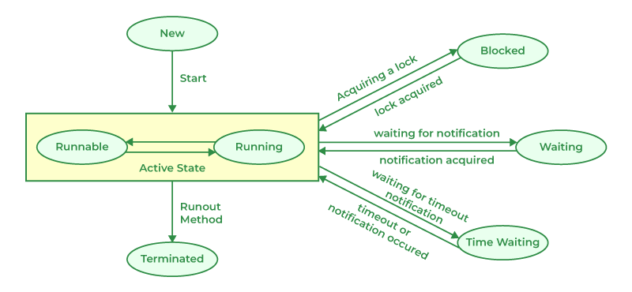

    <strong>Otázka 6</strong>

<nav style="
    position: sticky;
    top: 0;
    z-index: 100;
    background: rgba(0,0,0,0.8);
    padding: 8px 0 4px 0;
    box-shadow: 0 2px 8px rgba(0,0,0,0.1);
    text-align: center;
">
    <a href="08.md" style="color:white; text-decoration:none; margin: 0 16px;">⬅️ Předchozí</a>
    <a href="../README.md" style="color:white; text-decoration:none; margin: 0 16px;">🏠 Domů</a>
    <a href="10.md" style="color:white; text-decoration:none; margin: 0 16px;">Následující ➡️</a>
</nav>

# 9. Vývoj vícevláknových aplikací v C++/Javě

**Otázka:** Možné důvody použití více vláken, životní cyklus vlákna, úskalí přístupu vláken ke společným datovým strukturám. Diskuse o možném využití více vláken v aplikaci vytvořené v rámci závěrečné práce

---

### Vlákna obecně

Vlákna představují způsob, jak v rámci jednoho procesu provádět více činností paralelně (na počítači s více procesory
nebo s vícejádrovým procesorem) nebo pseudoparalelně (na počítači s jedním jednojádrovým procesorem).
Vlákno je posloupností po sobě jdoucích operací (příkazů, instrukcí, ...).
Každý proces je tvořen nejméně jedním vláknem.
V rámci každého z vláken je vykonáván kód nezávisle na ostatních vláknech.
Vícevláknové programování má smysl například u těchto typů úloh:

- u časově náročných výpočtů, kdy jedno vlákno provádí výpočet a druhé vlákno může průběžně informovat uživatele o stavu
  výpočtu,
- za účelem využití času stráveného čekáním na vstup od uživatele,
- pokud program simuluje aktivitu více entit, např. pohyb molekul plynu,
- u klient–server aplikací, kde bývá často pro obsluhu každého připojeného klienta vytvořeno samostatné vlákno,
- v úlohách typu producent–konzument, kde producent připravuje data, která konzument spotřebovává.

Vlákna mají oproti procesům řadu výhod:

- Vlákno se vytvoří rychleji než proces.
- Vlákno se ukončí rychleji než proces.
- Mezi vlákny se rychleji přepíná než mezi procesy.
- Lze dosáhnout lepší strukturalizace programu.

### Vlákna v Javě

Java přímo podporuje vícevláknový běh programu.
Vlákno lze vytvořit děděním z třídy `Thread` nebo implementací rozhraní `Runnable`.

Vlákno lze vytvořit jako instanci třídy java.lang.Thread nebo její podtřídy.
V nejjednodušším případě stačí odvodit potomka od třídy Thread a překrýt klíčovou metodu `run()`, která popisuje, co
vlákno při svém běhu vlastně dělá.
Metoda `run()` vlákna se nespouští přímo, ale pomocí volání metody `start()` zděděné ze třídy `Thread`.

Pro práci s vlákny se používá několik důležitých metod:
- `getState()` - vrací aktuální stav vlákna
- `yield()` - může vlákno nabídnout předání řízení jinému vláknu
- `sleep()` - uspí vlákno na zadaný počet milisekund
- `wait()` - pozastaví vlákno do doby, než bude probuzeno metodou `notify()`, `notifyAll()` nebo bude než bude přerušeno metodou `interrupt()`
- `isAlive()` - zjistí, jestli vlákno žije, tzn. nachází se mezi spuštěním metodou start() a ukončením metody run()
- `join()` - pozastaví běh metody vlákna, dokud neskončí jiné vlákno

Vlákna je možná přerušit.
Přerušením oznamujeme vláknu, že by mělo přestat vykonávat svoji běžnou činnost a udělat něco jiného.
Je na programátorovi, aby rozhodl, jak bude vlákno reagovat na přerušení.
Je ovšem obvyklé ukončit činnost vlákna (tedy metody `run()`).
Metoda vyvolá výjimku `InterruptedException`, kterou je třeba ošetřit v bloku `catch`.

### Životní cyklus vláken

Každé vlákno se v každém okamžiku nachází v jednom z šesti možných stavů.
Přechody mezi těmito stavy zajišťují nejčastěji metody třídy `Thread`.
Stavy vláken jsou:

- **New** - nové vlákno, bylo vytvořeno pomocí konstruktoru, ale dosud nebylo spuštěno metodou `start()`
- **Runnable** - běhuschopné vlákno, metoda `start()` již proběhla. Těchto vláken může být víc, ale pouze jedno může být
  **běžící**, ostatní čekají na předání řízení.
- **Blocked** - zablokované vlákno, které čeká na získání zámku od jiného vlákna, které ho právě vlastní
- **Waiting** - vlákno čekají buď na doběhnutí jiného vlákna (metoda `join()`) nebo bylo do čekání uvedeno
  metodou `wait()` a bude převedeno zpět do stavu Runnable po zavolání metody `notify()` nebo `notifyAll()`
- **Timed Waiting** - uspané vlákno čekající po určitou časovou dobu, nejčastěji uspáno metodou `sleep()`
- **Terminated** - mrtvé vlákno, jeho metoda `run()` skončila

### Priority
Každé vlákno má prioritu, podle které je mu předáváno řízení (tj. poskytovány systémové prostředky).
To znamená, že pokud jsou běhuschopná dvě vlákna, bude vždy předáno řízení vláknu s vyšší prioritou.
Změnit prioritu vlákna lze před i po jeho spuštění metodou `start()`. 

Nejnižší priorita má hodnotu MIN_PRIORITY, nejvyšší MAX_PRIORITY, normální je NORM_PRIORITY, což je priorita standardně přidělená nově vznikajícím vláknům.
ze použít i čísla v rozsahu od 1 do 10, přičemž platí: 
- MIN_PRIORITY = 1,
- NORM_PRIORITY = 5,
- MAX_PRIORITY = 10.

### Démoni
Pokud program používá běžná vlákna, nemůže skončit dříve, než jsou ukončena všechna vlákna (tzn. jejich metody `run()`).
Někdy však vlákno slouží pouze k obsluze určitých požadavků a jeho existence po skončení ostatních vláken je nepotřebná.
Pokud vlákno označíme jako démona, program skončí bez ohledu na to, zda již vlákno doběhlo či nikoliv. 

### Synchronizace vláken
Vlákna přinášejí spoustu výhod a dovolují dobrou paralelizaci programu.
Jsou zde ovšem také nevýhody, jako je **souběh**.
Ten nastává, když několik vláken sdílí data.
Problém konzistence sdílených dat vláken:
- Vlákna jednoho procesu sdílí paměť a soubory, a tudíž mohou mezi sebou komunikovat, aniž by k tomu potřebovaly služby jádra. 
- Vlákna jedné aplikace se proto musí mezi sebou synchronizovat, aby se zachovala konzistentnost zpracovávaných dat. 

Nekonzistenci dat lze předejít použitím tzv. **monitoru**.
Monitor je synchronizační prvek, který se používá pro řízení přístupu ke sdíleným prostředkům.
Monitor se skládá z dat, ke kterým je potřeba řídit přístup, a množiny funkcí, které nad těmito daty operují.
V Javě má každý objekt automaticky přiřazen svůj monitor.
Funkce, které patří do monitoru, jsou označeny pomocí klíčového slova `synchronized`.
Synchronizace může způsobit uváznutí (deadlock).

Existují i jiné metody synchronizace vláken, než je monitor.
Dalšími populárními možnostmi jsou:
- zámek (Lock)
- Mutex
- semafor
