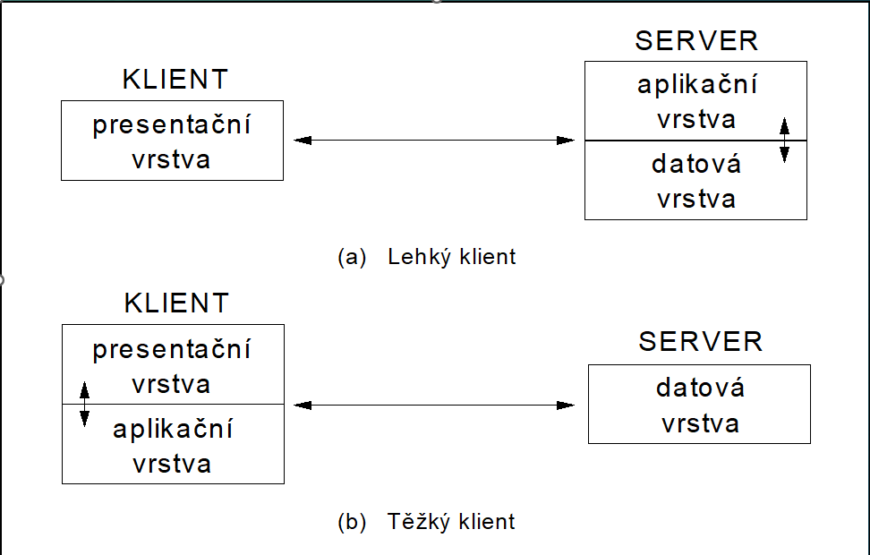
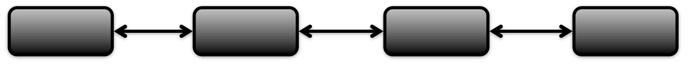
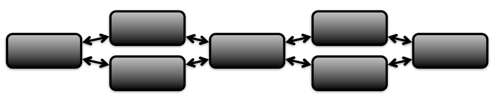
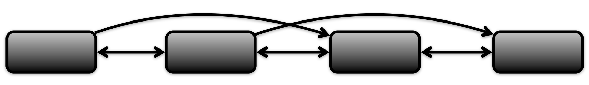
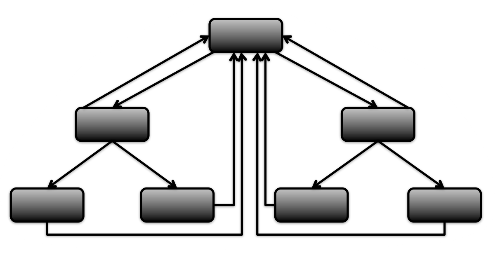

# Návrh a vývoj webových aplikací
## Architektura 
Všechny systémy mají 3 vrstvy: 
- datová vrstva
- funkční vrstva
- prezentační vrstva

Toto rozdělení podle vrstev spadá pod typy technologické archtektury (a to zase pod dílčí architekrury)

-> podle toho jak jsou tyto vrstvy uspořádáné, dělíme architekturu na 3 typy:
- monolitická architektura 
- dvouvrstvá architektura 
- třívrstvá architektura  
### monolitická architektura

= všechny vrstvy jsou v jednom programu/celku

příkladem může být **Flask + Jinja**, **Django**, **Nette**

***výhody:***
- snadné zajištění aplikace proti výpadkům
- snadné zajištění ochrany funkcí a dat aplikace před neautorizovaným použitím
- jednoduchý vývoj a nasazení
  
***nevýhody:***
- obtížné pokud narůstají počty uživatelů a jejich nároky - obtížné škálování
- problémy při implementaci nových technologií
- Změny v jedné části systému mohou vyžadovat úpravy v dalších částech, což může být časově náročné a náchylné k chybám

### Dvouvrstvá architektura

= oddělení komunikační a datové funkce aplikace

typicky provádíme buď lehkého nebo těžkého klienta 

 

***lehký klient***

= starší přístup. Vytváříme Multi-Page aplikace (MPA)

Každým kliknutím na stránce fetchuju layout a data ze serveru

***težký klient***

= modernější přístup. Vytváříme Single-Page aplikace (SPA)

Přes API klient získává data ze serveru. 

### Třívrstvá architektura
= všechny tři vrstvy odděleny (lehký klienti, server (business logika), databáze) - podle Rábové

## Design
Při vývoji designu se preferuje agilní přístup, kdy každý krok je konzultován se zakazníkem (sběr požadavků, informační architektura designu, wireframes, grafické designy, klikatelné prototypy, testování, implementace)

***Informační architektura designu***

strategie: 
- top-down - začne se obecnými informacemi a jde se k těm více detailním
- bottom-up - sběr prvků a dat a z toho se pak vytváří struktura

schéma:
- abecední (karaoke texty uspořádány abecedně podle názvu písniček)
- geografický (počasí)
- chronologický (například časově - programy v televizi, kino)
- tématický (heureka, alza - rozdělení podle zařízení)

uspořádání: 
- lineární - vhodné pro prezentaci informací
  - čistě lineární 
  - lineární s alternativami 
  - lineární s možnostmi 
- hiearchické uspořádání - nejběžnější, kořenová stránka (domovská) se vzhledově liší od ostatních stránek
  - úzké stromy - převažuje hloubka nad šířkou
  - široké stromy - převažuje šířka nad hloubkou
  - webové stromy - typické pro weby. Liší se tím, že na každé stránce je odkaz na domovskou obrazovku
  - 

***Wireframe***
  
= kostra webové stránky - grafické znázornění hlavních prvků webu 

- jednodušší úpravy než v konečném designu
- důležité je se zaměřit na pozicování a prostor - ne design
- reálné pojmenování (vyhnout se například heading1)
- prvky by měly být symetrické a pravidelné

***Responzivní layout***

- Přizpůsobení designu pro různé velikosti obrazovek.

- Lepší začít menšími zařízeními

***Design***

- Pro tvorbu designu si můžeme pomoct Design System = kolekce komponent, které dodržují standardy a ladí spolu 

- Patří sem komponenty (tlačítka, chip, dialog, progress bar, ..), font, layout, typografie, velikosti a vzdálenosti, barvy

- Můžeme si vytvořit vlastní Design System nebo použít například Vuetify

- Design by měl být přívětivý - dostatečný kontrast, popis obrázků, dostatečné odsazení a mezery,správné uspořádání 

*animace*

- měli by být přirozené a rychlé, ne rušivé
- využití například při načítání, kniknutím na tlačítko, placeholdery při načítání obrázků, errory, navigace 
- Pro tvoření deisgnu používáme Figmu, Sketch, Affinity Designer, Adobe Illustrator, ..

`User Experience` = říká nám jak se člověk dokáže na webu orientovat. Zaměřuje se na to, jak lze zlepšit užitečnost, snadnost použití

***Testování***

- Lab Usability Testing - uživatelé plní úkoly na připraveném zařízení
- Guerilla Testing - testování na veřejnosti
- First-click testing - pozorujeme jestli první kniknutí je správné
- A/B testování - máme dvě verze a testujeme, která je lepší 

## Frontend

= moderní je SPA a reaktivní vykreslování (k tomu slouží frameworky jako Vue, React, Angular, Svelte)

Tyto frameworky využívají jazyk JavaScript nebo TypeScript (má datové typy)

Frontend komunikuje s Backendem pomocí REST API (JSON nebo XML formát - spíš už JSON) nebo Websockets (obousměrná real-time komunikace)

Pokud nemáme vlastní backend a použijeme cloud (Firebase, MongoDB) ke komunikaci používáme SDK

`webové api` = samotný prohlížeč nám nabízí sadu API k použití - geolokace, web storage, notifikace, přístup k souborům systému, ...  

### Rendering

***CSR (Client Side Rendering)***

- například Vue, React
- server odešle klientovi minimální dokument HTML + JavaScript soubory. JavaScript načítá data přes API a manipuluje s celým DOM 

***SSR (Server Side Rendering)***

- například Django, Next.js (podporuje SSR i CSR), WordPress
- server pro každý požadavek vygeneruje plně vykreslenou stránku HTML a odešle ji klientovi

***SSG (Static Site Generator)***

- například VitePress, Hugo, JamStack
- metoda pro vytváření statických webových stránek

## Backend

= server který je připojený k nějaké databázi (SQL, NoSQL), zpracovává data a poskytuje frontendu 

Podle velikosti a náročnosti projektu vytváříme backend pro jednodušší aplikace (Express, FastAPI) nebo enterpise aplikace (Spring, .NET)

**Enterpise aplikace**

- aplikace kde se předpokládá práce s velkým množství dat (pojišťovny, banky,  rozsáhlé informační systémy)
- vysoké nároky na bezpečnost, výkon, spolehlivost, škálovatelnost

`Migrace` = textové soubory které popisují změny v databázi

### Trendy

***Kontejnerizace***

`virtualizace` = více operačních systémů na jednom hardware (VirtualBox)

`kontejnerizace` = více nezávislých prostředí na jednom operačním systému

`docker` = engine pro běh kontejnerů

***Cloudové služby***

= pronájem prostředků místo správy vlastního řešení

Používáme například pro nasazení webových aplikací

- například AWS, GCP, Azure

***Běhové prostředí***

= jednoduché přepínání různých konfigurací v našem projektu (dev, prod, test, staging)

***Mikroslužby***

= rozdělení backendu na více služeb

### Zabezpečení

`Autentizace` = Kdo jsi?  

`Autorizace` = Co můžeš dělat

***Autentizace***

- HTTP Basic Autentizace
- HTTP Digest Autentizace
- Session-Based Autentizace
- Token-Based Autentizace

***OAuth***

= standard pro autentizaci 

- Authorization Code Grant (Standard Flow)
- Implicit Grant (Implicit Flow)
- Resource Owner Password Credential Grant / Password (Direct access grant)
- Client Credentials Grant

## Testování webových aplikací

`Mockování` = místo komunikace s API se volají jiné metody, které vrací namockovaná data 

`Seeding` = před každým testem, se vyhodí všechny tabulky a insertnou se specifická testovací data 

### Druhy testů 

- Jednotkové testy - testuje se jedna metoda
- Integrační testy - testuje se endpoint
- E2E testy - testují se klíčové funkce aplikace (UI testování)
- Komponentové testy - testuje se komponenta (změna stavu komponenty - UI testování)
- Výkonostní testy - testuje se doba odezvy při volání endpointu
- Penetrační testy - testuje se zabezpečení
