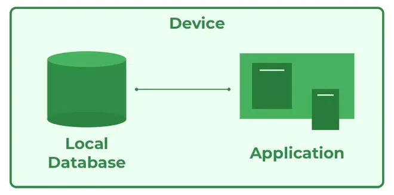
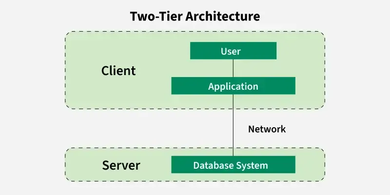
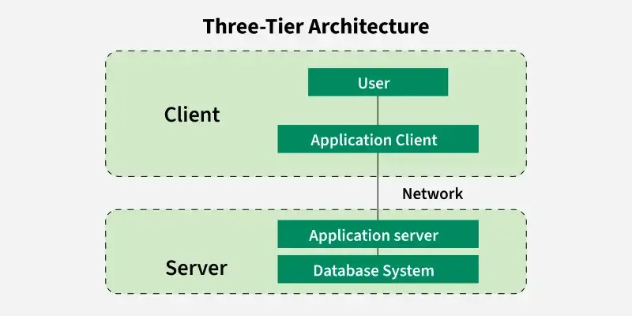
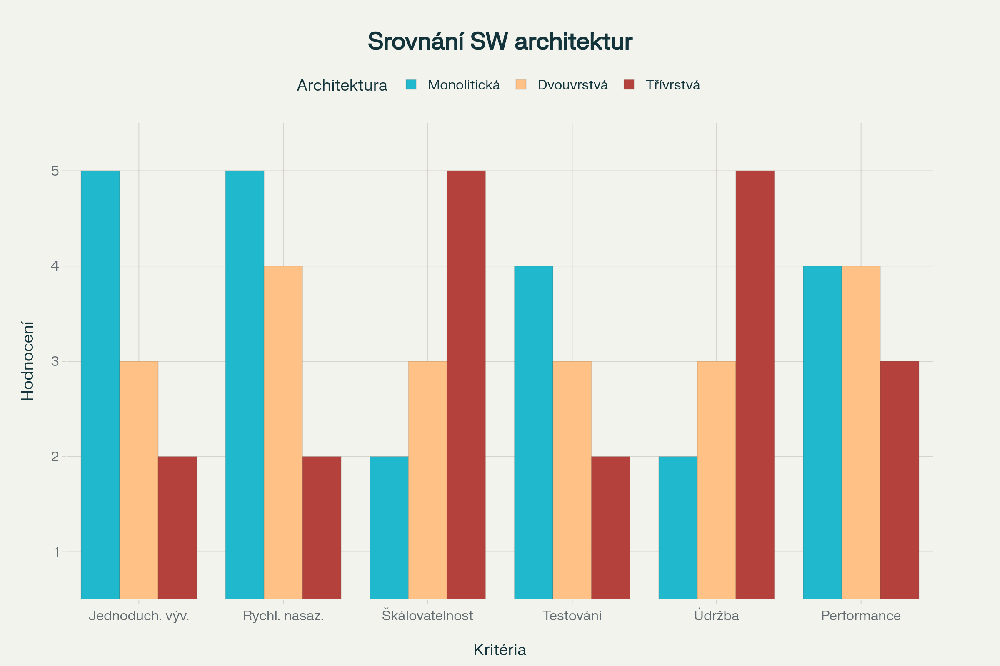
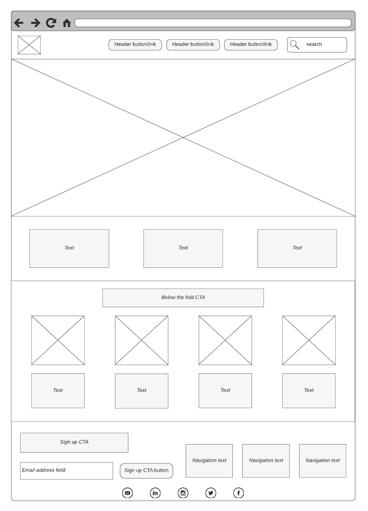
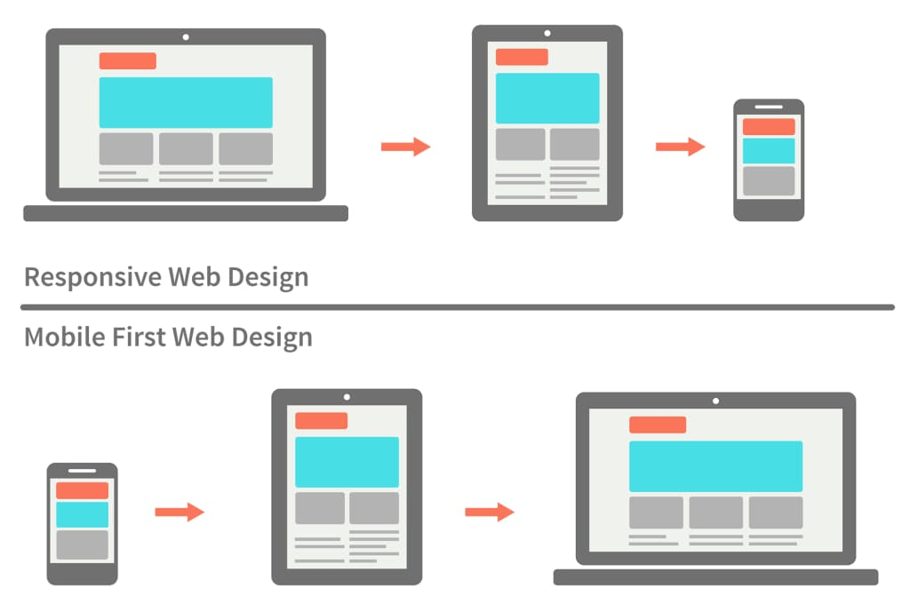
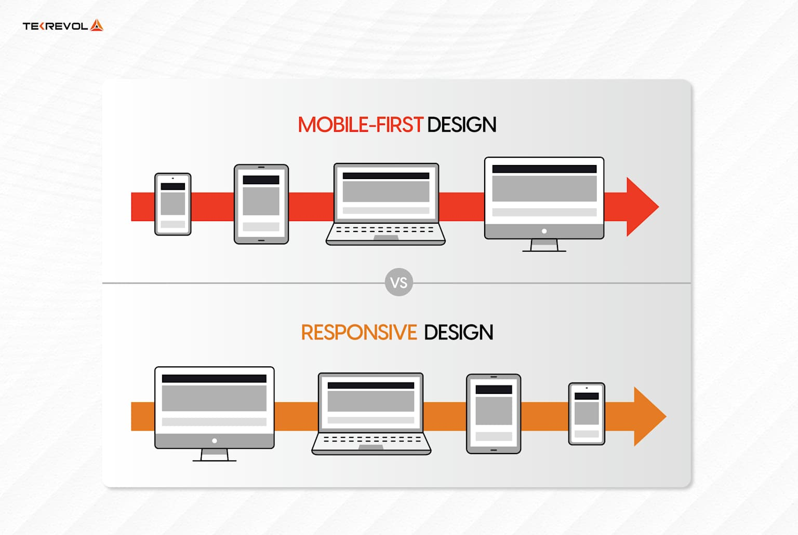

    <strong>Otázka 10</strong>

<nav style="
    position: sticky;
    top: 0;
    z-index: 100;
    background: rgba(0,0,0,0.8);
    padding: 8px 0 4px 0;
    box-shadow: 0 2px 8px rgba(0,0,0,0.1);
    text-align: center;
">
    <a href="09.md" style="color:white; text-decoration:none; margin: 0 16px;">⬅️ Předchozí</a>
    <a href="../README.md" style="color:white; text-decoration:none; margin: 0 16px;">🏠 Domů</a>
    <a href="11.md" style="color:white; text-decoration:none; margin: 0 16px;">Následující ➡️</a>
</nav>

# Návrh a vývoj webových aplikací

🔴 Klíčová otázka 1

> [!TIP]Otázka
> Design webové aplikace implementované v rámci závěrečné práce; architektura implementované aplikace a její alternativy (s důrazem na třívrstvou architekturu), technologie používané pro implementaci jednotlivých vrstev

---

# 1. Obecné informace o návrhu a architektuře webových aplikací

## Architektura

Architektura softwarových systémů je klíčovým aspektem návrhu aplikací, protože určuje způsob, jakým jsou jednotlivé části systému organizovány a spolupracují. Typická architektura webových aplikací zahrnuje tři základní vrstvy:

1. **Datová vrstva**  
  - Zajišťuje ukládání, správu a přístup k datům.  
  - Typicky implementována pomocí databází (SQL, NoSQL) nebo cloudových služeb.  
  - Příklady: MySQL, PostgreSQL, MongoDB, Firebase.

2. **Funkční vrstva (Business Logic)**  
  - Obsahuje aplikační logiku, která zpracovává data a implementuje pravidla a procesy systému.  
  - Zajišťuje komunikaci mezi prezentační a datovou vrstvou.  
  - Příklady: API, middleware, serverové skripty.

3. **Prezentační vrstva**  
  - Zodpovídá za interakci s uživatelem.  
  - Obsahuje uživatelské rozhraní (UI) a zajišťuje vizualizaci dat.  
  - Příklady: HTML, CSS, JavaScript, frontendové frameworky (React, Angular, Vue).

Toto rozdělení vrstev spadá pod typy technologické architektury, které jsou součástí širšího konceptu dílčích architektur. Na základě způsobu uspořádání těchto vrstev lze architekturu rozdělit do následujících typů:

### Typy architektury

#### Monolitická architektura
- všechny vrstvy jsou v jednom programu/celku
- příkladem může být _**Flask + Jinja**, **Django**, **Nette**_

**Výhody:**
- Snadné zajištění aplikace proti výpadkům díky centralizovanému řízení.
- Jednoduché zajištění ochrany funkcí a dat aplikace před neautorizovaným použitím.
- Rychlý vývoj a nasazení díky menší složitosti systému.

**Nevýhody:**
- Obtížné škálování při narůstajícím počtu uživatelů a jejich nárocích.
- Problémy při integraci nových technologií kvůli omezené flexibilitě.
- Změny v jedné části systému mohou vyžadovat úpravy v dalších částech, což zvyšuje časovou náročnost a riziko chyb.

#### Dvouvrstvá architektura
- oddělení komunikační a datové funkce aplikace
- typicky provádíme buď lehkého nebo těžkého klienta 

 

**Lehký klient**
- starší přístup. Vytváříme Multi-Page aplikace (MPA)
- každým kliknutím na stránce fetchuju layout a data ze serveru

**Težký klient**
- modernější přístup. Vytváříme Single-Page aplikace (SPA)
- přes API klient získává data ze serveru. 

### Třívrstvá architektura
- všechny tři vrstvy odděleny (lehký klienti, server (business logika), databáze) - podle Rábové

### Srovnání architektur

## Design
Moderní designový proces představuje sofistikovaný přístup k vytváření uživatelských rozhraní, který kombinuje agilní metodologie s důkladným výzkumem a testováním. Tento proces začíná sběrem požadavků a pokračuje přes informační architekturu až po finální implementaci a iterativní zlepšování. Agilní přístup umožňuje kontinuální konzultace se zákazníkem v každé fázi vývoje, což zajišťuje, že výsledný produkt splňuje reálné potřeby uživatelů a business cíle.

### Agilní přístup v designu

Agilní metodologie v designu vychází z principů formulovaných v Manifestu agilního programování, které zdůrazňují spolupráci nad procesy, fungující software nad dokumentací a reagování na změny nad dodržováním plánu. V kontextu designu to znamená iterativní přístup, kde každý krok je konzultován se zákazníkem a výsledky předchozích fází ovlivňují směr dalšího vývoje.

Typický agilní designový proces zahrnuje následující kroky: sběr požadavků, informační architekturu designu, wireframes, grafické designy, klikatelné prototypy, testování a implementaci. Klíčové je pochopení, že tento proces není lineární, ale iterativní - výsledky testování mohou vést k úpravám wireframes nebo dokonce k přehodnocení informační architektury.

Výhody agilního přístupu zahrnují rychlejší reakci na změny požadavků, kontinuální zapojení zákazníka do procesu a minimalizaci rizika vývoje produktu, který nesplňuje očekávání uživatelů. Nevýhodou může být vyšší náročnost na komunikaci a koordinaci týmu.

### Informační architektura designu

Základní principy a strategie
Informační architektura představuje návrh struktury a pojmenování informací na webu, webové aplikaci či v softwaru tak, aby podporoval použitelnost a nalezitelnost obsahu. Jedná se o pořádek v digitálních prostorech - promyšlenou organizaci obsahu, logickou navigaci a intuitivní orientaci, které uživateli dávají smysl.

Existují dva hlavní strategické přístupy k vytváření informační architektury. Top-down strategie začíná obecnými informacemi a postupuje k více detailním, což je vhodné pro projekty s jasně definovanou hierarchií a strukturou. Bottom-up strategie naopak začíná sběrem jednotlivých prvků a dat, ze kterých se následně vytváří struktura - tento přístup je užitečný při redesignu existujících systémů nebo když není předem jasná optimální organizace obsahu.

Informační architektura se zaměřuje na tři klíčové oblasti: uživatele (kdo jsou a co potřebují), kontext (kde, proč a jak s obsahem interagují) a obsah (s jakým obsahem přicházejí do kontaktu a jak ho využívají). Tyto tři složky spolu vytvářejí základ pro dobře promyšlenou strukturu, která vede k lepšímu uživatelskému zážitku.

**Schémata organizace obsahu**

Pro organizaci obsahu existuje několik základních schémat, které určují logiku uspořádání informací. Abecední schéma je nejjednodušší a používá se například u katalogu karaoke textů uspořádaných podle názvů písniček. Geografické schéma organizuje obsah podle místa, typicky u aplikací s informacemi o počasí nebo mapových služeb.

Chronologické schéma uspořádává obsah podle času, což je vhodné pro programy v televizi, kino nebo novinové články. Tématické schéma skupina obsah podle podobnosti nebo kategorie, jak je to vidět na e-commerce stránkách jako Heureka nebo Alza, kde jsou produkty rozděleny podle typu zařízení.

**Uspořádání a navigační struktury**

- **Lineární uspořádání** je vhodné především pro prezentaci informací, kde je důležité logické pořadí kroků. Rozlišujeme tři typy lineárního uspořádání: čistě lineární (jeden možný tok), lineární s alternativami (možnost výběru cesty) a lineární s možnostmi (volitelné kroky v sekvenci).

- **Hierarchické uspořádání** je nejběžnější strukturou pro weby a aplikace. Kořenová stránka (domovská) se vzhledově liší od ostatních stránek a tvoří vrchol hierarchie. Rozlišujeme úzké stromy (převažuje hloubka nad šířkou), široké stromy (převažuje šířka nad hloubkou) a webové stromy typické pro weby, kde na každé stránce je odkaz na domovskou obrazovku.

### Wireframes: Kostra designu
Wireframe představuje kostru webové stránky - grafické znázornění hlavních prvků webu bez vizuálních detailů. Jde o velmi hrubý náčrt, který se zaměřuje na strukturu a umístění prvků, nikoliv na grafický design. Wireframe slouží jako náčrt informační architektury webu a zobrazuje, jak bude distribuován obsah na webu včetně menu a obsahu jednotlivých podstránek 

Low-fidelity wireframes jsou základní nákresy používající jednoduché tvary a zástupné prvky pro zobrazení obsahu a layoutu. Prioritou je struktura a tok uživatele. High-fidelity wireframes se více podobají finálnímu designu a zahrnují typografii, specifické rozestupy a někdy i obrázky.

Wireframes se nacházejí v raných fázích designového workflow, následují po uživatelském výzkumu a personas a předcházejí vizuálnímu designu a prototypování. Působí jako plány, které vedou vývoj mockupů a prototypů a zajišťují, že design i funkcionalita jsou v souladu s potřebami uživatelů.

### Responzivní layout a mobile-first přístup

Responzivní layout představuje přizpůsobení designu pro různé velikosti obrazovek, což je v současné době nezbytnost vzhledem k rozmanitosti zařízení, na kterých uživatelé přistupují k webovým stránkám. Mobile-first design je designový přístup, který při návrhu webových stránek a mobilních aplikací klade důraz na to, aby byly primárně optimalizované pro mobilní zařízení a postupně se přizpůsobovaly větším obrazovkám.

### Komponenty design systému
Design systém zahrnuje několik klíčových kategorií komponent. UI komponenty zahrnují tlačítka, chipy, dialogy, progress bary a další interaktivní prvky. Typografie definuje fonty, velikosti písma a hierarchii textu. Layout systém určuje způsob uspořádání prvků na stránce a responzivní chování.

### Populární design systémy
Mezi nejznámější design systémy patří Lightning Design System od Salesforce, Material Design od Google, Carbon Design System od IBM a Fluent Design System od Microsoft. Material Design, který byl představen Googlem v roce 2014, rozšiřuje koncepty "karet" a používá více grid-based layouty, responzivní animace a přechody, padding a hloubkové efekty jako světlo a stíny.

### Animace a mikrointerakce
UI animace hrají klíčovou roli ve zlepšování uživatelských zážitků - od jemných přechodů po poutavé efekty. Animace vdechují život uživatelským rozhraním, zvyšují použitelnost, zapojení a celkovou spokojenost uživatelů. Moderní animace by měly být přirozené a rychlé, nikoliv rušivé.

### User Experience a použitelnost
User Experience říká, jak se člověk dokáže na webu orientovat a zaměřuje se na to, jak lze zlepšit užitečnost a snadnost použití. UX design je uživatelsky orientovaný designový přístup, protože zohledňuje uživatelovu zkušenost při používání produktu nebo platformy. Na rozdíl od designu uživatelského rozhraní, který se zaměřuje pouze na design počítačového rozhraní, UX design zahrnuje všechny aspekty vnímané uživatelovy zkušenosti s produktem nebo webem.

UX design definuje zkušenost, kterou by uživatel měl při interakci se společností, jejími službami a produkty. Výzkum, analýza dat a výsledky testů řídí designová rozhodnutí v UX designu spíše než estetické preference a názory. UX design je také prvkem zákaznické zkušenosti (CX) a zahrnuje všechny designové aspekty a designové fáze, které se týkají zákaznické zkušenosti.

### Testování uživatelské zkušenosti
Uživatelské testování představuje techniku používanou v uživatelsky orientovaném interakčním designu k evaluaci produktu testováním s uživateli. Tato praxis je nenahraditelná, protože poskytuje přímý input o tom, jak skuteční uživatelé systém používají. Uživatelské testování se více zajímá o intuitivnost designu produktu a testuje se s uživateli, kteří s ním nemají předchozí zkušenost.

- **A/B testování** je metoda uživatelského výzkumu, která spočívá v randomizovaném experimentu obvykle zahrnujícím dvě varianty (A a B). A/B testy jsou způsobem porovnání více verzí jedné proměnné testováním odezvy subjektu na variantu A proti variantě B a určením, která z variant je efektivnější. Multivariantní testování je podobné A/B testování, ale může testovat více než dvě verze současně.

- **Pětisekundový test** je rychlý test, který se zaměřuje na první dojem. Spočívá v tom, že uživateli ukážete webovou stránku na 5 sekund a poté zjišťujete, co si z ní zapamatoval - zda ví, o jakou šlo firmu, co nabízí nebo jaké logo používá. Díky tomu zjistíte, jestli je obsah dostatečně poutavý, jednoznačný a dobře rozvržený.

- **Tree Testing** zkoumá web komplexně a zaměřuje se na navigační strukturu. Card Sorting je metoda úzce spojená s informační architekturou, používá se při tvorbě nových aplikací i při redesignu stávajících aplikací. Při této metodě je důležité řídit se podle požadavků uživatelů - uživatelé třídí kartičky s obsahem do kategorií podle své vlastní logiky.

## Frontend

- moderní je SPA a reaktivní vykreslování (k tomu slouží frameworky jako Vue, React, Angular, Svelte)

Tyto frameworky využívají jazyk JavaScript nebo TypeScript (má datové typy)

Frontend komunikuje s Backendem pomocí REST API (JSON nebo XML formát - spíš už JSON) nebo Websockets (obousměrná real-time komunikace)

Pokud nemáme vlastní backend a použijeme cloud (Firebase, MongoDB) ke komunikaci používáme SDK

`webové api` = samotný prohlížeč nám nabízí sadu API k použití - geolokace, web storage, notifikace, přístup k souborům systému,...  

### Rendering

***CSR (Client Side Rendering)***

- například Vue, React
- server odešle klientovi minimální dokument HTML + JavaScript soubory. JavaScript načítá data přes API a manipuluje s celým DOM 

***SSR (Server Side Rendering)***

- například Django, Next.js (podporuje SSR i CSR), WordPress
- server pro každý požadavek vygeneruje plně vykreslenou stránku HTML a odešle ji klientovi

***SSG (Static Site Generator)***

- například VitePress, Hugo, JamStack
- metoda pro vytváření statických webových stránek

## Backend

- server který je připojený k nějaké databázi (SQL, NoSQL), zpracovává data a poskytuje frontendu 

Podle velikosti a náročnosti projektu vytváříme backend pro jednodušší aplikace (Express, FastAPI) nebo enterpise aplikace (Spring,.NET)

**Enterpise aplikace**

- aplikace kde se předpokládá práce s velkým množství dat (pojišťovny, banky,  rozsáhlé informační systémy)
- vysoké nároky na bezpečnost, výkon, spolehlivost, škálovatelnost

`Migrace` = textové soubory které popisují změny v databázi

### Trendy

***Kontejnerizace***

`virtualizace` = více operačních systémů na jednom hardware (VirtualBox)

`kontejnerizace` = více nezávislých prostředí na jednom operačním systému

`docker` = engine pro běh kontejnerů

#### Cloudové služby

- pronájem prostředků místo správy vlastního řešení

Používáme například pro nasazení webových aplikací

- například AWS, GCP, Azure

**Běhové prostředí**
= jednoduché přepínání různých konfigurací v našem projektu (dev, prod, test, staging)

**Mikroslužby**
= rozdělení backendu na více služeb

### Zabezpečení

`Autentizace` = Kdo jsi?  
`Autorizace` = Co můžeš dělat

**Autentizace**
- HTTP Basic Autentizace
- HTTP Digest Autentizace
- Session-Based Autentizace
- Token-Based Autentizace

**OAuth**
= standard pro autentizaci 
- Authorization Code Grant (Standard Flow)
- Implicit Grant (Implicit Flow)
- Resource Owner Password Credential Grant / Password (Direct access grant)
- Client Credentials Grant

## Testování webových aplikací

`Mockování` = místo komunikace s API se volají jiné metody, které vrací namockovaná data 

`Seeding` = před každým testem, se vyhodí všechny tabulky a insertnou se specifická testovací data 

### Druhy testů 
- **Jednotkové testy** - testuje se jedna metoda
- Integrační testy - testuje se endpoint
- E2E testy - testují se klíčové funkce aplikace (UI testování)
- Komponentové testy - testuje se komponenta (změna stavu komponenty - UI testování)
- Výkonostní testy - testuje se doba odezvy při volání endpointu
- Penetrační testy - testuje se zabezpečení

---

# 2. Konkrétní informace o aplikaci HydroLeaf

## Architektura a design aplikace HydroLeaf

Webová aplikace HydroLeaf je navržena jako moderní cloudová aplikace s důrazem na třívrstvou architekturu. Cílem je oddělit prezentační, aplikační (logickou) a datovou vrstvu, což zajišťuje lepší škálovatelnost, údržbu a bezpečnost systému.

### Třívrstvá architektura v praxi

- **Prezentační vrstva (Frontend):**
  - Implementována pomocí Next.js (React) a TypeScriptu.
  - Stylování zajišťuje Tailwind CSS a komponentová knihovna Shadcn UI.
  - Komponenty jsou organizovány v adresáři `components/`, stránky v `app/`.
  - Uživatel zde interaguje s aplikací, zadává data a získává vizualizace (např. grafy senzorů).

- **Aplikační logika (Business Logic):**
  - Logika je implementována v React komponentech, pomocných hookách (`hooks/`) a utilitách (`lib/utils.ts`).
  - Zajišťuje validace, zpracování dat, komunikaci s backendem a správu stavu aplikace.

- **Datová vrstva (Data Layer):**
  - Pro ukládání a správu dat je využíván cloudový backend Firebase (viz `lib/firebase.ts`).
  - Firebase poskytuje autentizaci uživatelů a databázi (Firestore/Realtime Database).

### Alternativy architektury
- **Monolitická architektura:** Všechny vrstvy v jednom kódu (např. Flask, Django). Jednodušší vývoj, ale horší škálovatelnost.
- **Dvouvrstvá architektura:** Oddělení klienta a serveru, ale bez samostatné business vrstvy.
- **Mikroservisní architektura:** Každá služba je samostatná, vhodné pro rozsáhlé systémy, ale složitější správa.

---

## Použité technologie v jednotlivých vrstvách

| Vrstva                | Technologie                | Popis |
|-----------------------|---------------------------|-------|
| Prezentační (frontend)| Next.js, React, TypeScript, Tailwind CSS, Shadcn UI | Moderní SPA/SSR framework, komponentový přístup, typová bezpečnost, rychlý vývoj UI |
| Aplikační logika      | React hooky, vlastní utility, Next.js API routes     | Validace, zpracování dat, komunikace s backendem |
| Datová (backend)      | Firebase (Firestore, Auth), REST API                 | Cloudová databáze, autentizace, správa dat |

---

## Praktická ukázka rozdělení vrstev v HydroLeaf

- **Frontend:**
  - Složka `app/` obsahuje stránky (např. dashboard, login, registrace).
  - Komponenty v `components/` (např. tabulky, grafy, formuláře).
  - Stylování pomocí Tailwind CSS (`globals.css`).

- **Aplikační logika:**
  - Hooky v `hooks/` (např. `use-toast.ts` pro notifikace).
  - Utility v `lib/utils.ts`.
  - Komunikace s Firebase přes `lib/firebase.ts`.

- **Datová vrstva:**
  - Konfigurace a přístup k Firebase v `lib/firebase.ts`.
  - Ukládání a čtení dat ze senzorů, autentizace uživatelů.

---

## Srovnání s alternativami

- **Monolit:** Vše v jednom (např. Django), rychlý vývoj, ale horší údržba a škálování.
- **Mikroservisy:** Každá část zvlášť, vhodné pro velké projekty, složitější na správu.
- **Třívrstvá architektura (HydroLeaf):** Jasné oddělení vrstev, snadná údržba, možnost rozšiřování.