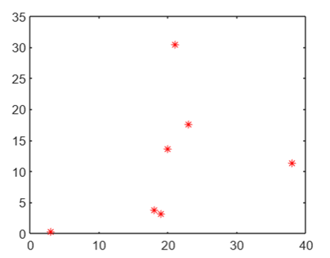

    <strong>Otázka 12</strong>

<nav style="
    position: sticky;
    top: 0;
    z-index: 100;
    background: rgba(0,0,0,0.8);
    padding: 8px 0 4px 0;
    box-shadow: 0 2px 8px rgba(0,0,0,0.1);
    text-align: center;
">
    <a href="11.md" style="color:white; text-decoration:none; margin: 0 16px;">⬅️ Předchozí</a>
    <a href="../README.md" style="color:white; text-decoration:none; margin: 0 16px;">🏠 Domů</a>
    <a href="13.md" style="color:white; text-decoration:none; margin: 0 16px;">Následující ➡️</a>
</nav>

# Grafy a zobrazení dat v jazyce Matlab

> [!TIP]Otázka
> Existující typy grafů ve 2D a 3D (např. plot, bar, surf, mesh), související funkce pro jejich nastavení, typické příklady užití a možnosti užití pro zobrazení dat v závěrečné práci

---

Matlab je určen pro práci s daty různých typů. Pro větší přehlednost a snadnější pochopení těchto dat poskytuje Matlab sadu grafů.

## Vykreslování 2D 
Následující funkce slouží pro zobrazení dat ve 2D prostoru. Což znamená, že známe osu x a y.

### Plot 
Spojitý graf. Slouží pro vykreslení křivek. 
- Slouží například pro vykreslení vektoru (jedna osa jsou hodnoty, druhá index)

  

- Také můžeme vykreslit pouze body: 

  

`hold on` - slouží pro vykreslení více grafů v jednom obrázku

*Využití:*
- plot je velmi univerzální, lze ji využít v podstatě všude:
  - Analýza složitosti algoritmů: Vykreslování grafů časové a prostorové složitosti algoritmů pro různé vstupní velikosti.
  - porovnání různých datasetů
  - Sledování výkonu: Měření a vizualizace doby běhu, využití paměti a dalších výkonových metrik při běhu algoritmů nebo softwarových aplikací.
  - Vizualizace dat z logů, jako jsou chybové sazby, latence, počet požadavků za sekundu apod.
  
### Stem 
- Vykreslení diskrétních sekvenčních dat. 

  

- Slouží také pro zvýraznění některých dat. Můžeme vylreslit zároveň Plot a Stem.

  

### Scatter
- bodový graf (korelační diagram)
- podobné jako Stem - vykreslení diskrétních bodů, nemají ale pod sebou svislou čáru

  

*Využití:* 
- graf nejbližších sousedů k-NN
- data mining
- je možné jednoduše zjistit vzájemný vztah mezi oběma proměnnými (závislé i nezávislé), případně tuto závislost interpolovat (přímkou, křivkou, nebo jiným typem závislosti) = křivka nám rozdělí body na dvě strany
  - př. lineární regrese
  
### Bar
sloupcový graf (histogram)
- znázorňuje data pomocí obdélníků (sloupců), jejichž délka odpovídá hodnotě, kterou představují. Sloupce mohou být uspořádány svisle nebo vodorovně. 
  
  

*Využití:* 
- používá se především pro vyjádření hodnot příslušných ke kategorickým datům
- většinou není vhodný pro zobrazení změn v čase, k tomu lépe slouží spojnicové grafy
- pro každou skupinu můžeme zobrazit několik hodnot formou sloupců vedle sebe
- příklad: počet odpracovaných hodin v denní a noční službě v měsíci v daném roce - pozorujeme dvě hodnoty v daném měsíci

### Pie chart
- koláčový/výsečový graf

  

*Využití:*
-  využíváme především pro vyjádření „části z celku“
-  nevýhoda je, že na první pohled lidské oko nerozezná rozdíly mezi výseči (pokud jsou hodně podobné). Horší orientace pokud je hodně výsečí. Jistota je použít histogram.
-  další nevýhodou je, že nemůžeme pozorovat více dvě proměnné ve stejném grafu. Opět tento problém řeší histogram (více obdélníků vedle sebe nebo nad sebou)
-  příklad: počet prodeje ovoce (maliny, jahody, jablka)

**Funkce pro nastavení 2D grafu:**
- křivka propojující jednotlivé body: plná čára, čerchovaná, žádná,..
- barva křivky
- vzhled bodu - kolečko, hvězdička
- šířka křivky
- nadpis, podnadpis
- pojmenování osy x a y
- nastavení délky osy x a y 
- legenda
- mřížka do grafu

## Vykreslování 3D 
Známe osu x, y a z. Slouží pro vykreslení matic. 
**Vykreslení dvou vektorů**
- může nastat situace, kdy máme dva vektory a chceme je vykreslit v 3D prostoru.
- osa x je jeden vektor, osa y je druhý vektor, osa z je 0. Výsledná matice bude mít velikost: délka jednoho vektoru x délka druhého vektoru
- abychom nemuseli připisovat data ručně, použijeme funkci ` meshgrid `

   

- Výsledkem funkce *meshgrid* jsou dvě stejně velké matice. První matice X vznikla kopírováním vektoru x pod sebe tolikrát, kolik prvků je ve vektoru y. Druhá matice Y vznikla kopírování vektoru y vedle sebe tolikrát, kolik je hodnot ve vektoru x. 

### Mesh
Funkce mesh vytvoří drátěnou síť. Ve výchozím nastavení je barva sítě úměrná výšce povrchu.

   

*Využití:*
- Vizualizace terénních údajů a topografických map, kde z-osa představuje nadmořskou výšku
- Vizualizace závislostí mezi různými ekonomickými proměnnými, například rizikem a výnosem investic
- Vývoj a analýza algoritmů strojového učení - vizualizace chyby během tréninku neuronové sítě

### Surface 
Stejné jako mesh, akorát 'vnitřek' sítě je barevný. 

  

### Plot3d
Spojitá diskrétní data v trojrozměrném prostoru 

**Plot3d vs Surface**

*plot3:*
- plot3 se používá pro vykreslování jednotlivých bodů nebo křivek ve 3D prostoru
- vhodný pro jednoduché 3D trajektorie a vizualizace
  
*surf:*
- surf se používá pro vykreslování povrchů ve 3D prostoru
- vhodný pro detailní a komplexní vizualizace 3D povrchů

### Scatter3
Diskrétní data v trojrozměrném prostoru

  

***funkce pro nastavení 3D grafu:***
- nastavení barevného schématu
- osvětlení
- pohled na trojrozměrný objekt
