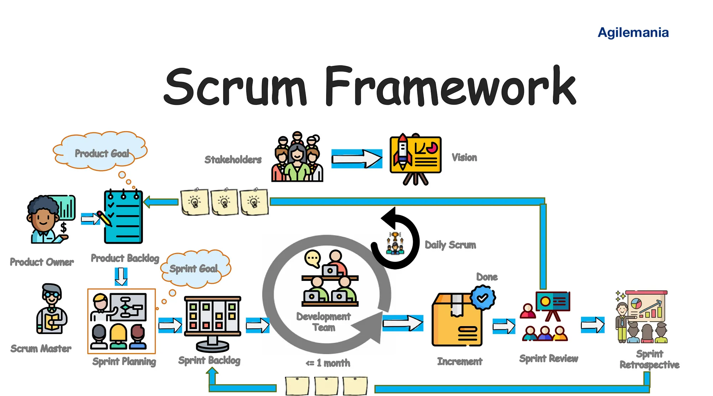

# 1. Disclaimer

Tento dokument obsahuje informace převážně získané z interních směrnic korporátu, kde pracuji. Tyto informace by měly být industry-ready, ale nemusí přesně odpovídat našemu školnímu kurikulu. Just sayin. 

(Nenašel jsem předmět, kde se to učí)

# 2. Obsah

- [1. Disclaimer](#1-disclaimer)
- [2. Obsah](#2-obsah)
- [3. Řízení vývoje software](#3-řízení-vývoje-software)
  - [3.1. Nejpoužívanější metodiky](#31-nejpoužívanější-metodiky)
    - [3.1.1. Waterfall Model (Vodopádový model)](#311-waterfall-model-vodopádový-model)
    - [3.1.2. V-Model](#312-v-model)
    - [3.1.3. Agile Model](#313-agile-model)
- [4. Možné odpovědi a odůvodnění metodik v BK:](#4-možné-odpovědi-a-odůvodnění-metodik-v-bk)
  - [4.1. Agilní metodiky](#41-agilní-metodiky)
  - [4.2. Vodopádový model](#42-vodopádový-model)
  - [4.3. V-Model](#43-v-model)
- [5. Výběr správné metodiky řízení softwarového vývoje](#5-výběr-správné-metodiky-řízení-softwarového-vývoje)
  - [5.1. Agile (např. Scrum)](#51-agile-např-scrum)
  - [5.2. Vodopádový model (Waterfall)](#52-vodopádový-model-waterfall)
  - [5.3. V-Model](#53-v-model)
- [6. Co je Scrum?](#6-co-je-scrum)
  - [6.1. Role ve Scrumu](#61-role-ve-scrumu)
  - [6.2. Termíny a definice](#62-termíny-a-definice)

# 3. Řízení vývoje software

## 3.1. Nejpoužívanější metodiky

### 3.1.1. Waterfall Model (Vodopádový model)
<!-- omit in toc -->
#### Popis
- **Sekvenční vývojový model:** Projekty postupují lineárně skrze fáze analýzy požadavků, designu, implementace, testování a údržbu.
- **Bez překrývání fází:** Každá fáze musí být dokončena, než se může začít s další.

<!-- omit in toc -->
#### Klady
- **Jasné požadavky:** Požadavky musí být jasné před zahájením designu a dalších fází.
- **Snadná implementace:** Díky lineárnímu modelu bez překrývání je menší náročnost na vývojáře/tým. Vždy se pracuje jen na jedné části.
<!-- omit in toc -->
#### Zápory
- **Nízká flexibilita:** Jakékoli změny v požadavcích po jejich schválení jsou obtížně realizovatelné. V moment kdy se projekt dokončuje můžou být již požadavky outdated.
- **Pozdní objevení chyb:** Chyby se často objevují až ve velmi pozdních fázích vývoje.

### 3.1.2. V-Model
<!-- omit in toc -->
#### Popis
- **Rozšíření Waterfall modelu:** Fáze vývoje nejdou pouze dolů lineárně, ale po fázi programování se kroky obrací zpět nahoru, což vytváří typický tvar V (proto V-model).
- **Větší důraz na testování:** Každá fáze vývoje má svou odpovídající testovací fázi.

<!-- omit in toc -->
#### Klady
- **Integrace testování:** Testy jsou integrovány do každé fáze, což zvyšuje kvalitu a snižuje rizika.
- **Změny požadavků jsou možné:** V případě potřeby lze požadavky měnit a aktualizovat dokumentaci.
<!-- omit in toc -->
#### Zápory
- **Rigidita:** Model je velmi striktní a málo flexibilní, což může být problém u projektů, které potřebují adaptabilitu.
- **Náročnost na zdroje:** Vyžaduje mnoho zdrojů, což může být limitující pro menší organizace.

### 3.1.3. Agile Model
<!-- omit in toc -->
#### Popis
- **Iterativní a inkrementální vývoj:** Metodiky založené na Agile umožňují rychlou a flexibilní reakci na změny požadavků během vývoje.
- **Kontinuální spolupráce:** Tým pracuje v těsné spolupráci s klientem, což zajišťuje neustálou zpětnou vazbu a rychlé dodávky funkcí.

<!-- omit in toc -->
#### Klady
- **Flexibilita:** Agile je vysoce adaptabilní na změny, i když nastanou pozdě ve vývoji.
- **Zákaznická spokojenost:** Rychlé a průběžné dodávky funkcí zvyšují spokojenost klienta.
<!-- omit in toc -->
#### Zápory
- **Výzvy u velkých projektů:** U rozsáhlých projektů může být obtížné odhadnout čas a úsilí potřebné pro dokončení.
- **Potřeba zkušených vývojářů:** Agile vyžaduje, aby rozhodovací procesy vedli zkušení vývojáři, což může být omezující pro juniory v týmu.

# 4. Možné odpovědi a odůvodnění metodik v BK:

## 4.1. Agilní metodiky
- **Použitá metodika:** Scrum
- **Důvod použití:** Scrum poskytuje flexibilitu a adaptabilitu, což je klíčové pro projekty s rychlými změnami požadavků.
- **Příklady použití:** Startupy vyvíjející nové produkty, softwarové projekty s častými aktualizacemi, projekty s nejistými nebo se měnícími požadavky.

## 4.2. Vodopádový model
- **Použití:** V projektech, kde jsou požadavky jasně definované a neměnné.
- **Důvod nepoužití agilní metodiky:** Potřeba přesného plánování a rozsáhlých testovacích fází před nasazením.
- **Příklady použití:** Stavební projekty, velké vládní zakázky, vývoj velkých systémů, kde jsou požadavky známé a stabilní.

## 4.3. V-Model
- **Použití:** V projektech, kde je potřeba vysokého stupně verifikace a validace na každé fázi projektu.
- **Důvod použití:** V-Model poskytuje strukturovaný proces, který zajišťuje, že každá fáze vývoje je důkladně testována a ověřena před postupem k další.
- **Příklady použití:** Projekty v oblastech, kde jsou vysoké požadavky na kvalitu a bezpečnost, například v automobilovém průmyslu, leteckém průmyslu a ve zdravotnictví.

# 5. Výběr správné metodiky řízení softwarového vývoje

## 5.1. Agile (např. Scrum)

- **Nejvhodnější pro:**
  - Vysoká míra nejistoty nebo měnícími se requirementy (nevím přesně co budu dělat).
  - Projekty, které vyžadují rychlou a častou zpětnou vazbu od klientů nebo uživatelů.
  - Týmy, které preferují flexibilitu a rychlou adaptaci na změny v oboru.

- **Klíčové faktory pro výběr:**
  - Velikost týmu (menší až střední týmy).
  - Blízká a častá spolupráce s klientem.
  - Potřeba iterativního a inkrementálního vývoje.

## 5.2. Vodopádový model (Waterfall)

- **Nejvhodnější pro:**
  - Jasně definované a stabilní requirementy.
  - Potřeba podrobného plánování a postupné realizace.

- **Klíčové faktory pro výběr:**
  - Vysoká míra regulace a požadavků na dokumentaci.
  - Velké projekty s předvídatelným průběhem.
  - Distribuované týmy, kde detailní plánování předem pomáhá koordinovat práci.

## 5.3. V-Model

- **Nejvhodnější pro:**
  - Vysoce regulované odvětví (např. zdravotnictví, automobilový průmysl).
  - Projekty, kde je klíčové důkladné testování a verifikace v každé fázi vývoje.

- **Klíčové faktory pro výběr:**
  - Vysoké nároky na kvalitu a bezpečnost.
  - Potřeba přesného propojení vývojových fází na testovací fáze.

# 6. Co je Scrum?

Scrum je typ **agilní metodiky**. 

Je to praktická implmenetace agilní metodiky s definovanými pravidly. Cílem je pomoci podnikům přejít na tento styl vývoje a podpořit transparentnost a komunikaci s klientem/stakeholdry.

## 6.1. Role ve Scrumu

- **Product Owner**: Zodpovídá za produkt, spravuje Product Backlog a stanovuje priority úkolů pro tým. Jeho hlavní role je zajistit, že tým pracuje na nejvhodnějších úkolech pro dosažení obchodních cílů.
- **Scrum Master**: Podporuje tým v dodržování scrumových metod, odstraňuje překážky a zajišťuje, že všechny procesy probíhají hladce. Scrum Master funguje jako facilitátor pro agilní tým.
- **Development Team**: Skupina profesionálů (vývojáři, testeři, designéři atd.), kteří jsou samostatní a organizují svou práci tak, aby dosáhli cílů sprintu. Tým má všechny dovednosti potřebné k dokončení projektu.
- **Stakeholders**: Toto jsou zúčastněné strany, které mají zájem na úspěchu projektu. Mohou to být například externí investoři, klienti, management společnosti nebo jiní jednotlivci, kteří jsou přímo nebo nepřímo ovlivněni vývojem produktu. Stakeholders se pravidelně účastní Sprint Reviews, aby poskytli zpětnou vazbu a ujistili se, že produkt splňuje jejich očekávání a potřeby.

## 6.2. Termíny a definice

- **Sprint**: Základní jednotka vývoje ve Scrumu, obvykle trvající 1-4 týdny, během kterého tým pracuje na dosažení předem definovaného cíle.
- **Product Backlog**: Seznam všech funkcí, úprav, oprav a dalších požadavků potřebných pro produkt, vytvořený a prioritizovaný Product Ownerem.
- **Sprint Backlog**: Sada úkolů vybraných z *Product Backlogu*, které tým plánuje dokončit během nadcházejícího sprintu.
- **Daily Scrum (Stand-up)**: Denní krátké setkání týmu, kde členové sdílí pokroky, plány na následující den a potenciální překážky ve své práci. (Občas také Daily-Sync)
- **Sprint Review**: Setkání na konci každého sprintu, kde tým prezentuje co bylo dokončeno. Toto setkání slouží k získání zpětné vazby od zákazníků a stakeholderů. (Reflexe pro klienta/stakeholdery)
- **Sprint Retrospective**: Schůzka po skončení sprintu, na které tým reflektuje procesy a dynamiku práce ve sprintu s cílem identifikovat oblasti pro zlepšení. (Reflexe pro vývojáře)

