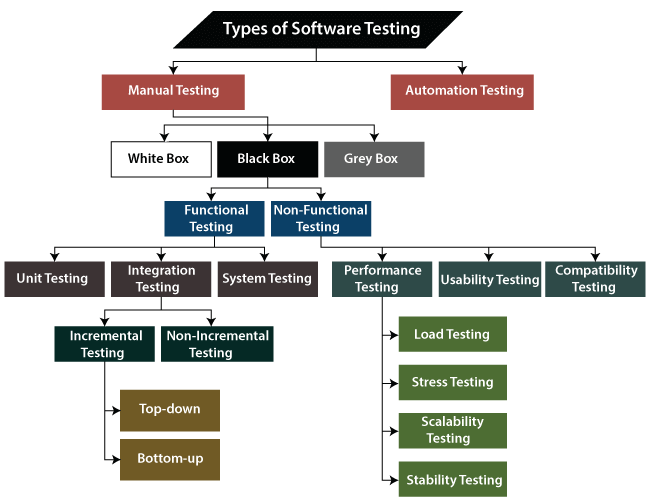
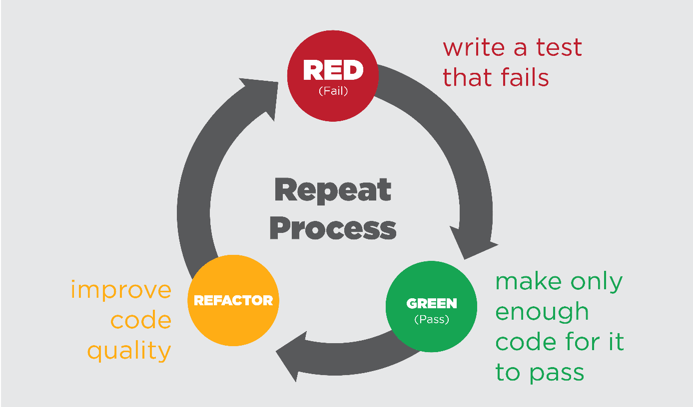

    <strong>Otázka 14</strong>

<nav style="
    position: sticky;
    top: 0;
    z-index: 100;
    background: rgba(0,0,0,0.8);
    padding: 8px 0 4px 0;
    box-shadow: 0 2px 8px rgba(0,0,0,0.1);
    text-align: center;
">
    <a href="14.md" style="color:white; text-decoration:none; margin: 0 16px;">⬅️ Předchozí</a>
    <a href="../README.md" style="color:white; text-decoration:none; margin: 0 16px;">🏠 Domů</a>
</nav>

# Testování kvality software

🟡 Důležitá otázka 3  

> [!TIP]Otázka
> Použité metody testování kvality výsledného software v rámci závěrečné práce; testování uživatelské přívětivosti; automatizace testování a CI/CD (testování uživatelského rozhraní, jednotkové testy atp.)

---

Testování softwaru je klíčové pro zajištění kvality a spolehlivosti produktu. Zajišťuje, že produkt splňuje požadované specifikace a funguje správně v různých situacích. 
[Fireship video na SW testování 3 min](https://www.youtube.com/watch?v=u6QfIXgjwGQ)

## 1.1. Klíčové termíny
- **Test Case**: Specifikace vstupů, Pass Fail kritérií, Setupů a procedury potřebných pro ověření určité funkce nebo vlastnosti softwaru. (Může mít víc požadovaných částí)
- **Test Execution**: Proces provádění testů na produktu za účelem zjištění chyb nebo potvrzení správnosti funkcionality. (Postupuje se podle Test Case)
- **Requirement**: Dokument nebo specifikace popisující vlastnosti, funkce nebo omezení, které musí software splňovat.
- **Test Plan**: Dokument popisující rozsah, přístup, zdroje a harmonogram plánovaných testovacích aktivit.
- **Defect**: Nesoulad mezi očekávaným a skutečným výsledkem, odchylka od requirementů nebo specifikací.
- **Regression Testing**: Typ testování zaměřený na ověření, že nové změny neovlivnily existující funkčnost softwaru negativně. Retestování existujícího.
- **Acceptance Criteria**: Soubor podmínek, které musí být splněny, aby byl produkt přijat zákazníkem nebo koncovým uživatelem.
- **Mock**: Objekt, který simuluje chování reálného objektu v testovacím prostředí.
- **Staging Environment**: Prostředí, které se co nejvíce podobá produkčnímu prostředí, používá se pro finální testování před nasazením do produkce.
- **Continuous Integration (CI)**: Zahrnuje pravidelné a **automatické sestavování** a testování aplikace po každé změně v kódu.
- **Continuous Delivery (CD)**: Zahrnuje **automatické nasazení** aplikace do produkčního prostředí po úspěšném dokončení testů.

[Tady jsou vysvětlené ty termíny (ne všechny) i s příklady v 5 min](https://www.youtube.com/watch?v=JoXSp9L61zI)

## 1.2. Typy testování
- **White Box Testing**: Tester má přístup k vnitřní struktuře nebo kódu aplikace. Tento typ testování umožňuje detailní ověření vnitřní logiky a struktury programu.
- **Black Box Testing**: Tester nemá přístup k vnitřní struktuře nebo kódu aplikace. Zaměřuje se na funkčnost softwaru a ověřuje, že vstupy vedou k očekávaným výstupům.
- **Grey Box Testing**: Kombinace White Box a Black Box testování. Tester má částečný přístup k vnitřní struktuře systému, což umožňuje efektivnější testování s ohledem na vnitřní i vnější chování softwaru.

## 1.3. ISTQB
ISTQB (International Software Testing Qualifications Board) je mezinárodní organizace, která poskytuje standardy a certifikace v oblasti testování softwaru. Něco jako IEEE pro síťové standardy ale v testování.

## 1.4. Nejdůležitější typy testů
- **Unit testy** (White Box)
    - Účel: Rychlé testy pro testování jednotek (jednotlivé třídy nebo moduly).
    - \+ Rychlá detekce chyb, snazší lokalizace problémů na jednotlivé clasys/unity, zajištění kvality kódu od začátku vývoje.
    - Nástroje: JUnit (pro Java), NUnit (pro .NET), PyTest (pro Python).

- **Integrační testy** (White Box nebo Grey Box)
    - Účel: Testování integrace (propojení) více jednotek, ověřuje jejich spolupráci.
    - \+ Ověření správnosti rozhraní mezi moduly, odhalení problémů v komunikaci mezi komponentami nebo procesy.
    - Nástroje: TestNG (pro Java), Jasmine (pro JavaScript), pytest (pro Python).

- **Systémové testy** (Black Box)
    - Účel: Kompletní testování celého systému v produkčním prostředí. Celý produkt se bere jako jeden systém.
    - \+ Testování celkové funkčnosti a výkonu, identifikace problémů při integraci všech částí.
    - Nástroje: Selenium (pro webové aplikace), JMeter (pro výkonové testy), Robot Framework (pro automatizované testy).

- **Akceptační testy** (Black Box)
    - Účel: Testování z pohledu uživatele, ověřuje splnění požadavků zákazníka.
    - \+ Zajištění, že systém plně odpovídá potřebám uživatele, minimalizace rizika nespokojenosti zákazníka.
    - Nástroje: Cucumber (pro BDD testy), FitNesse (pro akceptační testy).

- **E2E/GUI testy** (Black Box)
    - Účel: Kompletní testování funkčnosti celého systému (Z jednoho konce na druhý - end to end), pro web appky zejména interakcí v uživatelském rozhraní.
    - \+ Ověření správnosti interakcí v uživatelském rozhraní, simulace uživatelských scénářů.
    - Nástroje: Cypress (pro JavaScript), Selenium (pro různé jazyky), TestCafe (pro JavaScript).

## 1.5. Testování UX
**Popis:** Testování uživatelské přívětivosti (UX) se zaměřuje na hodnocení, jak snadno a efektivně mohou uživatelé interagovat se systémem.
### 1.5.1. Metody:
#### 1.5.1.1. Heuristická analýza:
- Popis: Odborníci na použitelnost hodnotí uživatelské rozhraní na základě stanovených heuristik (např. Nielsenovy heuristiky).
- Proces: Odborníci procházejí aplikaci a identifikují problémy na základě předdefinovaných pravidel nebo zásad.
- Výhody: Rychlé a relativně levné, poskytuje dobrý přehled o obecných problémech použitelnosti.
- Nevýhody: Subjektivní, závislé na zkušenostech a znalostech odborníků.
#### 1.5.1.2. Uživatelské testování:
- Popis: Skuteční uživatelé vykonávají specifické úlohy a jejich interakce jsou sledovány a analyzovány.
- Proces: Uživatelé dostanou konkrétní úkoly a jsou sledováni, jak je plní. Zaznamenávají se problémy, se kterými se setkávají, a jejich reakce.
- Výhody: Přímá zpětná vazba od skutečných uživatelů, identifikace reálných problémů v použitelnosti.
- Nevýhody: Nákladné a časově náročné, potřeba pečlivého plánování a organizace.
#### 1.5.1.3. A/B testování:
- Popis: Srovnání dvou nebo více variant uživatelského rozhraní, aby se zjistilo, která je pro uživatele lepší.
- Proces: Uživatelé jsou náhodně rozděleni do skupin, kde každá skupina používá jinou variantu rozhraní. Výsledky (např. míra konverze, čas strávený na úloze) se porovnávají.
- Výhody: Data založená na skutečném používání, kvantitativní přístup.
- Nevýhody: Potřeba dostatečně velkého vzorku uživatelů, může být náročné na implementaci a analýzu.
#### 1.5.1.4. Kognitivní průchod (Cognitive Walkthrough):
- Popis: Experti simulují kroky uživatele při plnění úkolu, aby identifikovali problémy v návrhu rozhraní.
- Proces: Experti procházejí systém krok za krokem, přičemž se zaměřují na snadnost a logiku každého kroku.
- Výhody: Identifikace problémů v rané fázi návrhu, relativně rychlé provedení.
- Nevýhody: Subjektivní, závislé na znalostech a zkušenostech expertů.
- Výhody: Zlepšení uživatelského zážitku, zvýšení spokojenosti uživatelů, identifikace a odstranění problémů v použitelnosti.
## 1.6. Automatizace testování
### 1.6.1. Automatizace testování:
Automatické provádění testů pro zrychlení testovacího procesu, zvýšení efektivity a konzistence testování.

- Výhody: Rychlejší detekce chyb, možnost provádění testů často a opakovaně, snížení lidské chyby. Prostě proč se dělá automatizace kdekoliv v průmyslu, ty důvody jsou stejný.

Automatizované testování se neprovádí jen na softwaru, kde je to značně jednodušší, ale i na hardwaru. Existují celé testovací platformy, například ve zdravotnictví nebo letectví, kde se nové moduly připojí k zařízení, které provede velkou sadu testů automaticky (většinou systémové testy). Dnes je automatizace víceméně standardem.

# 2. CI/CD Pipeline

Tento obrázek znázorňuje proces CI/CD (Continuous Integration/Continuous Delivery/Deployment), který zahrnuje následující kroky:

1. **Commit change**: Vývojář provede změnu kódu a commitne ji do verzovacího systému.
2. **Trigger build**: Spuštění build procesu, který automaticky začne po každém commitu.
3. **Build**: Sestavení aplikace nebo její části, včetně kompilace a další potřebné přípravy.
4. **Notify of build outcome**: Oznámení výsledku buildu, zda byl úspěšný nebo obsahoval chyby.
5. **Run test**: Spuštění automatizovaných testů, které ověřují funkčnost a kvalitu kódu (pokud byl build úspěšný).
6. **Notify of test outcome**: Oznámení výsledku testů, zda prošly všechny testy nebo byly zjištěny chyby.
7. **Deliver build to environment**: Nasazení sestavené aplikace do testovacího nebo produkčního prostředí (pokud byly testy úspěšné).
8. **Deploy where necessary**: Konečné nasazení do produkčního prostředí, pokud je vše v pořádku.

## 2.1. Proč CI/CD?

CI/CD automatizuje mnoho kroků potřebných pro vývoj, testování a nasazení softwaru. Představte si, že každý commit je okamžitě otestován a nasazen do prostředí - máte jistotu, že kdykoliv můžete přidat nové funkce a nestresovat z těch existujících. (Ty se automaticky testují a říká se tomu **REGRESNÍ TESTOVÁNÍ**, viz termíny). Automatizace tohoto procesu nejen zvyšuje efektivitu, ale také snižuje riziko chyb a zajišťuje konzistenci při nasazování nových verzí softwaru.

# 3. Test-Driven Development (TDD) (je ve více otázkách)

Prvně testy pak funkcionalita.

Proces TDD začíná napsáním minimálního testu, který pokrývá jednu konkrétní funkcionalitu, a tento test na začátku selže, protože funkčnost ještě neexistuje. Poté se píše minimální množství kódu potřebného k tomu, aby test prošel. Po úspěšném průchodu testu se provádí refaktoring kódu, aby se zlepšila jeho kvalita a struktura, přičemž se neustále zajišťuje, že všechny testy procházejí. Tento cyklus "test-implementace-refaktoring" se opakuje, dokud není dosaženo požadované funkcionality.

 Hlavní výhody TDD zahrnují vyšší kvalitu kódu, lepší pokrytí testy a rychlejší detekci a opravu chyb. Díky TDD je kód robustnější a udržovatelnější, což usnadňuje jeho další rozvoj a přizpůsobení změnám. Je ovšem časově náročnější a občas je rychlejší deployment vyšší prioritou. 

[Super video na TDD](https://www.youtube.com/watch?v=Jv2uxzhPFl4)
